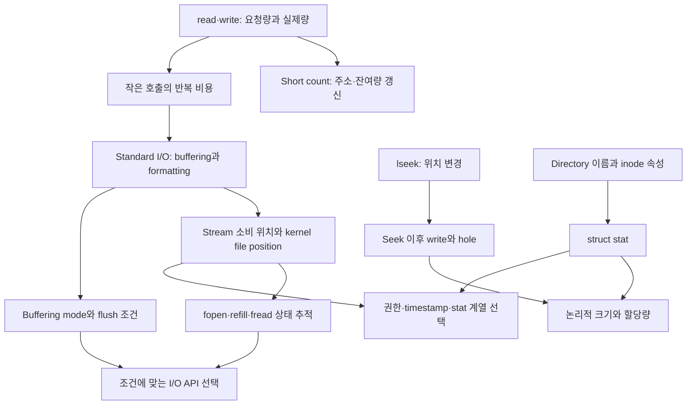

이 문서는 녹음이 없는 **2026년 9월 16일의 자료 기반 추정 복습**이며, 그날의 정확한 진도·발언·강조점은 확인되지 않았다.  
M01 슬라이드 12–47과 M02 슬라이드 3–8의 고정된 본문을 바탕으로 연결 관계와 회상·연습을 정리한다.  
코드 보정과 자체 문제는 학습을 위한 설명이며, 당시의 STT나 실제 수업 예제를 복원한 것이 아니다.

## 강의 내용과 설명

이 본문은 녹음이 없는 **2026년 9월 16일의 자료 기반 추정 복습**이다. M01 슬라이드 12–47과 M02 슬라이드 3–8을 다루며, 그날 실제로 다룬 범위·발언·강조점은 확인되지 않았다. 아래의 코드 보정과 계산 예시는 자료를 이해하기 위한 설명이며, 강의 발언이나 STT를 복원한 것이 아니다.

### Unix I/O의 `read`·`write`: 요청한 양과 실제 처리한 양

Unix I/O(유닉스 입출력)의 `read`와 `write`는 [[concepts/file-descriptor|File descriptor]](파일 서술자)로 지정한 대상과 프로그램의 메모리 사이에서 byte를 옮긴다. `read`는 파일에서 메모리로, `write`는 메모리에서 파일로 옮긴다. 일반적인 순차 파일 접근에서는 현재 File position(파일 위치)에서 전송을 시작하고, 실제로 처리한 만큼 위치가 전진한다. 여기서 가장 먼저 구분할 것은 **요청량, 메모리 용량, 실제 처리량**이다. [M01 p.12]

```c
#include <unistd.h>

ssize_t read(int fd, void *buf, size_t count);
ssize_t write(int fd, const void *buf, size_t count);
```

`fd`는 접근 대상을, `buf`는 메모리의 시작 주소를, `count`는 요청하는 byte 수를 나타낸다. `read`를 호출할 때는 `buf`부터 적어도 `count` bytes를 저장할 공간이 있어야 한다. `write`에서는 그 범위가 읽을 수 있는 유효한 데이터여야 한다. 함수에 주소 하나를 넘긴다고 해서 함수가 원래 배열의 용량이나 유효 데이터 길이를 자동으로 알게 되는 것은 아니다. [M01 p.12] [M01 p.13] [M01 p.14]

요청 크기의 형식은 `size_t`, 반환값의 형식은 `ssize_t`이다. 크기는 음수가 아니지만 반환값은 `-1`이라는 오류 표시를 표현해야 하기 때문이다. 따라서 반환값을 처음부터 unsigned 형식으로 받아 음수 오류를 잃어버리지 않도록 한다. 반환값의 해석은 다음과 같다. [M01 p.12]

| 반환값 | 해석 |
|---|---|
| 양수 `n` | 실제로 `n` bytes를 처리했다. 요청량 전체를 처리했는지는 별도 비교가 필요하다. |
| `read`의 `0` | 양의 크기를 요청한 일반적인 파일·byte stream 읽기에서는 EOF에 해당한다. |
| `-1` | 오류가 발생했다. 이때 `errno`를 이용해 오류 종류를 해석한다. |

크기 `0`을 요청한 호출에서도 `0`이 반환될 수 있으므로, **반환값 `0`만 보고 요청 조건과 무관하게 EOF라고 판단해서는 안 된다.** 반대로 양수 반환은 진행이 있었다는 뜻이지, 요청 전체가 끝났다는 뜻이 아니다. [M01 p.12] [M01 p.20]

슬라이드 13의 예제는 `char buf[512]`에 대해 `read(fd, buf, sizeof(buf))`를 호출하고, 결과가 음수이면 `perror`로 오류를 출력한 뒤 `EXIT_FAILURE`로 종료한다. 이 위치에서 `buf`는 실제 배열이므로 `sizeof(buf)`는 512이다. 그러나 배열을 함수 인자로 전달해 포인터로 받은 곳에서 `sizeof(buf)`를 사용하면 포인터 자체의 크기가 된다. **배열 용량을 알고 있는 코드와 주소만 알고 있는 코드는 다르다.** [M01 p.13]

슬라이드 14의 `write` 조건식에는 닫는 괄호가 하나 빠져 있다. 의도한 대입과 비교의 순서를 보존한 표기 보정은 다음과 같다. `fd` 개방과 `buf`의 유효한 내용 준비는 이 조각 밖에서 이루어졌다고 가정한다. [M01 p.14]

```c
ssize_t nbytes;

if ((nbytes = write(fd, buf, sizeof(buf))) < 0) {
    perror("Cannot write to file");
    exit(EXIT_FAILURE);
}
```

괄호의 역할은 `write`의 반환값을 먼저 `nbytes`에 저장하고 그 값을 `0`과 비교하는 것이다. 비교 결과인 참·거짓을 저장하려는 코드가 아니다. 또한 이 보정은 문법과 대입 순서를 바로잡을 뿐이다. `nbytes`가 512보다 작은 양수일 때 남은 부분을 처리하는 로직은 여전히 없다. 슬라이드 12의 `retval < sizeof(buf)`도 요청량이 배열 전체인 예제에 맞춘 표현이며, 일반적인 비교 대상은 **실제 전달한 `count`**이다. [M01 p.12] [M01 p.14]

### 문자열 출력: `strlen`, 끝의 NUL, 명시적인 출력 길이

`write`는 문자열을 출력하는 전용 함수가 아니다. 지정한 byte 범위를 전달하므로 문자열의 끝을 찾거나 자동으로 줄바꿈을 붙이지 않는다. 슬라이드 15의 예제가 `strlen(str)`를 사용하는 이유는 C 문자열의 내용 길이와 배열의 저장 공간 크기를 구별하기 위해서이다. [M01 p.15]

```c
char str[] = "Hello, world\n";

write(STDOUT_FILENO, str, strlen(str));
```

이 배열에는 표시할 문자와 newline 뒤에 NUL character(널 문자), 즉 `'\0'`이 추가된다. 이 NUL은 C 문자열의 끝을 표시하지만 보통 출력하려는 내용에는 포함하지 않는다. 따라서 `strlen`은 NUL 전까지의 길이를 계산하고, 배열 자체에 대한 `sizeof`는 NUL을 포함한 저장 공간을 계산한다. [M01 p.15]

원본의 두 Hello 예제는 실제 문자열이 조금 다르다. 제목만 보고 같은 문자열로 합치지 않아야 한다. [M01 p.15] [M01 p.16]

| 슬라이드의 실제 문자열 | `strlen(str)` | 배열에 대한 `sizeof(str)` |
|---|---:|---:|
| `"Hello, world\n"` | 13 | 14 |
| `"Hello, world!\n"` | 14 | 15 |

`strlen`이 올바른 선택인 이유는 이 예제의 데이터가 NUL로 끝나는 문자열이기 때문이다. Binary data(바이너리 데이터)는 중간에 값 `0`인 byte를 포함할 수 있으므로 `strlen`을 일반적인 데이터 길이 함수처럼 사용하면 안 된다. 예를 들어 `{0x41, 0x00, 0x42}`라는 3-byte 배열을 모두 전달하려면 길이를 3으로 관리해야 한다. 문자열 규칙을 적용하면 중간의 `0x00`에서 길이 계산이 끝나 버린다. 이는 문자열 길이와 전송 길이를 구분하는 자료의 원리를 적용한 설명용 예이다. [M01 p.12] [M01 p.15]

`STDOUT_FILENO`는 standard output(표준 출력)의 정수 descriptor이다. 슬라이드 15에서는 이미 열린 이 대상을 사용한다. 반면 슬라이드 16의 `output.txt`에 출력하려면 파일을 명시적으로 열어야 한다. [M01 p.15] [M01 p.16]

```c
int fd = open(
    "./output.txt",
    O_WRONLY | O_CREAT | O_APPEND,
    S_IRUSR | S_IWUSR | S_IRGRP | S_IROTH
);
```

`O_WRONLY`는 쓰기 접근, `O_CREAT`는 필요할 경우 파일 생성, `O_APPEND`는 파일 끝에 덧붙이는 쓰기를 지정한다. 마지막 인자는 새 파일을 만들 때 요청하는 permission bits(권한 비트)이다. Owner(소유자)에게 read/write, group과 others에게 read를 요청한다. 요청 비트가 실행 환경의 최종 권한과 반드시 같다고 단정할 수는 없다. [M01 p.16]

원본 프로그램은 `open`이 `-1`이면 `perror` 후 실패를 반환하고, 성공하면 `write`와 `close`를 호출한다. 다만 `write`와 `close`의 결과를 검사하지 않는다. 따라서 이 코드는 **standard output 대신 명시적으로 연 파일에 append하는 절차**를 보여 주는 짧은 예제이다. 모든 오류와 부분 전송을 처리한 완성된 파일 출력 프로그램으로 읽지는 않는다. [M01 p.15] [M01 p.16]

기출에 적용하면, 2024-2 중간 Q2는 숫자의 문자 표현을 직접 만든 뒤 standard output으로 전달하도록 요구한다. 여기서 현재 자료와 직접 연결되는 판단은 출력 대상, 생성된 문자열의 길이, 끝의 NUL 포함 여부, 반환된 실제 전송량이다. 정수의 자릿수 생성과 역순 배열 처리는 추가적인 C 연산·배열 지식이 필요하다. 또한 제공 골격의 부호 반전은 가장 작은 signed 정수에서 범위 문제가 생길 수 있으므로, 그 골격을 모든 `int` 값에 안전한 변환 함수로 일반화해서는 안 된다. [EX:sp_2024_2_midterm_q02 p.4] [EX:sp_2024_2_midterm_q02 p.5]

### `lseek`: 위치 변경과 파일 크기 변경은 다르다

[[concepts/file-offset|File offset]](파일 오프셋)은 파일 안에서 다음 접근이 시작될 위치를 나타낸다. `lseek`는 데이터를 복사하지 않고 이 위치를 바꾼다. 함수 이름에 `seek`가 있다고 해서 장치가 반드시 물리적으로 이동한다는 뜻도 아니다. 이 자료에서 추적하는 것은 프로그램에 보이는 파일 위치이다. [M01 p.17]

```c
off_t lseek(int fd, off_t offset, int whence);
```

`whence`는 `offset`을 어느 기준에서 해석할지 정한다. 현재 위치를 $p$, 파일의 논리적 크기를 $L$, 전달한 offset을 $d$라고 하면 다음과 같다. [M01 p.17]

| 기준 | 새 위치 |
|---|---|
| `SEEK_SET` | $d$ |
| `SEEK_CUR` | $p+d$ |
| `SEEK_END` | $L+d$ |

반환값은 성공 시 **새로운 절대 위치**, 실패 시 `-1`이다. 슬라이드 18의 `lseek(fd, 100, SEEK_SET)`은 현재 위치에 100을 더하는 호출이 아니라 파일 시작 기준 100으로 이동하는 호출이다. 원본은 반환값이 음수이면 `perror` 후 실패 종료한다. 파일이나 장치가 해당 위치 변경을 지원하는지와 호출 성공 여부를 확인해야 하며, 모든 descriptor가 동일한 seek 동작을 제공한다고 가정하지 않는다. [M01 p.17] [M01 p.18]

EOF를 넘어선 위치로 이동하는 것과 파일이 커지는 것은 별개이다. 자료가 Hole(빈 영역)을 설명하는 예는 **EOF 이후로 seek한 뒤 그 위치에 write하는 조합**이다. Seek만 수행했다고 중간 데이터가 쓰이거나 논리적 크기가 자동으로 늘어난 것은 아니다. [M01 p.17]

예를 들어 크기 100 bytes인 일반 파일에서 위치 8192로 seek한 뒤 1 byte를 성공적으로 썼다고 가정하자. 이때 새 논리적 크기는 8193 bytes이다. 기존 데이터 끝인 offset 100부터 새 데이터 직전인 8191까지, 총 $8192-100=8092$ bytes의 구간은 읽을 때 0으로 나타난다. 해당 file system이 hole을 지원하면 이 구간 전체에 데이터 block을 할당하지 않을 수 있다. **0으로 읽힌다는 논리적 내용과 실제 저장 공간의 할당은 구분해야 한다.** [M01 p.17]

2025-2 중간 Q3(c)는 seek와 부분 쓰기에 descriptor 복제를 결합한다. 이번 자료로 접근할 수 있는 부분은 새 위치와 덮어쓰는 byte 범위를 추적하는 일이다. 그러나 `dup`으로 복제한 descriptor의 위치 공유와 `close` 뒤 자원 유지까지 설명하려면 추가 개념이 필요하다. 단일 descriptor의 `lseek`를 이해했다고 전체 문항을 현재 범위만으로 해결할 수 있다고 판정하지 않는다. [EX:sp_2025_2_midterm_q03 p.7]

### 1-byte 복사와 Short count: 진행 상황을 수치로 관리하기

슬라이드 19의 복사 프로그램은 `char c` 하나를 임시 저장 공간으로 사용한다. `read`가 1 byte를 읽으면 그 byte를 `write`로 넘기고 같은 일을 반복한다. 여기서는 파일 내용을 문자열로 해석하지 않으므로 값 `0`인 byte도 다른 byte와 같은 방식으로 전달할 수 있다. [M01 p.19]

```c
char c;

while (read(STDIN_FILENO, &c, 1) > 0) {
    write(STDOUT_FILENO, &c, 1);
}
```

이 코드는 데이터 흐름을 간결하게 보여 주지만, 종료 원인을 구별하지 않는다. `read`의 결과가 `0`이어도 반복이 끝나고 `-1`이어도 끝난다. `write`의 결과도 검사하지 않으며, 원본 프로그램은 마지막에 항상 `EXIT_SUCCESS`를 반환한다. 따라서 반복문을 빠져나왔다는 사실만으로 “정상적으로 끝까지 복사했다”고 말할 수 없다. [M01 p.19]

[[concepts/short-count|Short count]](부분 전송)는 오류 반환 `-1` 없이 요청보다 적은 byte를 처리한 경우이다. 슬라이드 20에서는 512 bytes를 요청했는데 302 bytes를 읽는다. 이 결과는 “실패해서 유효 데이터가 없다”가 아니라, **이번 호출로 302 bytes를 얻었다**는 뜻이다. 남은 210 bytes가 반드시 다음 호출에 도착한다거나, 이번 결과만으로 EOF가 확정된다는 뜻은 아니다. [M01 p.20]

자료는 short count가 나타날 수 있는 상황으로 EOF 근처의 읽기, 저장 공간이 부족한 쓰기, terminal의 행 입력, socket과 pipe의 입출력, interrupt와 signal을 열거한다. 이 상황들이 모두 같은 결과를 반환한다는 뜻은 아니다. 일부 진행 후 양수를 반환할 수도 있고, 진행 없이 오류를 반환할 수도 있으므로 **반환값을 먼저 분류한 뒤 오류인 경우 `errno`를 해석**해야 한다. 성공한 호출 뒤 남아 있는 `errno`만으로 양의 반환값을 오류로 바꾸어 읽으면 안 된다. [M01 p.20]

부분 전송을 처리할 때는 다음 두 값을 함께 유지한다.

- `done`: 지금까지 성공적으로 처리한 byte 수.
- `total - done`: 앞으로 처리해야 하는 byte 수.

원래 데이터의 시작 주소가 `buf`라면 다음 쓰기는 `buf + done`에서 시작해야 한다. 요청 길이는 `total - done`이다. 양의 결과 `n`을 받으면 `done`에 **요청했던 양이 아니라 실제 결과 `n`**을 더한다. 이 불변식을 지켜야 이미 보낸 부분의 중복 전송과 아직 보내지 않은 부분의 누락을 피할 수 있다. [M01 p.12] [M01 p.20] [M01 p.21]

슬라이드 21의 복사 출력도 같은 방식으로 해석한다. 입력 `data.dat`의 offset 400000에서 100000 bytes를 읽어 출력 `test.dat` 끝에 덧붙이려 한다. 필요하면 출력 파일을 만들고, 개방·위치 이동·복사·닫기 순서로 진행한다. 제시된 출력에는 마지막 34464-byte 요청에서 27776 bytes만 얻었으며 총 93312 bytes를 복사했다고 적혀 있다. [M01 p.21]

$$
\text{앞서 복사한 양}=100000-34464=65536
$$

$$
\text{실제 총량}=65536+27776=93312
$$

$$
\text{목표에 못 미친 양}=100000-93312=6688
$$

이 계산은 출력 내부의 수치가 서로 맞는지 확인한다. 그러나 이 출력만으로 마지막 short count의 원인을 확정하거나, 자료에 제시되지 않은 전체 구현을 복원할 수는 없다. 예를 들어 EOF는 가능한 원인이지만, “이 파일은 반드시 여기에서 끝났다”는 결론은 추가 결과 없이 만들지 않는다. [M01 p.21]

2025-1 중간 Q3의 관련 부분은 binary byte 배열의 길이, 다음 전송 주소, 잔여량, `EINTR` 상황을 연결해 반복문을 완성하도록 요구한다. 현재 자료에서 옮길 수 있는 핵심은 **실제 처리량에 맞춰 주소와 길이를 함께 갱신하는 판단**이다. `EINTR` 재시도 조건은 해당 문항에 명시된 추가 조건으로 읽으며, 임의의 모든 오류를 무조건 재시도하는 규칙으로 확대하지 않는다. 원문의 제출 상황을 재현할 필요 없이 일반적인 파일 쓰기의 정확성 문제로 연결할 수 있다. [EX:sp_2025_1_midterm_q03 p.7] [EX:sp_2025_1_midterm_q03 p.8] [EX:sp_2025_1_midterm_q03 p.9]

### Standard I/O의 동기: Buffering과 Formatted I/O는 별개의 기능이다

프로그램은 문자 하나나 한 줄씩 처리하는 경우가 많다. 그러나 프로그램의 처리 단위가 작다는 이유로 kernel에 요청하는 단위까지 항상 작아야 하는 것은 아니다. 슬라이드 19처럼 byte마다 `read`와 `write`를 호출하면, 데이터의 양에 비례해 system call(시스템 호출)이 매우 많이 발생한다. Standard I/O(표준 입출력)는 이 문제를 [[concepts/buffering|Buffering]](버퍼링)으로 줄인다. [M01 p.19] [M01 p.23] [M01 p.25]

슬라이드 23은 10 MiB를 byte 단위로 복사한 측정 예를 제시한다. 아래 수치는 자료에 수록된 특정 실행의 결과이며, 현재 컴퓨터에서 새로 측정한 결과가 아니다. [M01 p.23]

| 방식 | `real` | `user` | `sys` |
|---|---:|---:|---:|
| Unix I/O로 byte마다 복사 | 2.679초 | 0.363초 | 2.316초 |
| Standard I/O 사용 | 0.261초 | 0.261초 | 0.000초 |

`real`은 경과 시간, `user`는 user mode에서 사용한 CPU 시간, `sys`는 kernel mode에서 사용한 CPU 시간으로 읽는다. 자료의 비교에서는 반복되는 작은 system call의 비용이 큰 차이를 만든다. 다만 `sys`가 `0.000`으로 표시되었다고 system call이 하나도 없었다는 뜻은 아니다. 측정·표시 정밀도보다 작을 수 있다. 자료의 “10,000 clock cycles 초과”라는 설명 역시 모든 system call과 모든 기계에 고정된 비용으로 적용하지 않는다. [M01 p.23]

성공적인 1-byte read와 write로 $N$ bytes를 복사하면 데이터 전송을 위한 호출만 약 $2N$번 필요하다. EOF를 확인하는 마지막 read까지 포함하면 단순 모델에서는 $2N+1$번이다. 10 MiB라면 이 값은 20,971,521이다. Buffering은 프로그램에는 작은 단위의 입출력을 제공하면서 실제 `read`·`write`를 더 큰 단위로 묶어 호출 수를 줄인다. 이는 자료의 구조를 수치화한 설명이지, 실제 stdio 구현의 호출 수를 고정하는 명세는 아니다. [M01 p.19] [M01 p.23] [M01 p.25]

Standard I/O의 다른 목표는 Formatted I/O(형식 입출력)이다. `fprintf`·`fscanf` 계열은 format string(형식 문자열)에 따라 숫자나 문자열을 표현하고 해석한다. **Buffering은 데이터를 언제 얼마나 묶어 전달할지**, **formatting은 데이터를 어떤 표현으로 바꾸거나 해석할지**의 문제이다. 따라서 unbuffered stream에서도 formatted output을 사용할 수 있다. [M01 p.24] [M01 p.25]

도입 슬라이드의 다음 코드는 정수 `fd` 대신 `FILE *`로 stream을 다루는 인터페이스를 보여 준다. `"r+"`는 읽기와 쓰기를 위한 update mode(갱신 모드)이며, 파일을 새로 만들어 주는 모드는 아니다. 이 한 줄만으로 파일의 존재나 개방 성공을 알 수는 없다. [M01 p.22]

```c
FILE *f = fopen("standard.io", "r+");
```

2025-2 중간 Q3(d)는 문자 단위 Standard I/O와 byte마다 직접 `read`·`write`하는 구현의 실행 비용을 비교하도록 요구한다. 옮겨야 할 것은 “Standard I/O가 항상 더 빠르다”는 암기가 아니라, **응용 프로그램의 함수 호출 횟수와 kernel 경계를 통과하는 횟수를 구별하는 분석 방법**이다. 직접 Unix I/O를 사용하더라도 큰 buffer로 묶어 처리하면 비교 조건이 달라진다. [EX:sp_2025_2_midterm_q03 p.8]

### I/O 계층과 두 위치: Stream이 소비한 곳과 Kernel이 읽어 온 곳

슬라이드 38의 작은 계층 그림과 슬라이드 39의 확대 그림에는 두 경로가 있다. 하나는 application이 C standard library의 Standard I/O를 이용한 뒤 Unix I/O로 내려가는 경로이고, 다른 하나는 application이 Unix I/O 인터페이스를 직접 사용하는 경로이다. 두 경로는 system call interface에서 만나 kernel과 storage devices(저장 장치)로 이어진다. [M01 p.38] [M01 p.39]

```text
User application
  ├─ Standard I/O: fopen, fread, fwrite, fprintf, fflush ...
  │       └─ user-space C standard library
  │                └─ Unix I/O system call interface
  └─ 직접 Unix I/O: open, read, write, lseek, close
                   └─ 같은 system call interface
                              └─ Kernel ↔ Storage devices
```

Standard I/O가 user space에 있다는 점이 중요하다. `FILE`의 buffer에 이미 있는 문자를 하나 꺼내는 일은 매번 kernel을 호출하지 않고 수행할 수 있다. 반대로 buffer가 비어 새 데이터를 가져와야 할 때는 하위 Unix I/O가 필요하다. 자료의 화살표는 이런 계층 관계를 설명하며 kernel 내부 구현 전체를 나타내는 것은 아니다. [M01 p.26] [M01 p.39]

슬라이드 26의 Buffered read(버퍼를 이용한 읽기) 그림에서는 `read`가 $B_0$부터 $B_{k-1}$까지 미리 가져온다. 그 결과 kernel의 current file position은 다음 byte인 $B_k$를 가리킨다. 그러나 application이 그중 일부만 소비했다면 stream의 다음 위치는 아직 $B_s$이다. 그림에서 이미 읽어 온 범위와 아직 application이 소비하지 않은 범위가 나뉘어 있는 이유가 이것이다. [M01 p.26]

$$
\text{kernel이 가져온 위치}\neq\text{application이 소비한 위치}
$$

슬라이드 40은 이 차이를 숫자로 구체화한다. `FILE` 쪽에는 `bufpos = 378`, `fd = 4`가 있고, kernel의 열린 파일 상태에는 `pos = 1024`, `refcnt = 1`이 있다. 첫 1024 bytes를 buffer에 가져온 후 application이 앞의 378 bytes를 소비한 상태로 읽으면, buffer에 남은 양은 $1024-378=646$ bytes이다. 다음 stream 입력은 남은 buffer에서 제공될 수 있다. [M01 p.40]

이 그림에는 구별해야 할 구조가 여럿 있다.

| 구조 | 그림에서의 역할 |
|---|---|
| User-space `FILE` 상태 | Buffer 주소, 소비 위치, underlying descriptor를 관리한다. |
| Process A의 descriptor table | 정수 `fd = 4`를 kernel의 열린 파일 상태에 연결한다. |
| 열린 파일 상태 | 현재 파일 위치와 참조 상태 등을 보유한다. |
| 파일의 metadata | Access 정보, 크기, 종류 등 파일 자체의 속성을 나타낸다. |
| Kernel의 disk block cache | 저장 장치의 block 데이터를 다루는 별도 계층이다. |

따라서 stdio buffer와 kernel의 disk block cache를 같은 buffer로 부르면 안 된다. 둘 다 데이터를 보관하지만 위치, 소유 계층, 목적이 다르다. `refcnt = 1`은 그림의 해당 참조 상태이며 파일 내용의 길이나 user buffer 잔량이 아니다. 또한 그림 위의 `fopen("input.txt", "r")` 한 줄만으로 즉시 1024 bytes가 읽혔다고 결론 내리지 않는다. 그림 전체는 buffering이 진행된 상태를 설명하는 개념도이다. [M01 p.40]

이 차이는 두 인터페이스를 섞을 때도 중요하다. Stream이 미리 읽어 둔 데이터가 남아 있는데 underlying descriptor로 직접 읽으면, application이 생각하는 “다음 문자”와 kernel이 접근하는 “다음 byte”가 다를 수 있다. 두 위치를 조정하는 규칙 없이 `FILE *`와 그 `fd`를 번갈아 사용하면 이해하기 어려운 결과가 생기는 이유이다. [M01 p.26] [M01 p.35] [M01 p.40]

### Stream API: 생명주기, Element 단위 전송, EOF와 Error

`FILE *`는 Standard I/O가 관리하는 stream 상태에 접근하는 포인터이다. 단순히 파일 번호를 포인터로 바꾼 값이 아니다. Stream은 descriptor에 더해 buffering과 상태 정보를 관리한다. 슬라이드 27의 API 표는 이 stream의 개방부터 종료까지 필요한 작업을 묶어 보여 준다. [M01 p.27] [M01 p.40]

| 작업 | 주요 API와 자료에 제시된 관련 함수 |
|---|---|
| 개방·연결 | `fopen`, `fdopen`, `freopen` |
| Block 전송 | `fread`, `fwrite` |
| 위치 이동·조회 | `fseek`, `ftell`, `rewind`, `fsetpos`, `fgetpos` |
| 종료 | `fclose`, 표에 함께 제시된 `fcloseall` |
| 전달·상태·descriptor | `fflush`, `feof`, `ferror`, `fileno` |

이름을 외우기보다 역할을 구별한다. `fopen`은 경로와 mode로 stream을 연다. `fdopen`은 이미 열린 descriptor에 stream을 연결하는 계열이고, `freopen`은 기존 stream의 연결을 다시 설정하는 계열이다. 위치 함수도 서로 다르다. `fseek`는 위치를 바꾸고, `ftell`은 위치를 조회하며, `fgetpos`·`fsetpos`는 위치를 저장하고 복원하는 짝이다. 이 표에 함께 실렸다는 이유로 모든 함수가 같은 표준 지위와 이식성을 갖는다고 가정해서는 안 된다. [M01 p.27]

`fread`와 `fwrite`에서는 반환 단위를 특히 주의해야 한다. [M01 p.27]

```c
size_t fread(void *ptr, size_t size, size_t nmemb, FILE *stream);
size_t fwrite(const void *ptr, size_t size, size_t nmemb, FILE *stream);
```

요청하는 총 byte 수는 `size * nmemb`이지만, 반환값은 **완료한 element(요소)의 수**이다. 예를 들어 `size = 4`, `nmemb = 3`이면 요청량은 12 bytes이다. 반환값이 2라면 4-byte element 두 개가 완전히 처리되었다는 뜻이다. 이를 “2 bytes 처리” 또는 “12 bytes 처리”로 해석하면 모두 틀린다. `size = 1`일 때에만 element 수와 byte 수가 수치상 같다. [M01 p.27]

입력에서 완성되지 않은 마지막 element의 내용까지 정상 element처럼 해석해서는 안 된다. 따라서 반환값을 사용해 처리 가능한 element 수를 정하고, 부족하게 반환되었다면 EOF인지 오류인지 추가로 구분한다. Standard I/O가 하위 short count 처리를 맡는다는 설명은 모든 `fread`가 언제나 요청한 element 전체를 반환한다는 뜻이 아니다. [M01 p.27] [M01 p.46]

`feof`는 다음 읽기의 성공 여부를 예언하는 함수가 아니다. 읽기 과정에서 EOF 상태가 설정되었는지를 확인한다. `ferror`는 stream의 오류 상태를 확인한다. 따라서 입력 함수의 반환값을 먼저 검사하고 필요한 경우 이 상태들을 확인해야 한다. `while (!feof(f))`만으로 다음 읽기의 성공을 가정하면, 마지막 실패한 읽기를 정상 데이터처럼 처리할 수 있다. [M01 p.27]

`fileno`는 stream의 underlying descriptor를 얻는 함수이다. 새 파일을 열거나 새로운 descriptor를 복제하는 함수가 아니다. `fclose`는 stream 사용을 끝내고 관련 자원을 정리한다. 출력 stream에는 아직 buffer에 남은 데이터가 있을 수 있으므로 종료 과정의 전달 실패까지 고려해야 한다. [M01 p.27] [M01 p.35] [M01 p.42]

### Character·Line I/O와 Formatted I/O의 구별

슬라이드 28은 문자·행을 다루는 함수와 format에 따라 값을 해석하거나 표현하는 함수를 나누어 제시한다. Character I/O(문자 입출력), Line I/O(행 입출력), Formatted I/O는 데이터에 적용하는 규칙이 다르다. [M01 p.28]

`fgets(s, size, stream)`는 저장 공간 크기를 인자로 받는 행 입력 함수이다. 읽은 내용을 문자열로 사용할 수 있도록 끝의 NUL 공간을 고려해야 하며, buffer가 작으면 한 번의 호출에 한 행 전체가 들어오지 않을 수 있다. “행 입력 함수이므로 언제나 완전한 한 줄을 반환한다”는 가정은 위험하다. `fgetc`, `getc`, `getchar`는 문자 단위 입력에 연결되고, `ungetc`는 읽기 흐름에 문자를 되돌리는 기능이다. [M01 p.28]

`fgetc`·`getchar`의 결과를 다룰 때는 문자 값과 `EOF`를 구별할 수 있는 `int`를 사용한다. 입력 byte를 너무 일찍 `char`로 줄이면 byte 값과 종료 표시를 구별하기 어려워질 수 있다. 이 점은 문자 하나를 저장하는 공간과 **입력 함수의 반환값을 저장하는 형식**이 서로 다른 문제임을 보여 준다. [M01 p.28]

원본 표의 `gets`에는 빨간 취소선이 있다. 텍스트 추출 결과에 다른 함수와 나란히 나타난다고 사용 권장 목록으로 옮기면 안 된다. 저장 공간 크기를 제한하지 못하는 unsafe legacy interface(안전하지 않은 과거 인터페이스)로 구별하고, 이 자료에서는 크기 인자를 가진 `fgets`와 대비해 읽는다. [M01 p.28]

Formatted input의 대표는 `fscanf(stream, format, ...)`이다. 입력을 format에 따라 해석해 목적지 객체에 저장하므로, format과 목적지의 형식이 맞아야 한다. `scanf`는 standard input을 사용하고, `sscanf`는 문자열을 입력 대상으로 사용한다. `vscanf` 계열은 가변 인자를 전달하는 방식이 다른 관련 함수이다. 같은 계열이라는 이유로 입력 대상과 인자 형식까지 같다고 생각하지 않는다. [M01 p.28]

출력에서는 `fputs`가 문자열을, `fputc`·`putc`·`putchar`가 문자를 다룬다. `fputs` 자체는 자동으로 newline을 붙이지 않지만 `puts`는 newline을 덧붙인다. `fprintf`는 format을 해석해 출력하며, `printf`, `dprintf`, `sprintf`, `snprintf`, `vprintf` 등은 대상이나 인자 전달 방식이 달라지는 관련 함수이다. `dprintf`는 descriptor, `sprintf`·`snprintf`는 메모리의 문자 배열을 대상으로 하므로 모두 `FILE *`를 받는다고 외우면 안 된다. [M01 p.28]

이 표에는 두 가지 명시적인 표기 보정이 필요하다. `fputs`의 반환형은 원본의 `char`가 아니라 `int`이고, `sprint`는 이 문맥에서 `sprintf`의 오기로 읽는다. 이는 자료의 코드를 설명하기 위한 보정이며, 실제 강의에서 교정되었다는 뜻은 아니다. [M01 p.28]

### Standard streams와 `fprintf`·`printf`의 Hello 예제

[[concepts/standard-streams|Standard streams]](표준 스트림)는 프로그램의 기본 입력, 일반 출력, 오류 출력을 나누는 통로이다. Unix descriptor와 stdio stream의 대응은 다음과 같다. [M01 p.29]

| 역할 | Standard I/O stream | Unix I/O descriptor |
|---|---|---|
| Standard input | `stdin` | `STDIN_FILENO`, 일반적으로 0 |
| Standard output | `stdout` | `STDOUT_FILENO`, 일반적으로 1 |
| Standard error | `stderr` | `STDERR_FILENO`, 일반적으로 2 |

왼쪽은 `FILE *` 인터페이스이고 오른쪽은 정수 descriptor이다. 따라서 `fprintf(stdout, ...)`와 `write(STDOUT_FILENO, ...)`는 같은 출력 역할에 접근하더라도 서로 다른 계층의 함수이다. `stdout`과 `STDOUT_FILENO`를 인자로 서로 바꾸어 넣을 수 없다. [M01 p.29]

슬라이드 29는 `fprintf(stdout, "Hello, world\n")`를 사용하고, 슬라이드 30은 다음 두 호출을 같은 `main` 안에 나란히 둔다. [M01 p.29] [M01 p.30]

```c
char str[] = "Hello, world!\n";

fprintf(stdout, "%s", str);
printf("%s", str);
```

`fprintf`는 출력 stream을 명시하고, `printf`는 암묵적으로 `stdout`을 사용한다. `%s`는 NUL로 끝나는 문자열을 해석하므로 `write`처럼 별도의 byte 수를 전달하지 않는다. 두 줄을 모두 실행하면 문자열은 **두 번** 출력된다. 두 함수가 같은 효과를 갖는다는 설명과, 두 호출을 모두 실행했을 때의 결과는 구별해야 한다. [M01 p.30]

파일에 출력하는 슬라이드 31은 다음 순서를 보여 준다. `fopen("./output.txt", "a+")`로 reading과 appending을 허용하는 stream을 열고, `NULL`이면 실패 처리한다. 성공하면 `fprintf`로 쓰고 `fclose`로 닫는다. 높은 수준의 API를 사용해도 일반 파일의 명시적인 개방과 종료는 필요하다. [M01 p.31]

```c
FILE *out = fopen("./output.txt", "a+");

if (out == NULL) {
    perror("Cannot open/create file");
    return EXIT_FAILURE;
}

fprintf(out, "%s", str);
fclose(out);
```

위 코드는 원본의 곡선 따옴표를 C 문자열의 일반 따옴표로 보정한 핵심 조각이다. `"a+"`는 읽기도 허용하지만, 이 예제는 출력만 한다. 읽기와 쓰기를 섞는 update stream의 상세 전환 규칙까지 이 짧은 예제가 보여 주는 것은 아니다. 또한 원본과 이 조각은 `fprintf`와 `fclose`의 실패 검사를 생략하므로, 반환값 검사가 불필요하다는 예로 사용하지 않는다. [M01 p.31] [M01 p.35]

### 세 Buffering mode와 `fflush`: 출력이 보이는 시점

Buffering은 대체로 투명하지만, **출력이 관찰되는 시점**에는 영향을 준다. 슬라이드 33은 세 mode와 흔한 기본 연결 대상을 제시한다. 실제 mode는 연결 대상과 설정에 따라 달라질 수 있으며 `setvbuf`로 명시적으로 지정할 수도 있다. [M01 p.33]

| Mode | 상수 | 자료에서 제시한 대표적 사용 상황 |
|---|---|---|
| Fully buffered(완전 버퍼링) | `_IOFBF` | 일반 파일 |
| Line buffered(행 버퍼링) | `_IOLBF` | Terminal에 연결된 stream |
| Unbuffered(무버퍼링) | `_IONBF` | `stderr` 또는 명시적인 사용자 설정 |

Fully buffered 입력에서는 먼저 buffer에 남아 있는 데이터를 제공한다. Buffer가 비면 하위 `read`로 채운다. 출력에서는 데이터를 모으다가 buffer가 가득 차면 하위 `write`로 내보낸다. 그래서 `fread`·`fwrite` 호출마다 반드시 `read`·`write`가 한 번씩 발생하는 것은 아니다. 큰 전송의 직접 처리 등 실제 library의 모든 경로를 이 단순 모델이 열거하는 것도 아니다. [M01 p.34]

`fflush`는 출력 buffer에 남은 데이터를 underlying stream으로 전달하도록 요청한다. 여기서 [[concepts/flushing|Flushing]](버퍼 비우기)을 **저장 장치에 영구적으로 기록되었다는 보장**과 혼동해서는 안 된다. 슬라이드의 “disk에 쓴다”는 표현은 stdio buffer에서 하위 I/O로 전달하는 동작으로 한정해 이해한다. 전달이 실패할 수 있으므로 실제 코드에서는 `fflush` 결과도 확인해야 한다. [M01 p.34]

슬라이드 32의 그림은 여섯 번의 `printf`가 `h`, `e`, `l`, `l`, `o`, `\n`을 같은 buffer에 쌓고, 이 6 bytes가 `write(1, buf, 6)`로 전달되는 관계를 보여 준다. 별도의 문자열 끝 NUL까지 출력하는 그림이 아니다. 이 그림에서 newline으로 전달이 일어나는 조건은 뒤의 mode 설명과 함께 **line buffering**으로 읽어야 한다. [M01 p.32] [M01 p.33]

Line-buffered output의 전달 계기로 자료는 newline, buffer full, input 요청, `fflush`, stream close, process 종료를 나열한다. 특히 **newline이 없어도 buffer가 가득 차면 전달될 수 있다.** Line buffering은 줄바꿈이 올 때까지 크기 제한 없이 메모리에 쌓는 방식이 아니다. [M01 p.35]

두 가지 조건은 보충해서 읽어야 한다. 첫째, input 요청에 따른 flush는 관련 stream과 실제 입력 동작의 조건을 가지며, 자료의 한 줄을 “어떤 입력 함수든 호출하면 모든 출력이 비워진다”로 확대하지 않는다. 둘째, process 종료에 따른 flush는 stdio 정리를 수행하는 정상 종료를 전제로 한다. 비정상 종료나 그 정리를 수행하지 않는 종료 경로까지 항상 출력이 보존된다는 보장은 아니다. [M01 p.35]

Unbuffered도 `FILE` 인터페이스를 사용한다. 달라지는 것은 stdio가 출력을 모아 두는 방식이다. 자료는 Unix 환경의 `stderr`를 기본 unbuffered stream으로 설명하지만, `stderr`가 언제나 terminal에 연결되어 있다는 뜻은 아니다. 또한 stdio buffer에 기다리지 않는다고 kernel이나 장치의 모든 buffering과 지연이 사라지는 것도 아니다. [M01 p.36]

이 구별은 2024-2 중간 Q3(d)의 디버그 출력 판단에 직접 연결된다. Newline이 있더라도 stdout이 일반 파일에 연결되어 fully buffered라면 즉시 관찰되지 않을 수 있다. 풀이에서는 먼저 출력 대상과 mode를 확인하고, 그다음 newline·명시적 flush·종료 조건을 적용해야 한다. Q3(e)의 Standard I/O 장점도 buffering에 의한 호출 수 감소, 하위 부분 전송 처리, formatting 편의를 서로 다른 근거로 설명할 수 있다. [EX:sp_2024_2_midterm_q03 p.7]

### `strace` 예제: 여러 `printf`가 세 번의 `write`로 묶이는 과정

슬라이드 37은 `setvbuf`로 `stdout`을 line-buffered로 지정하고 `strace`로 system call을 관찰하는 예이다. 아래는 원본의 곡선 따옴표를 일반 C 따옴표로 보정한 호출 순서이다. Mode 설정과 출력이 성공한다는 자료의 예시 조건에서 읽는다. [M01 p.37]

```c
setvbuf(stdout, NULL, _IOLBF, 0);

printf("hello\n");
printf("hello");
printf(",");
fflush(stdout);
printf("wor");
printf("ld");
printf("\n");
```

첫 번째 `printf`는 `"hello\n"`을 출력한다. Newline이 포함되어 있으므로 자료의 trace에서는 6-byte write가 나타난다. 이어지는 `"hello"`와 `","`는 각각 호출되지만 newline이 없어 같은 buffer에 모이고, `fflush(stdout)`에서 `"hello,"`라는 6-byte write로 전달된다. 마지막 `"wor"`, `"ld"`, `"\n"`도 buffer에서 합쳐져 `"world\n"`이라는 6-byte write가 된다. [M01 p.37]

| Application의 호출 묶음 | 전달을 일으키는 계기 | 자료에 제시된 하위 전송 |
|---|---|---|
| `"hello\n"` | Newline | `write(1, "hello\n", 6)` |
| `"hello"` 다음 `","` | `fflush(stdout)` | `write(1, "hello,", 6)` |
| `"wor"` 다음 `"ld"` 다음 `"\n"` | Newline | `write(1, "world\n", 6)` |

이 예는 source code의 함수 호출 수와 system call 수가 다를 수 있음을 직접 보여 준다. 출력 문자열을 예측할 때는 각 `printf`의 결과를 순서대로 이어 붙이고, 하위 전달 묶음을 예측할 때는 buffer와 flush 조건을 추가로 추적한다. 두 분석은 관련되지만 같은 작업은 아니다. [M01 p.37]

자료의 `strace -o log ./bufferedio x`는 trace를 `log`에 남기고, `cat log`는 그 내용을 확인하는 명령이다. 제시된 log의 `execve`와 `exit_group`은 프로그램 실행·종료에 관련되고, 세 `write`가 여기서 관심을 두는 출력 전달이다. 인자 `x`는 제시된 `main` 본문에서 사용되지 않는다. 이는 **슬라이드에 수록된 관찰 예**이며 이번 복습에서 새로 실행한 trace나 9월 16일의 확인된 시연으로 주장하지 않는다. [M01 p.37]

### `fopen`과 보조 함수 의사코드: 상태와 자원의 생성·소비·정리

슬라이드 41–43의 코드는 실제 C library의 구현을 그대로 공개한 것이 아니라 buffering의 원리를 설명하는 Pseudocode(의사코드)이다. `FILE` 내부의 필드 이름도 학습용 가정이다. 실제 프로그램에서 동일한 내부 구조가 공개되어 있다고 가정해 `stream->bufpos` 같은 필드에 직접 접근해서는 안 된다. [M01 p.41] [M01 p.42] [M01 p.43]

`fopen` 의사코드의 생성 순서는 다음과 같다. 먼저 `open(path, ...)`으로 descriptor를 얻고 실패하면 `NULL`을 반환한다. 성공하면 `FILE` 상태를 위한 메모리를 할당하고 descriptor를 저장한다. 다음으로 `BUFSIZE` 크기의 user buffer를 할당하고 `bufpos = 0`, `bufsize = 0`으로 초기화한다. [M01 p.41]

여기서 `BUFSIZE`와 `bufsize`는 이름이 비슷하지만 뜻이 다르다. `BUFSIZE`는 **할당된 buffer의 용량**이고, 이 의사코드의 `bufsize`는 **아직 소비할 수 있는 유효 데이터의 잔량**이다. Buffer 공간을 할당했더라도 아직 아무 데이터도 읽지 않았다면 유효 데이터 잔량은 0이 맞다. [M01 p.41] [M01 p.42]

오류 처리도 자원의 생성 순서와 연결해야 한다. Descriptor를 열었는데 `FILE` 할당이 실패하면 이미 연 descriptor를 정리해야 한다. `FILE` 할당 뒤 buffer 할당이 실패하면 두 자원을 함께 정리해야 한다. 원본은 이런 실패 검사와 되돌리기를 완성하지 않았고, mode 문자열을 `open` flags로 변환하는 구체적인 처리도 생략한다. 따라서 `open`의 실패만 검사했다고 `fopen` 전체의 실패 경로가 처리된 것은 아니다. [M01 p.41]

슬라이드 42의 네 보조 함수는 서로 다른 책임을 보여 준다.

| 함수 | 의사코드에서 수행하는 일 |
|---|---|
| `refill_buffer` | `read`로 데이터를 채우고 `bufpos`를 0으로 되돌린다. |
| `slide_buffer` | 소비한 길이만큼 `bufpos`를 늘리고 `bufsize`를 줄인다. |
| `fclose` | Descriptor를 닫고 buffer와 stream 메모리를 해제한다. |
| `fileno` | Stream에 저장된 descriptor 값을 반환한다. |

`refill_buffer`는 `read` 결과가 양수이면 그 값을 `bufsize`에 저장하고, 0 또는 음수이면 0을 저장한다. 그러나 함수 자체는 원래 결과를 반환하므로 호출자는 EOF와 오류를 구별할 여지가 있다. **잔량이 0이라는 상태만으로는 EOF와 오류를 구별할 수 없다.** 실제 stream 구현에는 상태 기록도 필요하다. 원본의 `int res` 역시 `read`의 반환형인 `ssize_t`를 충실히 반영한 선언은 아니므로 설명용 단순화로 읽는다. [M01 p.42]

`slide_buffer`라는 이름은 데이터를 메모리 안에서 실제로 밀어 옮긴다는 뜻으로 오해하기 쉽다. 제시된 코드는 위치와 잔량만 바꾼다. 예를 들어 `bufpos = 2`, `bufsize = 6`에서 3 bytes를 소비하면 각각 5와 3이 된다. `len`이 잔량보다 크면 범위를 벗어나므로, 원본 주석이 요구하듯 경계 검사가 필요하다. [M01 p.42]

`fclose` 의사코드는 `close`, 두 번의 `free`, `return 0`만 보여 준다. 앞서 설명한 출력 buffer flush가 없고 `close` 실패도 보고하지 않는다. 그러므로 이것을 실제 `fclose`의 완전한 동작으로 가르칠 수 없다. **자원 정리의 골격을 보여 주는 부분 모델**로 이해해야 한다. [M01 p.35] [M01 p.42]

### `fread` 의사코드: Refill–Copy 반복과 반환 단위 오류

슬라이드 43의 핵심은 요청량이 현재 buffer 잔량보다 커도 여러 번의 refill과 copy로 처리할 수 있다는 점이다. 먼저 `len = size * nmemb`로 요청 byte 수를 계산하고, `read_bytes = 0`으로 실제 복사량을 시작한다. 남은 요청이 있는 동안 다음 순서를 반복한다. [M01 p.43]

1. Buffer 잔량이 0이면 `refill_buffer`를 호출한다.
2. Refill 결과가 0 이하이면 더 진행하지 못하므로 지금까지 처리한 양을 바탕으로 종료한다.
3. 남은 요청량과 buffer 잔량 중 작은 값을 `copy_bytes`로 정한다.
4. 목적지의 다음 위치에 `copy_bytes`만큼 복사한다.
5. 복사 누적량을 늘리고 요청 잔량을 줄인 뒤 buffer 소비 상태를 갱신한다.

`min(len, stream->bufsize)`는 두 가지 한계를 동시에 지킨다. 요청보다 많이 복사하지 않고, buffer에 실제로 있는 유효 데이터보다 많이 읽지도 않는다. 목적지 주소에 `read_bytes`를 더하는 이유는 앞선 반복에서 복사한 부분을 덮어쓰지 않기 위해서이다. [M01 p.43]

자료의 원리를 적용한 설명용 상태 추적을 보자. Buffer 용량이 8 bytes이고 현재 `bufpos = 5`, 유효 잔량이 3 bytes라고 하자. 4-byte element 3개, 총 12 bytes를 요청하며 이후 refill은 각각 8 bytes를 성공적으로 가져온다고 가정한다.

| 단계 | 이번에 복사한 양 | 누적 복사량 | 요청 잔량 | `bufpos` | Buffer 잔량 |
|---|---:|---:|---:|---:|---:|
| 기존 buffer 소비 | 3 | 3 | 9 | 8 | 0 |
| 첫 refill 후 소비 | 8 | 11 | 1 | 8 | 0 |
| 두 번째 refill 후 소비 | 1 | 12 | 0 | 1 | 7 |

마지막 refill에서 가져온 8 bytes를 전부 application에 넘길 필요는 없다. 요청한 양을 채우는 데 1 byte만 더 필요하므로 7 bytes는 다음 입력을 위해 남긴다. 이 과정이 앞의 “kernel이 가져온 위치가 stream 소비 위치보다 앞설 수 있다”는 그림을 코드 수준에서 설명한다. [M01 p.26] [M01 p.43]

원본에는 중요한 반환 단위 오류가 있다. 함수 이름을 `fread`로 적어 놓고 마지막에 `read_bytes`를 그대로 반환한다. 그러나 실제 `fread` API의 반환값은 완료한 element 수이다. 위 예에서 내부 byte 누적량은 12지만 API 반환값은 3이어야 한다. 만약 11 bytes를 복사한 뒤 EOF로 중단되었다면 완성된 4-byte element는 2개이며, 부분적으로 채워진 나머지 element를 완성된 값처럼 사용하면 안 된다. [M01 p.27] [M01 p.43]

또한 원본에는 앞 페이지의 `buffer`와 현재 페이지의 `buf`라는 필드명 불일치가 있다. `void *`에 대한 직접 덧셈은 이식 가능한 표준 C의 byte 단위 포인터 연산으로 그대로 사용할 수 없으므로, 실제 코드에서는 적절한 문자 포인터 형식으로 구체화해야 한다. `size * nmemb`의 overflow, `copy_bytes`의 형식과 범위, EOF·error 상태 보존도 검토해야 한다. 이 의사코드에서 배울 것은 **buffer 경계를 넘는 반복 구조와 상태 불변식**이며, 이름만 같은 완성된 `fread` 구현으로 복사하는 것이 아니다. [M01 p.41] [M01 p.43]

### I/O 인터페이스 선택: 편의, 제어, 적용 조건

Unix I/O는 자료의 모델에서 다른 I/O 계층의 기반이 되는 일반적인 인터페이스이다. 추가적인 library buffering을 직접 제어할 수 있고 file metadata에도 접근한다. 대신 short count 처리와 효율적인 행 입력을 위한 buffering을 application이 직접 다루면 구현 부담과 오류 가능성이 커진다. [M01 p.45]

자료가 Unix I/O를 “낮은 overhead”라고 부르면서 byte 단위 호출의 높은 비용도 지적하는 것은 모순이 아니다. **한 호출 위에 얹히는 추상화 비용과 전체 호출 횟수는 다른 변수**이다. 낮은 계층의 함수를 사용하더라도 아주 작은 호출을 수천만 번 수행하면 전체 비용이 커질 수 있다. 반대로 workload에 맞는 큰 전송 단위를 선택하면 직접 I/O가 유리한 경우도 있다. [M01 p.23] [M01 p.45] [M01 p.47]

Standard I/O는 buffering과 formatting을 제공하고 하위 부분 전송 처리의 상당 부분을 맡는다. 하지만 EOF와 오류를 없애지는 않으며, `FILE` 중심의 입출력 함수만으로 파일의 모든 metadata를 조회할 수도 없다. 높은 수준의 함수를 사용해도 자신의 요청이 얼마나 완료되었는지 확인하는 책임은 남는다. [M01 p.27] [M01 p.46]

자료의 Async-signal-safe(비동기 signal 처리 중 안전하게 호출할 수 있음) 설명은 적용 범위를 한정해야 한다. Signal handler 안에서 stdio를 일반적인 출력 함수처럼 사용하지 말라는 선택 지침은 보존하되, “Unix와 관련된 모든 함수는 handler에서 안전하다”는 포괄적인 보장으로 바꾸지 않는다. 실제 handler를 작성하려면 허용되는 개별 함수와 handler의 다른 제약을 별도로 알아야 한다. 선택된 슬라이드는 signal mechanism 자체를 완전히 가르치지 않는다. [M01 p.45] [M01 p.46] [M01 p.47]

Socket에 대한 경고도 마찬가지다. 자료는 Standard I/O stream의 제약과 socket의 제약이 잘 맞지 않을 수 있어 network I/O에 부적절하다는 지침을 제시한다. 이것을 “socket에는 어떤 경우에도 stdio를 연결할 수 없다”는 불가능성 주장으로 바꾸지 않는다. 구체적인 양방향 통신과 stream 전환 조건은 선택 범위에 충분히 설명되어 있지 않으므로, 현재 내용만으로 network 프로그램의 전체 동작을 확정하지 않는다. [M01 p.46]

슬라이드 47의 선택 원칙은 필요한 기능과 조건을 만족하는 높은 수준의 API를 우선 사용하는 것이다. 일반적인 disk·terminal 작업에는 Standard I/O를 고려하고, signal handler의 안전성 요구나 측정으로 확인한 특수한 성능 요구가 있으면 raw Unix I/O를 검토한다. “성능이 중요하다”는 말만으로 buffering을 제거하거나 byte 단위 system call로 바꾸는 것은 이 원칙의 적용이 아니다. [M01 p.47]

### File metadata와 Inode: 파일 이름과 파일의 속성

[[concepts/file-metadata|File metadata]](파일 메타데이터)는 파일 내용에 대한 정보이다. 자료는 파일 이름, 종류, 크기, 시간 정보, 접근 권한을 예로 든다. 파일을 읽어 얻는 byte 내용과 그 파일이 누구 소유이며 얼마나 크고 어떤 종류인지에 대한 정보는 서로 다른 대상이다. [M02 p.4]

Kernel이 파일별 metadata를 관리하지만 모든 정보가 같은 장소에 저장되는 것은 아니다. 자료의 기본 모델에서 **filename은 directory에**, 파일 자체의 대표적인 속성은 [[concepts/inode|Inode]](아이노드)에 저장된다. Directory는 이름과 파일을 연결하는 관계를 제공하고, inode는 파일의 내부 식별과 속성을 다룬다. 이 구분 때문에 파일 이름을 inode 안의 단일 문자열 필드처럼 생각하면 안 된다. [M02 p.4]

슬라이드의 “나머지는 모두 inode에 있다”는 표현은 소개하는 기본 metadata 모델의 범위로 읽는다. 모든 file system의 모든 확장 속성 배치와 저장 방식을 하나의 문장으로 확정하는 것은 아니다. 중요한 학습 대상은 **이름을 찾는 구조와 파일 자체의 속성을 나타내는 구조를 분리하는 것**이다. [M02 p.4]

이 구분은 2025-2 중간 Q3(a–b)의 link count 문제를 이해하는 출발점이지만, 그 문제 전체를 풀려면 hard link와 symbolic link의 참조 방식, directory의 `.`·`..` 관계까지 추가로 배워야 한다. 이번 선택 범위에서 `st_nlink`가 무엇을 나타내는지는 설명할 수 있어도, 임의 directory 구조의 link count를 계산하는 규칙을 모두 배웠다고 볼 수는 없다. [EX:sp_2025_2_midterm_q03 p.7]

### `struct stat`: 식별, 권한, 크기, 할당량을 분리해서 읽기

`stat` 계열 함수는 metadata를 `struct stat`에 담아 전달한다. M02 슬라이드 3은 제목 페이지처럼 보이지만 실제 구조체 선언이 있으므로, 슬라이드 5의 주석 있는 선언과 함께 읽어야 한다. 필드가 많아 보여도 각각이 답하는 질문을 나누면 이해하기 쉽다. [M02 p.3] [M02 p.5]

| 필드 | 무엇을 나타내는가 |
|---|---|
| `st_dev` | 해당 파일이 속한 device 정보 |
| `st_ino` | Inode number |
| `st_mode` | File type과 permission 정보 |
| `st_nlink` | Hard link 수 |
| `st_uid`, `st_gid` | 파일 소유자의 user ID와 group ID |
| `st_rdev` | Special file이 나타내는 device ID |
| `st_size` | 파일의 논리적 크기, byte 단위 |
| `st_blksize` | File system I/O에 적합한 block size에 관한 정보 |
| `st_blocks` | 할당된 저장량, 자료의 설명에서는 512-byte block 수 |
| `st_atim`, `st_mtim`, `st_ctim` | Access·modification·status change 시간의 고해상도 표현 |
| `st_atime`, `st_mtime`, `st_ctime` | 해당 시간의 초 단위 표현 |

`st_dev`와 `st_rdev`는 둘 다 device와 관련되지만 같은 질문에 답하지 않는다. 전자는 파일이 어느 device에 속하는지를, 후자는 special file이 어떤 device를 나타내는지를 구분하기 위한 항목이다. `st_ino`도 파일 이름 자체가 아니라 inode의 번호이다. [M02 p.5]

크기 관련 세 필드는 특히 혼동하기 쉽다. `st_size`는 application이 보는 파일의 논리적 길이, `st_blocks`는 저장 공간의 할당량, `st_blksize`는 I/O에 적합한 크기에 대한 정보이다. `st_blksize`를 `st_blocks`의 단위로 사용해 곱하거나, `st_size`를 항상 `st_blocks * 512`와 같다고 놓으면 안 된다. [M02 p.5] [M02 p.6]

원본 선언에는 형식상의 차이도 있다. 슬라이드 3은 `st_blksize`와 `st_blocks`에 `blksize_t`, `blkcnt_t`를 사용하지만, 슬라이드 5는 `unsigned long`으로 적는다. 이를 합쳐 하나의 보편적인 실제 ABI 선언으로 복사하지 않는다. 프로그램에서는 해당 환경의 header가 제공하는 구조체와 형식을 사용하고, 이 자료에서는 각 필드의 의미와 단위를 학습한다. [M02 p.3] [M02 p.5]

### `st_mode` 해석: File type 검사와 Permission bit 검사는 다르다

`st_mode`는 파일 종류와 권한을 함께 encode한다. 그러므로 전체 값을 하나의 permission mask와 단순 비교해서는 원하는 정보를 제대로 얻기 어렵다. 자료는 file type에는 `S_IS***` 계열 macro를, permission에는 `S_IR/W/X***` 계열 mask를 사용하도록 구분한다. [M02 p.6]

```c
S_ISREG(sb.st_mode)          /* regular file 여부 */
(sb.st_mode & S_IRUSR) != 0 /* owner read bit 설정 여부 */
```

첫 번째 식은 Regular file(일반 파일)이라는 종류를 검사한다. 두 번째 식은 owner의 read permission bit가 설정되어 있는지를 검사한다. `st_mode == S_IRUSR`처럼 전체 값을 비교하면 type이나 다른 권한 비트까지 일치해야 하므로 질문이 달라진다. Bit mask는 “이 비트가 켜져 있는가”를 추출하는 데 사용한다. [M02 p.6]

자료의 `stat("filename", &sb)`는 결과를 저장할 `struct stat`의 주소를 넘기는 예이다. 실제로 필드를 사용하기 전에는 조회가 성공했는지 확인해야 한다. 아래 조각은 자료의 두 검사를 성공 조건 아래에 배치한 설명용 형태이다. [M02 p.6]

```c
struct stat sb;

if (stat("filename", &sb) == 0) {
    int is_regular = S_ISREG(sb.st_mode);
    int owner_read_bit = (sb.st_mode & S_IRUSR) != 0;
    /* 두 값은 서로 다른 속성을 나타낸다. */
}
```

Owner read bit가 설정되어 있다는 사실과 현재 process가 실제로 읽기에 성공한다는 결론도 구별한다. 전자는 metadata의 특정 비트에 관한 관찰이다. 실제 접근은 process의 자격과 다른 접근 조건도 영향을 받으므로 이 한 식이 전체 접근 판정을 대신하지 않는다. [M02 p.6]

`st_uid`와 `st_gid`는 이름 문자열이 아니라 수치 ID이다. 자료는 `getpwuid(sb.st_uid)`와 `getgrgid(sb.st_gid)`를 통해 해당 user·group 정보를 조회할 수 있다고 연결한다. Metadata를 읽는 단계와 그 ID를 사람이 읽는 정보로 해석하는 단계가 나뉘는 것이다. [M02 p.6]

### Sparse file: 논리적 크기와 실제 할당량

[[concepts/sparse-file|Sparse file]](희소 파일)을 이해하려면 “파일에서 읽을 수 있는 범위”와 “그 범위를 저장하기 위해 할당한 공간”을 분리해야 한다. 앞의 seek 후 write 예처럼 일부 범위가 hole이면, 그 구간은 읽을 때 0으로 보이면서도 모든 위치에 데이터 block이 할당되지 않을 수 있다. [M01 p.17] [M02 p.6]

슬라이드 6은 다음 비교식을 제시한다.

```text
st_size / 512 > st_blocks
```

왼쪽의 byte 크기를 512-byte 단위로 바꿔 오른쪽의 할당 block 수와 비교하려는 식이다. 예를 들어 `st_size = 1,048,576`, `st_blocks = 16`이라면 논리적 크기는 1 MiB이고, 이 필드가 보고하는 할당량은 $16\times512=8192$ bytes이다. `st_blksize`가 4096이라고 해도 여기서 `16 × 4096`으로 계산하는 것은 단위 해석 오류이다. [M02 p.5] [M02 p.6]

다만 이 식은 자료의 유용한 판별 기준이지 모든 file system에 대한 완전한 정의는 아니다. 정수 나눗셈의 경계와 file system의 저장·할당 정책을 고려해야 한다. 논리적 크기와 보고된 할당량만으로 모든 hole의 위치까지 알아낼 수도 없다. [M02 p.6]

자료는 sparse file을 non-zero byte의 비중이 작은 파일로 직관적으로 설명한다. 그러나 “0이 많다”와 “hole로 저장되었다”는 같은 말이 아니다. 0을 실제 데이터로 빽빽하게 써서 저장 공간을 할당한 파일도 있을 수 있다. Sparse 여부의 핵심은 byte 값의 빈도만이 아니라 **논리적 내용과 저장 공간 배치의 관계**이다. [M01 p.17] [M02 p.6]

선택한 기출 연결에서 sparse allocation 자체를 직접 요구하는 적절한 문항은 확인되지 않는다. 따라서 link count나 cache 문제를 억지로 이 개념의 기출 근거로 붙이지 않는다. 이 내용은 seek의 의미와 metadata의 단위를 이해하는 독립적인 자료 범위로 유지한다.

### File timestamps: `atime`, `mtime`, `ctime`, Birth time

[[concepts/file-timestamps|File timestamps]](파일 시간 정보)는 하나의 “마지막 변경 시간”으로 합칠 수 없다. 자료는 file access, content modification, inode status change를 구별한다. 이름이 비슷하더라도 어떤 사건의 시간을 나타내는지 먼저 확인해야 한다. [M02 p.5] [M02 p.7]

| 시간 | 의미 |
|---|---|
| `atime` | 마지막 access와 관련된 시간 |
| `mtime` | 파일 내용이 마지막으로 변경된 시간 |
| `ctime` | Inode의 status 또는 metadata가 마지막으로 변경된 시간 |
| Birth time | 지원되는 경우의 파일 생성 시간 |

**`ctime`의 `c`를 creation으로 읽으면 안 된다.** 내용 변경과 metadata 변경도 완전히 배타적인 사건 목록으로 외우지 않는다. 내용 변경이 파일의 상태에도 영향을 줄 수 있으므로, 각 timestamp가 기록하는 의미를 구별하는 것이 우선이다. [M02 p.7]

슬라이드 5의 `st_mtim`에는 “last access”라는 주석이 붙어 있지만, 같은 페이지의 `st_mtime`과 슬라이드 7은 modification으로 설명한다. 따라서 이 주석은 **modification의 오기**로 명시해 읽는다. 슬라이드 4의 access time 옆 “read/write” 표현 역시 읽기와 쓰기가 항상 같은 timestamp 갱신 규칙을 갖는다는 뜻으로 일반화하지 않는다. [M02 p.4] [M02 p.5] [M02 p.7]

`st_atim`, `st_mtim`, `st_ctim`은 `struct timespec` 형태의 표현이며 자료는 nanosecond 단위를 설명한다. `st_atime`, `st_mtime`, `st_ctime`은 초 단위 표현이다. 고해상도 표현이 있다고 모든 file system이 실제 변경 시각을 nanosecond 정확도로 측정·저장한다는 뜻은 아니다. **표현할 수 있는 단위와 실제 갱신 정밀도는 다르다.** [M02 p.5] [M02 p.7]

또한 초 단위 이름이 과거 표현으로 소개된다고 현재 사라진 필드라고 단정하지 않는다. 자료의 두 구조체 표기를 실제 header의 물리적 메모리 배치처럼 합쳐 읽는 것도 피해야 한다. 여기서의 목적은 대응하는 시간 의미와 표현 차이를 이해하는 것이다. [M02 p.3] [M02 p.5] [M02 p.7]

Access time은 성능을 위한 mount 정책에 따라 갱신이 제한되거나 꺼질 수 있다. 자료의 `-o noatime` 예가 그 경우이다. 따라서 `atime`이 변하지 않았다는 이유만으로 해당 파일이 전혀 읽히지 않았다고 단정할 수 없다. 시간값을 사건의 완전한 기록처럼 해석하기 전에 갱신 정책을 고려해야 한다. [M02 p.7]

Birth time은 별도 지원 조건을 갖는다. 자료는 전통적인 Unix file system의 시간 정보와 newer file system의 생성 시간 지원을 구별하고, 확장 정보는 `statx`로 조회할 수 있다고 연결한다. `ctime`을 birth time으로 대신 쓰거나, 모든 file system이 생성 시간을 제공한다고 가정하지 않는다. [M02 p.7]

### `stat` 계열: 경로, Descriptor, Directory 기준, 확장 조회

파일 내용의 byte를 읽는 것과 metadata를 조회하는 것은 다른 작업이다. 슬라이드 8은 `sys/stat.h`와 연결되는 다섯 조회 인터페이스를 제시한다. 차이는 **무엇으로 대상을 지정하는가**, **symbolic link를 어떻게 다루는가**, **어떤 결과 구조체를 받는가**에 있다. [M02 p.8]

| API | 대상 지정과 주요 차이 |
|---|---|
| `stat(pathname, statbuf)` | 경로로 지정한 대상의 정보를 `struct stat`에 받는다. |
| `lstat(pathname, statbuf)` | 경로의 마지막 대상이 symbolic link일 때 그 link 자체의 정보를 조회한다. |
| `fstat(fd, statbuf)` | 이미 열린 descriptor로 대상을 지정한다. |
| `fstatat(dirfd, pathname, statbuf, flags)` | Directory descriptor와 경로, 조회 flags를 함께 사용한다. |
| `statx(dirfd, pathname, flags, mask, statxbuf)` | 요청 mask를 포함해 extended status를 `struct statx`에 받는다. |

`stat`과 `lstat`의 구별은 Symbolic link(심볼릭 링크)를 따라가 최종 대상의 정보를 볼지, 마지막 link 자체의 정보를 볼지에 있다. 이 선택만으로 hard link의 전체 동작이나 directory 구조를 모두 설명할 수 있는 것은 아니다. 현재 자료에서는 조회 대상의 차이를 정확히 구분하는 데 집중한다. [M02 p.8]

`fstat`은 pathname을 다시 주는 대신 이미 열린 `fd`를 사용한다. 이는 앞에서 살펴본 `fileno`와 연결된다. Stream을 통해 데이터를 읽더라도, underlying descriptor를 이용해 파일의 metadata를 조회하는 계층을 구분할 수 있다. `FILE` 자체의 buffer 상태를 검사하는 것과 파일의 `struct stat` 정보를 얻는 일은 다르다. [M01 p.27] [M01 p.42] [M02 p.8]

`fstatat`의 `dirfd`는 directory를 기준으로 상대 경로를 해석하는 데 유용하다. `flags`는 조회 동작을 조절하는 인자이다. `statx`의 `mask`는 어떤 확장 정보를 요청하는지 지정하는 인자이므로 `flags`와 역할이 같지 않다. 확장 정보를 요청했다고 모든 file system이 모든 항목을 제공하는 것은 아니며, 반환된 정보의 지원 여부를 함께 해석해야 한다. 구체적인 flag 값과 완전한 오류 처리는 이 선택 표에 제시되어 있지 않다. [M02 p.8]

슬라이드 5가 이를 Unix I/O API family로 부르고 슬라이드 8이 C library 함수라고 표현하는 것은 접근 계층의 차이로 이해할 수 있다. C에서 호출하는 library 인터페이스가 kernel의 metadata 기능에 접근하는 것이며, 이를 `fread`·`fprintf`처럼 `FILE *`를 중심으로 하는 Standard I/O 기능과 혼동하지 않는다. [M01 p.39] [M02 p.5] [M02 p.8]

## 강의 흐름과 연결

### Byte 전송에서 Stream 관리로

앞 본문의 출발점은 [[concepts/file-descriptor|File descriptor]](파일 서술자)를 통한 byte 전송이다. `read`·`write`의 **요청량과 실제 처리량**을 구별하면, [[concepts/short-count|Short count]](부분 전송)를 처리할 때 다음 주소와 남은 길이를 함께 갱신해야 하는 이유가 이어진다. `lseek`는 이 전송의 시작 위치를 바꾸며, 위치 변경과 파일 크기 변경을 분리해서 생각하게 한다. [M01 p.12] [M01 p.17] [M01 p.20]

다음 연결은 프로그램의 처리 단위와 실제 system call(시스템 호출)의 단위를 분리하는 것이다. 문자마다 처리하는 프로그램도 [[concepts/buffering|Buffering]](버퍼링)을 통해 큰 단위로 데이터를 주고받을 수 있다. 여기서 `FILE *`가 관리하는 stream과 underlying descriptor의 역할이 나뉘고, application이 소비한 위치와 kernel이 미리 읽어 온 위치도 달라질 수 있다. Buffering의 이점과 출력 지연은 같은 구조의 두 결과이다. [M01 p.23] [M01 p.25] [M01 p.26] [M01 p.40]

`fopen`·보조 함수·`fread` 의사코드는 그 구조를 상태 변화로 풀어낸다. 자원을 확보하고, buffer를 채우고, 필요한 만큼 소비하고, 마지막에 정리하는 순서이다. 이 원리를 이해한 뒤에는 API 이름만으로 성능이나 안전성을 판단하지 않고, 필요한 기능·전송 단위·오류 처리·사용 조건을 함께 비교할 수 있다. [M01 p.41] [M01 p.42] [M01 p.43] [M01 p.45] [M01 p.46] [M01 p.47]

### 내용의 Byte와 파일의 속성을 연결하기

[[concepts/file-metadata|File metadata]](파일 메타데이터)는 파일 내용의 byte와 구별되는 속성이다. [[concepts/inode|Inode]](아이노드)와 directory의 역할을 나누면 이름, 소유자, 권한, 논리적 크기, 실제 할당량을 한 덩어리로 혼동하지 않게 된다. 앞의 seek 이후 write는 [[concepts/sparse-file|Sparse file]](희소 파일)의 논리적 크기와 할당량 차이로 이어지고, `fileno`는 stream을 사용하는 프로그램에서도 descriptor 기반 metadata 조회를 구분할 수 있게 한다. [M01 p.17] [M01 p.27] [M02 p.4] [M02 p.5] [M02 p.6] [M02 p.8]

아래 지도는 자료의 개념 의존 관계이다. **9월 16일에 실제로 진행된 순서나 범위를 뜻하지 않는다.**



### 학습목표와 복습 경로

| 목표 | 본문에서 연결되는 내용 | 일차 자료 | 회상·자체 연습 |
|---|---|---|---|
| LO01·LO02·LO05 | `read`·`write` 계약, 문자열 길이, short count | [M01 p.12]–[M01 p.16] [M01 p.20] [M01 p.21] | R01·R02·R05, P01·P02 |
| LO03 | `lseek`, 위치 변경과 EOF 이후 write | [M01 p.17] [M01 p.18] | R03, P03 |
| LO04 | 1-byte 복사의 EOF·읽기 오류·쓰기 결과·종료 상태 | [M01 p.19] | R04, P11 — 일반 연습, 기출 `no_match` |
| LO06 | Standard I/O의 동기, buffering과 formatting의 구별 | [M01 p.22]–[M01 p.25] | R06, P05 |
| LO07·LO15 | 두 위치와 user/kernel 계층 그림 | [M01 p.26] [M01 p.38] [M01 p.39] [M01 p.40] | R07·R15, P05–P06 |
| LO08–LO10 | Stream API, 문자·행·형식 입출력, standard streams | [M01 p.27]–[M01 p.31] | R08–R10, P02·P09 |
| LO11–LO14 | 세 buffering mode, flush 조건, `strace` 예 | [M01 p.32]–[M01 p.37] | R11–R14, P04 |
| LO16–LO18 | 자원 생성·정리와 refill–copy 의사코드 | [M01 p.41]–[M01 p.43] | R16–R18, P06·P09 |
| LO19–LO21 | Unix I/O와 Standard I/O의 장단점 및 선택 조건 | [M01 p.45]–[M01 p.47] | R19–R21, P10 |
| LO22–LO24 | Directory/inode, `struct stat`, type·permission·소유자 | [M02 p.3]–[M02 p.6] | R22–R24, P07–P08 |
| LO25 | Hole과 sparse allocation의 단위 해석 | [M01 p.17] [M02 p.6] | R25, P03·P07 |
| LO26–LO27 | [[concepts/file-timestamps\|File timestamps]](파일 시간 정보), 조회 대상과 metadata API | [M02 p.5] [M02 p.7] [M02 p.8] | R26–R27, P08 |

M01 슬라이드 44는 `Class Summary` 제목과 장식으로 구성된 전환 페이지이다. 별도의 내용을 만들어 목표에 추가하거나 실제 강의 종료 지점으로 해석하지 않는다.

이전 회차 탐색: [[courses/system_programming/lectures/2026-09-14-lecture-04|9월 14일 한국어 노트]] · [[courses/system_programming/lectures/en/2026-09-14-lecture-04|September 14 English note]]. 두 링크는 이전 회차로 이동하기 위한 것이며, 이번 개념 설명의 근거는 위의 M01·M02이다.

## 핵심 요약

- **전송의 기준은 반환값이다.** `count`는 요청량이고 `read`·`write`의 양수 반환은 실제 처리한 byte 수이다. 다음 주소와 잔여량은 실제 처리량으로 갱신한다. [M01 p.12] [M01 p.20]
- **문자열 길이와 메모리 크기는 다르다.** `strlen`은 유효한 C 문자열의 NUL 이전 길이이다. Binary data의 전송 길이를 대신하지 않는다. [M01 p.15] [M01 p.16]
- **위치, 크기, 할당량을 분리한다.** Seek만으로 파일이 커지는 것은 아니며, EOF 이후 write로 생긴 논리적 영역이 모두 실제 block을 차지하는 것도 아니다. [M01 p.17] [M02 p.5] [M02 p.6]
- **Buffering과 formatting은 독립적인 기능이다.** 전자는 하위 전송의 묶음과 시점, 후자는 데이터의 표현과 해석을 다룬다. [M01 p.24] [M01 p.25]
- **Stream 소비 위치와 kernel file position은 다를 수 있다.** Read-ahead(미리 읽기)로 가져온 데이터가 user buffer에 남을 수 있으며, 그 buffer는 kernel의 disk block cache와도 다르다. [M01 p.26] [M01 p.40]
- **출력 시점은 mode와 조건으로 판단한다.** Newline이 모든 출력에서 flush를 보장하지 않는다. `fflush`의 성공도 저장 장치의 영구 기록을 뜻하지 않는다. [M01 p.32]–[M01 p.36]
- **실제 `fread`·`fwrite`의 반환 단위는 완료한 element 수이다.** 슬라이드의 byte 누적 의사코드를 API 계약과 구별하고, EOF·오류·부분 element를 확인한다. [M01 p.27] [M01 p.43]
- **Metadata는 필드별 의미와 조회 대상을 함께 읽는다.** `st_size`, `st_blksize`, `st_blocks`는 서로 다른 양이며, `ctime`는 creation time이 아니다. `stat` 계열도 경로·descriptor·link 처리·확장 정보 요청이 서로 다르다. [M02 p.5]–[M02 p.8]

## 회상·연습문제

### 개념 회상

각 질문에 먼저 답한 뒤 정답을 펼친다. R01–R27은 primary-only baseline의 LO01–LO27에 각각 대응한다.

**R01 · LO01 — `read`·`write`에서 요청량, buffer 용량, 반환값은 무엇이 다른가? 슬라이드 14의 오류 검사는 무엇까지 확인하는가?** [M01 p.12] [M01 p.13] [M01 p.14]

<details><summary>정답</summary>

`count`는 요청 byte 수이고 buffer 용량은 접근 가능한 메모리 범위이다. 반환값은 실제 처리량 또는 오류 표시이다. `read`는 파일에서 메모리로, `write`는 반대 방향으로 옮기며 일반적인 순차 파일 위치는 실제 처리량만큼 전진한다.

요청량은 `size_t`, 반환값은 음수 오류를 표현하는 `ssize_t`로 구분한다. 원본의 빠진 괄호를 보정한 `if ((nbytes = write(...)) < 0)`는 대입 후 오류를 검사하지만, 양의 short count 뒤 남은 데이터를 처리하지는 않는다. 크기 0인 read의 0 반환도 무조건 EOF로 해석하면 안 된다.

</details>

**R02 · LO02 — 두 Hello 예제의 `strlen`과 배열 `sizeof`는 얼마이며, stdout 대신 파일 끝에 출력하려면 무엇이 추가되는가?** [M01 p.15] [M01 p.16]

<details><summary>정답</summary>

`"Hello, world\n"`은 각각 13과 14, `"Hello, world!\n"`은 각각 14와 15이다. 배열 크기에는 마지막 NUL이 포함된다.

파일 출력에서는 `open`으로 쓰기·필요시 생성·append를 요청하고 실패를 확인한 뒤 출력하고 닫는다. `O_WRONLY | O_CREAT | O_APPEND`와 생성 권한 비트의 역할을 구분한다. 요청한 권한 비트가 환경에서의 최종 권한과 항상 같다고 가정하지 않는다. 짧은 예제에 생략된 `write`·`close` 결과 검사도 실제 프로그램에는 필요하다.

</details>

**R03 · LO03 — 세 seek 기준과 반환값을 설명하라. EOF를 넘어 seek하면 즉시 파일 크기가 증가하는가?** [M01 p.17] [M01 p.18]

<details><summary>정답</summary>

`SEEK_SET`은 시작 기준, `SEEK_CUR`는 현재 위치 기준, `SEEK_END`는 파일 끝 기준이다. 성공 반환값은 새 절대 위치이며 오류는 `-1`이다. 따라서 `lseek(fd, 100, SEEK_SET)`은 현재 위치에 100을 더하는 호출이 아니다.

Seek는 위치 변경이다. EOF 이후 위치에 실제로 write해야 파일 크기 증가와 사이의 0으로 읽히는 구간을 설명할 수 있다. 그 구간의 물리적 할당 방식은 file system에 의존한다.

</details>

**R04 · LO04 — 1-byte copy loop가 끝났다면 정상 복사가 완료되었다고 말할 수 있는가?** [M01 p.19]

<details><summary>정답</summary>

말할 수 없다. `read(...) > 0`은 EOF의 0과 오류의 음수에서 모두 거짓이다. 원본은 둘을 구별하지 않고 `write` 결과도 검사하지 않으며 마지막에 성공을 반환한다.

`char c`는 전달할 byte의 임시 저장 공간이다. 그 저장 공간과 read의 성공·EOF·오류를 기록할 반환값 변수는 역할이 다르다. 값을 문자열로 해석하지 않으므로 NUL byte도 복사 대상이다.

</details>

**R05 · LO05 — 512-byte 요청에 302가 반환되면 무엇을 알 수 있는가? 자료의 100000-byte 복사 출력도 검산하라.** [M01 p.20] [M01 p.21]

<details><summary>정답</summary>

이번 호출에서 302 bytes를 얻었다는 사실을 안다. 그것만으로 오류, EOF 확정, 다음 호출의 210-byte 성공을 결론 내릴 수 없다. 자료는 EOF 근처, 공간 부족, terminal, socket·pipe, interrupt·signal 등의 상황을 열거하며 실제 반환값에 따라 판단하도록 한다.

복사 예에서는 앞선 처리량이 `100000 − 34464 = 65536`, 총량이 `65536 + 27776 = 93312`, 목표 대비 부족량이 6688 bytes이다. 출력만으로 마지막 short count의 원인은 확정되지 않는다. `errno`는 오류 반환과 연결해서 해석한다.

</details>

**R06 · LO06 — Standard I/O의 두 목표는 무엇이며, 슬라이드의 성능 수치를 어떻게 읽어야 하는가?** [M01 p.22] [M01 p.23] [M01 p.24] [M01 p.25]

<details><summary>정답</summary>

Buffering으로 반복되는 하위 I/O 호출을 줄이고, formatted I/O로 데이터의 표현·해석을 제공한다. Unbuffered mode에서도 formatting은 가능하다. `FILE *`와 `fopen(..., "r+")`는 stream 인터페이스를 보여 주며, `"r+"`가 파일을 생성해 준다고 해석하지 않는다.

10 MiB 예의 경과 시간 2.679초와 0.261초는 자료의 특정 측정값이다. `sys = 0.000`은 system call이 없었다는 증거가 아니고, 제시된 cycle 비용도 모든 기계에 적용되는 상수가 아니다.

</details>

**R07 · LO07 — 그림의 `bufpos = 378`, `fd = 4`, kernel `pos = 1024`, `refcnt = 1`은 각각 어떤 층의 정보인가?** [M01 p.26] [M01 p.40]

<details><summary>정답</summary>

`bufpos`는 user-space stream buffer의 소비 위치이고, `fd = 4`는 descriptor table을 통해 열린 파일 상태에 연결되는 번호이다. Kernel의 `pos = 1024`는 하위 읽기가 진행한 위치이며, `refcnt`는 그림에 표시된 참조 상태이다.

첫 1024 bytes를 가져와 378 bytes를 소비한 모델에서는 646 bytes가 남는다. `refcnt`를 데이터 길이로 해석하거나 user buffer를 kernel의 disk block cache와 합치면 안 된다. 그림의 `fopen` 한 줄만으로 즉시 read-ahead가 발생했다고 확정할 수도 없다.

</details>

**R08 · LO08 — 개방·전송·위치·상태·종료를 담당하는 stream API를 구분하라.** [M01 p.27]

<details><summary>정답</summary>

개방에는 `fopen`과 연결을 다루는 `fdopen`·`freopen`, 전송에는 `fread`·`fwrite`, 위치에는 `fseek`·`ftell`·`rewind`·`fgetpos`·`fsetpos`가 연결된다. `fflush`는 출력 전달, `feof`·`ferror`는 상태 확인, `fileno`는 underlying descriptor 확인, `fclose`는 종료에 해당한다.

`fread(ptr, 4, 3, stream)`의 요청은 12 bytes지만 반환 2는 완료한 4-byte element 두 개를 뜻한다. `feof`는 다음 읽기의 성공을 미리 알려 주지 않는다. 표에 함께 나온 `fcloseall` 등 모든 이름의 표준 지위와 이식성이 같다고 가정하지 않는다.

</details>

**R09 · LO09 — 문자·행 I/O와 formatted I/O를 구분하고, API 표의 세 가지 주의점을 말하라.** [M01 p.28]

<details><summary>정답</summary>

`fgets`·`fputs`와 문자 함수들은 문자·문자열·행을 다루고, `fscanf`·`fprintf` 계열은 format에 따라 값을 해석하거나 표현한다. `getchar`·`fgetc`의 반환값은 문자 값과 EOF를 구별할 수 있도록 `int`로 받는다. `ungetc`는 입력에 문자를 되돌리는 기능이다.

원본의 `gets` 취소선을 보존해 사용 권장 목록으로 읽지 않는다. `fputs` 반환형은 원본의 `char`가 아니라 `int`, `sprint`는 이 문맥에서 `sprintf`의 오기로 구별한다. 관련 함수라도 대상이 stream, descriptor, 메모리 문자열 중 무엇인지 확인해야 한다.

</details>

**R10 · LO10 — `stdout`과 `STDOUT_FILENO`, `fprintf`와 `printf`, `"a+"` 파일 예제를 연결하라.** [M01 p.29] [M01 p.30] [M01 p.31]

<details><summary>정답</summary>

`stdout`은 `FILE *` stream, `STDOUT_FILENO`는 정수 descriptor이다. `stdin`·`stderr`도 각각 대응하는 descriptor와 인터페이스가 다르다.

`fprintf(stdout, "%s", str)`는 stream을 명시하고 `printf("%s", str)`는 stdout을 사용한다. 두 호출을 모두 실행하면 두 번 출력한다. 파일 예제는 `"a+"`로 reading/appending을 허용하고 `NULL` 실패를 검사한 뒤 출력하고 닫는다. 곡선 따옴표는 C 따옴표로 보정해야 하며 출력·종료 오류 검사와 update stream의 상세 전환 규칙은 짧은 예제에서 완성되지 않았다.

</details>

**R11 · LO11 — `_IOFBF`, `_IOLBF`, `_IONBF`와 기본 연결 대상을 설명하라.** [M01 p.33] [M01 p.36]

<details><summary>정답</summary>

각각 fully buffered, line buffered, unbuffered이다. 자료는 일반 파일, terminal 연결, `stderr` 또는 사용자 요청을 대표 상황으로 제시한다. Mode는 `setvbuf`로 지정할 수 있다.

Unbuffered에서도 `FILE` 인터페이스를 사용한다. Stdio가 출력을 모아 기다리지 않는다는 뜻이지 kernel·장치의 모든 buffer가 없어지거나 출력 대상이 반드시 terminal이라는 뜻은 아니다.

</details>

**R12 · LO12 — Fully buffered 입력과 출력은 언제 하위 I/O를 필요로 하는가?** [M01 p.34]

<details><summary>정답</summary>

단순 모델에서 입력 buffer가 비면 읽어 채우고, 출력 buffer가 가득 차면 내보낸다. 출력은 `fflush`로 명시적으로 전달할 수도 있다.

따라서 application의 함수 호출 수와 하위 `read`·`write` 수는 같지 않아도 된다. 이 설명은 library의 모든 최적화 경로를 열거한 명세가 아니다. Flush를 영구 저장 완료로 해석해서도 안 된다.

</details>

**R13 · LO13 — `hello`와 newline의 그림에서 무엇이 묶이는가? Line buffering의 전달 조건과 한계는 무엇인가?** [M01 p.32] [M01 p.35]

<details><summary>정답</summary>

여러 `printf`가 만든 `h`, `e`, `l`, `l`, `o`, newline이 6-byte 출력으로 묶인다. 문자열 종료 NUL을 추가로 전송하는 그림이 아니다.

Line buffering에서는 newline뿐 아니라 buffer full, 명시적 flush, stream close, stdio 정리를 수행하는 정상 종료 등이 전달 계기이다. 자료의 input 요청 항목은 관련 조건이 생략되어 있으므로 모든 입력 호출에 일반화하지 않는다. 비정상 종료까지 자동 flush를 보장하지도 않는다.

</details>

**R14 · LO14 — 슬라이드 37의 세 write에 해당하는 내용과 전달 계기를 순서대로 말하라.** [M01 p.37]

<details><summary>정답</summary>

`"hello\n"`은 newline, `"hello,"`는 `fflush`, `"world\n"`은 마지막 newline에 의해 전달되는 세 6-byte 묶음이다. Source의 여러 `printf`와 하위 write는 일대일 대응하지 않는다.

`strace -o log ...`와 `cat log`는 자료에 수록된 관찰 절차이다. 제시된 `x` 인자는 해당 `main`에서 사용되지 않는다. 이것을 이번 복습에서 새로 실행한 trace나 확인된 9월 16일 시연으로 주장하지 않는다.

</details>

**R15 · LO15 — 계층 그림의 두 application 경로는 어디에서 만나는가?** [M01 p.38] [M01 p.39]

<details><summary>정답</summary>

Standard I/O 경로는 user-space C library를 거쳐 Unix I/O system call interface로 내려간다. 직접 Unix I/O 경로도 같은 interface로 들어간다. 이후 kernel이 storage와 상호작용한다.

슬라이드 38에는 이 관계의 축소 그림, 39에는 확대 그림이 있다. 제목만 추출되었다고 38을 내용 없는 페이지로 처리하면 안 된다. User buffer의 접근마다 kernel을 호출한다고 해석하는 것도 잘못이다.

</details>

**R16 · LO16 — `fopen` 의사코드는 `open` 성공 뒤 무엇을 더 준비하며, 무엇이 빠졌는가?** [M01 p.41]

<details><summary>정답</summary>

`FILE` 상태와 `BUFSIZE` 크기의 buffer를 할당하고 descriptor를 저장하며 위치와 유효 데이터 잔량을 0으로 초기화한다. 용량을 확보한 것과 읽을 데이터가 들어 있는 것은 다르다.

`FILE`·buffer 할당 실패 검사, 실패 시 이미 확보한 자원의 정리, mode의 구체적인 변환 등이 빠졌다. 제시된 필드 이름은 학습용 모델이며 실제 `FILE` 내부 구조의 사용 계약이 아니다.

</details>

**R17 · LO17 — `refill_buffer`, `slide_buffer`, `fclose`, `fileno`의 책임과 생략 사항을 말하라.** [M01 p.42]

<details><summary>정답</summary>

Refill은 읽기 후 위치를 0으로 만들고 양의 결과만큼 유효 잔량을 설정한다. EOF와 오류에서는 잔량이 모두 0일 수 있으므로 원래 반환값과 상태를 구별해야 한다.

Slide는 소비량만큼 위치를 늘리고 잔량을 줄이며, 실제 byte를 이동시키지 않는다. 소비량의 경계 검사가 필요하다. 제시된 `fclose`는 descriptor와 메모리를 정리하지만 출력 flush·오류 보고가 빠졌다. `fileno`는 저장된 descriptor를 반환하며 새로 열거나 복제하지 않는다.

</details>

**R18 · LO18 — `fread` 의사코드의 `min`과 누적 주소는 무엇을 보호하며, 반환값은 어떻게 보정해 이해해야 하는가?** [M01 p.27] [M01 p.43]

<details><summary>정답</summary>

`min(요청 잔량, buffer 잔량)`은 목적지 요청 범위와 유효 입력 범위를 동시에 지킨다. 목적지에 누적 복사량을 더하면 앞서 복사한 부분을 덮어쓰지 않는다.

원본은 byte 수를 반환하지만 실제 `fread`는 완료한 element 수를 반환한다. 또한 `buffer`·`buf` 필드명 불일치, `void *` 산술, 크기 곱셈 overflow와 EOF·error 기록을 검토해야 한다. Byte 수를 element 크기로 나누는 것만으로 완전한 구현이 되는 것은 아니다.

</details>

**R19 · LO19 — Unix I/O의 낮은 interface overhead와 반복 호출의 높은 비용은 모순인가?** [M01 p.23] [M01 p.45]

<details><summary>정답</summary>

모순이 아니다. API 위의 추가 추상화 비용과 전체 system call 횟수는 서로 다른 변수이다. 낮은 수준의 호출도 byte마다 반복하면 총비용이 커질 수 있다.

Unix I/O는 기반 인터페이스와 metadata 접근을 제공하지만 short count와 효율적인 buffering을 직접 처리하는 부담이 있다. Signal 관련 장점은 허용되는 개별 함수의 조건으로 읽으며 모든 Unix API의 안전성으로 확대하지 않는다.

</details>

**R20 · LO20 — Standard I/O가 short count를 처리한다면 호출자는 어떤 확인도 하지 않아도 되는가?** [M01 p.27] [M01 p.46]

<details><summary>정답</summary>

아니다. Library가 하위 전송을 관리해도 EOF·오류·미완료 element가 없어지지 않는다. High-level 함수의 반환값과 상태를 확인해야 한다.

자료는 metadata 조회 부재, signal handler에 대한 부적절성, socket과 stream 제약의 상호작용을 제한으로 제시한다. Socket에 stdio를 연결하는 일이 원천적으로 불가능하다는 뜻은 아니며, 선택 자료만으로 signal·network mechanism 전체를 설명할 수는 없다.

</details>

**R21 · LO21 — I/O 선택의 일반 원칙과 예외는 무엇인가?** [M01 p.47]

<details><summary>정답</summary>

필요한 기능과 조건을 충족하는 높은 수준의 API를 우선한다. 자료는 disk·terminal 작업에 Standard I/O를 제시한다.

Signal handler에서의 함수 안전성 요구나 드문 특수 성능 요구에는 raw Unix I/O를 검토한다. 최고 성능은 buffering, 호출 크기, workload를 고려해야 하므로 raw API를 쓰기만 하면 자동으로 빨라지는 것은 아니다.

</details>

**R22 · LO22 — 파일 이름과 파일 자체의 대표적 속성은 어디에 연결되는가?** [M02 p.4]

<details><summary>정답</summary>

자료의 기본 모델에서 filename은 파일을 포함하는 directory에 있고, 파일 자체의 대표적인 속성은 inode에 있다. Kernel이 관리한다는 말이 모든 metadata가 한 장소에 저장된다는 뜻은 아니다.

이름과 파일의 속성을 구별하는 것이 핵심이다. 원본의 “나머지는 모두 inode”를 모든 file system의 모든 확장 metadata 배치로 일반화하지 않는다.

</details>

**R23 · LO23 — `struct stat`의 식별·소유·종류·크기·시간 필드를 묶어 설명하라.** [M02 p.3] [M02 p.5]

<details><summary>정답</summary>

식별에는 `st_dev`·`st_ino`, 종류와 권한에는 `st_mode`, hard link 수에는 `st_nlink`, 소유에는 `st_uid`·`st_gid`, special device에는 `st_rdev`가 연결된다.

`st_size`는 논리적 byte 길이, `st_blksize`는 적합한 I/O 크기 정보, `st_blocks`는 자료에서 512-byte 단위로 설명한 할당량이다. 시간에는 access·modification·status change 표현이 있다. 슬라이드 3과 5의 일부 필드형 차이를 보편적인 ABI 선언으로 합치지 않는다.

</details>

**R24 · LO24 — `S_ISREG`, `S_IRUSR`, UID/GID 조회는 서로 무엇을 묻는가?** [M02 p.6]

<details><summary>정답</summary>

`S_ISREG(sb.st_mode)`는 regular file 종류인지, `(sb.st_mode & S_IRUSR) != 0`은 owner read bit가 설정되어 있는지 검사한다. 후자를 `st_mode == S_IRUSR`로 바꾸면 다른 type·permission 비트까지 전체 비교에 들어간다.

`st_uid`·`st_gid`는 수치 ID이며 `getpwuid`·`getgrgid`는 대응 정보를 조회한다. Owner read bit 한 개만으로 현재 process의 실제 접근 성공을 확정하지 않는다. 필드를 읽기 전에는 metadata 조회 성공을 확인해야 한다.

</details>

**R25 · LO25 — `st_size / 512 > st_blocks`는 무엇을 비교하며, 무엇까지 말해 주지는 않는가?** [M02 p.5] [M02 p.6]

<details><summary>정답</summary>

논리적 크기를 512-byte 단위로 바꿔 보고된 할당 block 수와 비교한다. `st_blksize`를 `st_blocks`의 단위로 대신 사용하지 않는다.

할당량이 논리적 크기보다 작을 수 있다는 설명에 유용하지만 모든 file system의 완전한 sparse 판별법은 아니다. 이 두 값만으로 hole 위치를 알 수 없으며, 파일에 0이 많다는 사실만으로 hole로 저장되었다고 확정할 수도 없다.

</details>

**R26 · LO26 — `atime`·`mtime`·`ctime`·birth time을 구별하고 원본의 시간 주석을 점검하라.** [M02 p.5] [M02 p.7]

<details><summary>정답</summary>

각각 access, 내용 modification, inode status change, 지원되는 경우의 생성 시간이다. `ctime`는 creation time이 아니다.

슬라이드 5의 `st_mtim`에 붙은 access 주석은 같은 페이지의 `st_mtime` 및 슬라이드 7과 대조해 modification의 오기로 표시한다. `timespec`의 nanosecond 표현과 실제 file system의 갱신 정확도는 다르다. 초 단위 표현이 사라졌다고 단정하지 않으며, `noatime` 등 정책 때문에 access 후에도 시간이 갱신되지 않을 수 있다.

</details>

**R27 · LO27 — `stat`, `lstat`, `fstat`, `fstatat`, `statx`의 선택 기준은 무엇인가?** [M02 p.8]

<details><summary>정답</summary>

`stat`은 경로의 대상, `lstat`은 마지막 symbolic link 자체의 정보, `fstat`은 이미 열린 descriptor를 기준으로 한다. `fstatat`은 directory 기준과 경로·flags를 함께 사용한다.

`statx`는 flags와 별도로 요청 mask 및 `struct statx`를 사용한다. Flags는 조회 동작, mask는 요청 정보와 관련되므로 같은 인자가 아니다. 지원하지 않는 확장 정보가 있을 수 있다. 선택 표에 없는 구체적인 flag 값이나 완전한 오류 처리를 이미 배운 범위로 만들지 않는다.

</details>

### 기출 스타일 기반 예상·변형 문제

아래 문제는 실제 기출 재현이 아니다. 관련 기출에서는 **요구한 판단 방식만** 가져오고, 숫자·데이터·조건은 새로 구성했다. 접근 가능 여부는 현재 자료의 개념 범위에 관한 구분이며 개인 숙달이나 출제 가능성의 판정이 아니다.

#### 연습 P01

**새로 만든 연습 — Binary data의 부분 쓰기와 진행 불변식**

- **범위·목표:** LO01·LO02·LO05. Byte 길이, 실제 반환량, 쓰기 반복의 오류 처리를 연결한다. [M01 p.12] [M01 p.15] [M01 p.20] [M01 p.21]
- **요구 능력:** 다음 전송 주소·잔여량을 계산하고 중복·누락을 막는 이유를 설명한다.
- **선수 개념:** C 배열, 포인터 덧셈, 반복문, signed 반환값.
- **접근 구분:** 현재 접근 가능. 아래의 `EINTR` 처리 조건은 문제에서 추가로 제공한다.
- **스타일 근거:** Binary 배열 길이, 다음 주소, 누적량과 재시도를 함께 완성하는 요구를 옮겼다. 원문의 다른 실행 상황은 사용하지 않는다. [EX:sp_2025_1_midterm_q03 p.7] [EX:sp_2025_1_midterm_q03 p.8] [EX:sp_2025_1_midterm_q03 p.9]

**문제.** 유효하게 열린 blocking descriptor에 다음 7 bytes를 순서대로 모두 쓰려 한다.

```c
unsigned char payload[] = {
    0x41, 0x00, 0x42, 0x43, 0x44, 0x45, 0x46
};
```

호출 결과는 차례대로 `2`, `-1`과 `errno == EINTR`, `3`, `2`이다. 이 문제에서는 `-1/EINTR` 호출은 전송 없이 중단되었으므로 같은 잔여 구간을 재시도한다. 다른 오류나 양의 요청에 대한 0 반환은 실패로 처리한다.

1. 각 호출 직전의 시작 offset과 요청 길이를 적어라.
2. `strlen`으로 총량을 정하면 안 되는 이유를 설명하라.
3. 전체 성공 시 0, 실패 시 -1을 반환하는 작은 함수를 작성하라. `0 ≤ len ≤ 4096`이며 해당 범위의 메모리는 유효하다고 가정한다.

<details><summary>풀이와 채점 포인트</summary>

| 호출 | 시작 offset | 요청 길이 | 결과 | 이후 완료량 |
|---|---:|---:|---|---:|
| 1 | 0 | 7 | 2 | 2 |
| 2 | 2 | 5 | `-1/EINTR` | 2 |
| 3 | 2 | 5 | 3 | 5 |
| 4 | 5 | 2 | 2 | 7 |

중간 `0x00`은 데이터이다. 문자열 규칙으로 길이를 계산하면 전체 7 bytes를 표현하지 못한다.

```c
#include <errno.h>
#include <stddef.h>
#include <unistd.h>

int write_all_small(int fd, const unsigned char *buf, size_t len)
{
    size_t done = 0;

    while (done < len) {
        ssize_t n = write(fd, buf + done, len - done);

        if (n > 0) {
            done += (size_t)n;
        } else if (n < 0 && errno == EINTR) {
            continue;
        } else {
            return -1;
        }
    }
    return 0;
}
```

불변식은 `0 ≤ done ≤ len`이고, `[0, done)`이 이미 전달된 구간이라는 것이다. 양의 결과만 진행량에 더하므로 중단을 byte 수로 오해하지 않는다. 0 반환에서 같은 상태로 무한 반복하지도 않는다. 실패 전에 일부 출력이 발생했을 수 있으므로 `-1`이 출력 전체의 취소를 뜻하지는 않는다.

**채점 10점:** 주소·길이 표 4점, binary 길이 구별 2점, 양수·중단·기타 실패 분기 3점, 불변식 또는 부분 출력의 의미 1점.

</details>

#### 연습 P02

**새로 만든 연습 — 숫자의 문자 표현과 실제 전송 길이**

- **범위·목표:** LO02·LO10. 문자열 내용, NUL, 저장 용량, 출력 대상의 구별. [M01 p.15] [M01 p.16] [M01 p.29] [M01 p.30]
- **요구 능력:** 표현된 문자열에서 전송 구간을 정한다.
- **선수 개념:** 배열, C 문자열, descriptor와 stream의 구별.
- **접근 구분:** 현재 접근 가능. 정수를 문자열로 변환하는 알고리즘은 이미 수행되었다고 가정한다.
- **스타일 근거:** 정수 표현을 만든 뒤 Unix I/O의 대상과 길이를 정하는 부분을 변형했다. 원문 전체의 자릿수 생성·역순 변환을 재현하지 않는다. [EX:sp_2024_2_midterm_q02 p.4] [EX:sp_2024_2_midterm_q02 p.5]

**문제.**

```c
char text[8] = {'-', '2', '6', '0', '\0', 'X', 'Y', 'Z'};
```

화면에 `-260`만 출력하려 한다.

1. 이 위치에서 `sizeof(text)`와 `strlen(text)`는 얼마인가?
2. `write`의 대상과 요청량을 적어라.
3. 첫 호출이 2를 반환했다면 남은 출력의 시작 주소와 길이는 무엇인가?
4. 이 배열을 받는 함수의 `char *text` 매개변수에 `sizeof(text)`를 적용해도 8인가?

<details><summary>풀이와 채점 포인트</summary>

배열의 `sizeof`는 8, 문자열 길이는 4이다. 출력 대상은 `STDOUT_FILENO`, 요청량은 4이다. `stdout`은 `FILE *`이므로 `write`의 첫 인자로 대신 넣지 않는다.

첫 호출이 앞의 `-2` 두 bytes를 처리했다면 다음 구간은 `text + 2`, 길이 2이다. NUL과 뒤의 `XYZ`는 원하는 출력에 포함되지 않는다.

함수 매개변수가 `char *`이면 `sizeof(text)`는 포인터 자체의 크기이다. 원래 배열 용량을 자동으로 복구하지 않는다.

**채점 8점:** 두 길이 2점, 대상·요청량 2점, 잔여 구간 2점, 매개변수의 포인터 크기 구별 2점.

</details>

#### 연습 P03

**새로 만든 연습 — Seek, 덮어쓰기, EOF 이후 확장**

- **범위·목표:** LO03·LO25. Offset 계산과 seek/write의 역할 분리. [M01 p.17] [M01 p.18] [M02 p.6]
- **요구 능력:** byte 위치와 논리적 크기를 단계별로 추적한다.
- **선수 개념:** 0-based offset, byte 구간.
- **접근 구분:** 현재 접근 가능. 단일 descriptor를 사용하며 `dup`은 사용하지 않는다.
- **스타일 근거:** Seek 이후 부분 쓰기가 파일 내용에 미치는 영향을 추적하는 요구를 옮겼다. 원문에 추가된 descriptor 복제·공유 상태는 이번 문제에서 제외했다. Hole 확장은 자료에서 추가한 변형이다. [EX:sp_2025_2_midterm_q03 p.7]

**문제.** 초기 내용이 `ABCDEFGHIJKL`인 12-byte regular file을 `O_APPEND` 없이 읽기·쓰기 가능하게 열었다. 모든 호출은 성공하며 두 write는 요청량 전체를 처리한다.

```c
lseek(fd, 3, SEEK_SET);
write(fd, "xy", 2);
lseek(fd, -2, SEEK_CUR);
lseek(fd, 4, SEEK_END);
write(fd, "Z", 1);
```

각 호출 뒤 offset과 파일 크기를 구하고 최종 내용을 설명하라. Seek 가능한 일반 파일이며 EOF 이후 빈 구간은 0으로 읽힌다고 가정한다.

<details><summary>풀이와 채점 포인트</summary>

| 호출 이후 | Offset | 논리적 크기 |
|---|---:|---:|
| 첫 seek | 3 | 12 |
| `"xy"` 쓰기 | 5 | 12 |
| 현재 위치에서 −2 | 3 | 12 |
| 파일 끝에서 +4 | 16 | 12 |
| `"Z"` 쓰기 | 17 | 17 |

첫 쓰기는 offset 3·4의 `D`, `E`를 바꾸므로 앞의 12 bytes는 `ABCxyFGHIJKL`이다. 마지막 쓰기는 offset 16에 `Z`를 둔다. Offset 12–15의 4 bytes는 0으로 읽힌다.

최종 논리적 내용은 `ABCxyFGHIJKL`, 네 개의 zero byte, `Z`이다. Offset 16으로 seek한 직후에는 아직 크기가 12라는 점이 핵심이다. 실제 할당 block 수는 이 연산만으로 확정할 수 없다.

**채점 10점:** Offset 추적 4점, 크기 변화 2점, 덮어쓴 내용 2점, zero 구간과 할당량 한계 2점.

</details>

#### 연습 P04

**새로 만든 연습 — 같은 출력 호출, 다른 전달 시점**

- **범위·목표:** LO11–LO14. Mode별 출력 축적과 flush. [M01 p.32] [M01 p.33] [M01 p.34] [M01 p.35] [M01 p.36] [M01 p.37]
- **요구 능력:** 호출 실행과 하위 전달을 구별한다.
- **선수 개념:** 문자열 연결, 세 buffering mode.
- **접근 구분:** 현재 접근 가능.
- **스타일 근거:** Newline을 붙인 출력도 대상과 mode에 따라 지연될 수 있다는 판단을 가져와 명시적인 세 mode 비교로 바꾸었다. [EX:sp_2024_2_midterm_q03 p.7]

**문제.** 초기 출력 buffer가 비어 있고 용량은 충분하다. 각 실험은 첫 I/O 전에 mode 설정을 성공적으로 마쳤다. 아래 네 호출 사이에 입력, 종료, 다른 flush는 없으며 모든 출력은 성공한다. 자료의 단순 buffering 모델을 적용한다.

```c
fputs("AB", out);   /* 1 */
fputs("\n", out);   /* 2 */
fputs("CD", out);   /* 3 */
fflush(out);       /* 4 */
```

Fully buffered, line buffered, unbuffered 각각에서 매 단계까지 **stdio가 하위 계층으로 전달한 누적 내용**을 적어라. 실제 write 호출의 개수나 디스크 영구 기록 시점은 묻지 않는다.

<details><summary>풀이와 채점 포인트</summary>

| 단계 | Fully buffered | Line buffered | Unbuffered |
|---|---|---|---|
| 1 | 없음 | 없음 | `AB` |
| 2 | 없음 | `AB\n` | `AB\n` |
| 3 | 없음 | `AB\n` | `AB\nCD` |
| 4 | `AB\nCD` | `AB\nCD` | `AB\nCD` |

Fully buffered에서는 용량이 충분하므로 명시적 flush 전까지 모인다. Line buffered에서는 newline에서 앞의 세 bytes가 전달되고 `CD`는 이후 flush에서 전달된다. Unbuffered는 stdio에 모아 기다리지 않는다.

이 표는 하위 계층으로 전달한 내용의 모델이다. 한 칸의 변화가 반드시 한 번의 write라는 뜻도, 전달된 내용이 저장 장치에 영구 반영되었다는 뜻도 아니다.

**채점 10점:** 세 열 6점, newline의 mode 의존성 2점, system call 수·영구 저장과의 구별 2점.

</details>

#### 연습 P05

**새로 만든 연습 — 호출 비용과 두 위치를 함께 계산하기**

- **범위·목표:** LO06·LO07·LO15. Buffering의 동기와 계층별 진행 위치. [M01 p.23] [M01 p.25] [M01 p.26] [M01 p.39] [M01 p.40]
- **요구 능력:** 단순 비용 모델을 계산하고 적용 한계를 설명한다.
- **선수 개념:** 정수 계산, EOF 확인, buffer 소비.
- **접근 구분:** 현재 접근 가능.
- **스타일 근거:** 문자 단위 library 호출과 byte마다 수행하는 system call의 비용을 비교하는 요구를 옮겼다. 위치 계산은 자료 그림에서 별도로 확장했다. [EX:sp_2025_2_midterm_q03 p.8]

**문제.** 정확히 12288 bytes인 파일을 복사한다.

- A는 byte마다 성공적인 1-byte read와 write를 호출한다.
- B의 이상화한 buffering 모델은 4096 bytes씩 읽고 쓰며, 매 요청이 전부 성공한다.
- 두 방식 모두 마지막 EOF 확인용 read 한 번을 추가한다.
- 개방·종료 등 다른 호출은 세지 않는다.

1. 각 방식의 read/write 합계는 얼마인가?
2. B에서 처음 4096 bytes를 읽어 온 뒤 application이 1000 bytes만 소비했다면 kernel 위치와 buffer 잔량은 얼마인가?
3. 호출 수 비율을 실제 실행 시간 비율로 그대로 바꿀 수 있는가?

<details><summary>풀이와 채점 포인트</summary>

A는 데이터 read 12288회, write 12288회, EOF read 1회이므로 다음과 같다.

$$
2\times12288+1=24577
$$

B는 데이터 read 3회, write 3회, EOF read 1회로 총 7회이다.

처음 block을 가져온 뒤 kernel 위치는 4096이다. Stream에서 1000 bytes를 소비했으므로 남은 데이터는 `4096 − 1000 = 3096` bytes이다.

호출 수 비율은 이 모델에서의 경계 통과 횟수 비교이다. 실제 시간에는 메모리 복사, library 처리, 장치와 cache 상태 등이 함께 영향을 주므로 동일 비율의 속도 향상을 보장하지 않는다.

**채점 8점:** A·B 계산 각 2점, 두 위치와 잔량 2점, 시간 비율의 한계 2점.

</details>

#### 연습 P06

**새로 만든 연습 — 일반 연습 — 관련 기출 근거 없음**

- **범위·목표:** LO07·LO08·LO17·LO18. Refill–copy 상태와 element 반환값. [M01 p.26] [M01 p.27] [M01 p.42] [M01 p.43]
- **요구 능력:** 상태 표를 작성하고 byte 누적량을 API 반환 계약과 구분한다.
- **선수 개념:** 배열 범위, 최소값, 정수 나눗셈.
- **접근 구분:** 현재 접근 가능.
- **기출 연결:** 선택 후보에서 이 buffer 내부 상태 모델을 직접 요구하는 적절한 문항은 확인하지 못했다.

**문제.** 자료의 입력 의사코드에서 buffer 용량은 8, 현재 `bufpos = 6`, 유효 잔량은 2이다. `size = 3`, `nmemb = 5`의 요청을 처리한다. 이후 두 번의 refill은 각각 8 bytes를 가져온다.

1. 각 copy 단계의 복사량·요청 잔량·buffer 상태를 구하라.
2. 모두 처리한 실제 `fread`의 반환값은 얼마인가?
3. 첫 refill에서 8 bytes를 얻고 다음 refill이 EOF라면 완료한 element 수는 얼마인가?

<details><summary>풀이와 채점 포인트</summary>

총 요청량은 `3 × 5 = 15` bytes이다.

| 단계 | 이번 copy | 누적 copy | 요청 잔량 | `bufpos` | 유효 잔량 |
|---|---:|---:|---:|---:|---:|
| 기존 데이터 소비 | 2 | 2 | 13 | 8 | 0 |
| 첫 refill 후 소비 | 8 | 10 | 5 | 8 | 0 |
| 두 번째 refill 후 소비 | 5 | 15 | 0 | 5 | 3 |

실제 API의 성공 반환값은 15가 아니라 5이다. 두 번째 refill 뒤 남은 3 bytes는 다음 읽기에 사용할 수 있다.

EOF 변형에서는 `2 + 8 = 10` bytes까지 확보하므로 완성된 3-byte element는 3개이다. 남은 1 byte를 네 번째 완성 element로 취급하지 않는다. 이는 학습용 상태 모델의 분석이며 부분 element의 값을 유효한 완성 객체처럼 사용하라는 뜻이 아니다.

**채점 10점:** 상태 표 5점, 정상 element 반환 2점, EOF 변형 2점, 부분 element 주의 1점.

</details>

#### 연습 P07

**새로 만든 연습 — 일반 연습 — 관련 기출 근거 없음**

- **범위·목표:** LO23·LO25. 논리적 길이, 할당량, I/O 크기 정보의 구별. [M02 p.3] [M02 p.5] [M02 p.6]
- **요구 능력:** 단위를 맞춰 계산하고 계산으로 알 수 없는 정보를 구별한다.
- **선수 개념:** Byte와 512-byte block의 단위 변환.
- **접근 구분:** 현재 접근 가능.
- **기출 연결:** Link count나 memory cache 문제를 sparse allocation의 스타일 근거로 대신 쓰지 않는다.

**문제.** 조회에 성공한 metadata가 다음과 같다.

```text
st_size    = 12288
st_blocks  = 8
st_blksize = 4096
```

이 문제에서는 자료의 `st_blocks` 설명대로 단위를 512 bytes로 해석한다.

1. 논리적 크기와 보고된 할당량은 각각 얼마인가?
2. 슬라이드의 sparse 비교식은 참인가?
3. 차이 8192 bytes가 하나의 연속된 hole이라고 결론 내릴 수 있는가?
4. `st_blocks * st_blksize`를 할당량으로 계산하면 왜 틀리는가?

<details><summary>풀이와 채점 포인트</summary>

논리적 크기는 12288 bytes, 보고된 할당량은 `8 × 512 = 4096` bytes이다. 비교식은 `12288 / 512 = 24 > 8`이므로 참이다.

두 값의 차이는 8192 bytes이지만 metadata의 두 수치만으로 hole 위치나 연속성을 복원할 수 없다. 이 식을 모든 file system의 완전한 정의로 확대하지도 않는다.

`st_blksize`는 적합한 I/O 크기 정보이며 `st_blocks`의 단위를 바꾸지 않는다. 따라서 `8 × 4096`은 이 필드의 올바른 할당량 해석이 아니다.

**채점 8점:** 두 크기 2점, 비교식 2점, hole 위치·정의의 한계 2점, 단위 오류 설명 2점.

</details>

#### 연습 P08

**새로 만든 연습 — 일반 연습 — 관련 기출 근거 없음**

- **범위·목표:** LO22·LO24·LO26·LO27. Metadata의 저장 모델, 검사식, 시간과 조회 대상. [M02 p.4] [M02 p.6] [M02 p.7] [M02 p.8]
- **요구 능력:** 질문에 맞는 API와 필드를 선택하고 과도한 결론을 피한다.
- **선수 개념:** Pathname, descriptor, bit mask, symbolic link 자체와 대상의 구별.
- **접근 구분:** 현재 접근 가능. 구체적인 flags·mask 상수의 암기는 요구하지 않는다.
- **기출 연결:** 현재 후보의 link count·권한 확대 문제는 추가 개념을 요구하므로 이 조회·timestamp 문제의 형식 근거로 사용하지 않는다.

**문제.**

1. 이미 열린 `fd`의 metadata, 마지막 경로 요소인 symbolic link 자체, directory 기준 상대 경로, 지원되는 생성 시간의 확장 조회에 적합한 API를 각각 골라라.
2. Regular file이면서 owner read bit가 켜졌는지 검사하는 두 식을 적어라.
3. `ctime`를 생성 시간으로 표시하거나, `atime`이 그대로라는 이유로 읽기가 없었다고 보고해도 되는가?
4. Filename, UID/GID의 이름 해석, 파일 자체의 대표 속성을 구분하라.

<details><summary>풀이와 채점 포인트</summary>

API는 순서대로 `fstat`, `lstat`, `fstatat`, `statx`이다. 확장 정보는 요청 및 반환된 지원 여부를 함께 확인해야 한다. 일반 pathname 대상 조회에는 `stat`이 연결된다.

종류와 permission 검사는 다음처럼 분리한다.

```c
S_ISREG(sb.st_mode)
(sb.st_mode & S_IRUSR) != 0
```

두 정보가 참이라고 현재 process의 읽기 성공까지 확정하지는 않는다.

`ctime`는 status change이므로 생성 시간으로 대신 표시할 수 없다. Access time은 `noatime` 등 정책의 영향을 받으므로 변화가 없다고 access 부재를 확정할 수 없다.

자료의 기본 모델에서 filename은 directory에, 파일 자체의 대표 속성은 inode에 연결된다. `st_uid`·`st_gid`는 수치 ID이며 사람이 읽는 대응 정보 조회에는 `getpwuid`·`getgrgid`가 연결된다.

**채점 10점:** 네 API 4점, 두 검사식 2점, 시간 판단 2점, 이름·ID·속성 구별 2점.

</details>

#### 연습 P09

**새로 만든 연습 — 일반 연습 — 관련 기출 근거 없음**

- **범위·목표:** LO08–LO10·LO16·LO17. Stream API 선택과 의사코드의 자원·오류 처리. [M01 p.27] [M01 p.28] [M01 p.29] [M01 p.31] [M01 p.41] [M01 p.42]
- **요구 능력:** 학습용 골격의 생략 사항을 찾고 책임별로 보정 방향을 설명한다.
- **선수 개념:** `malloc`·`free`, 실패 반환, stream과 descriptor.
- **접근 구분:** 현재 접근 가능. 실제 libc 내부 구현을 작성하는 문제는 아니다.
- **기출 연결:** 현재 선택 후보에 이 의사코드의 자원 수명과 API 표를 직접 대응시키는 근거가 없어 일반 연습으로 둔다.

**문제.** 다음 검토 메모에서 맞는 판단과 고쳐야 할 판단을 나누어라.

1. “Descriptor와 `FILE` 할당이 성공했다면 buffer 할당 실패에서는 그냥 `NULL`만 반환하면 된다.”
2. “`slide_buffer`는 매번 남은 byte를 buffer 앞쪽으로 이동시킨다.”
3. “출력 stream의 종료는 `close`와 `free`만 있으면 항상 충분하다.”
4. “행 입력에는 크기를 받는 `fgets`, formatted 입력에는 `fscanf`를 구별해 사용할 수 있다.”
5. “원본 표의 선언대로 `char fputs(...)`를 새 header에 복사한다.”
6. “`fprintf(stdout, "%s", s)`와 `printf("%s", s)`를 연달아 실행하면 한 번만 출력한다.”

<details><summary>풀이와 채점 포인트</summary>

1번은 불충분하다. 이 학습용 함수가 확보한 descriptor와 `FILE` 객체를 실패 경로에서 정리해야 한다. 아직 확보하지 못한 buffer까지 해제하려 해서는 안 된다.

2번은 틀리다. 제시된 코드는 위치 증가와 잔량 감소만 수행한다. 소비량이 유효 범위를 넘지 않는지 검사해야 한다.

3번은 불충분하다. 아직 전달하지 않은 출력과 종료 오류의 처리가 필요하다. 슬라이드의 짧은 `fclose`는 전체 동작을 구현하지 않았다.

4번은 맞다. 다만 `fgets` 한 번이 언제나 완전한 한 행을 담는다고 가정하지 않으며, formatted 입력에서는 format과 목적지 type을 맞춰야 한다.

5번은 틀리다. 반환형은 `int`로 구별해야 한다. `gets`의 취소선과 `sprint` 표기 오류도 권장 API나 정상 선언으로 옮기지 않는다.

6번은 틀리다. 같은 문자열을 두 번 출력한다. 두 API의 효과가 대응한다는 사실과 두 호출의 실행 횟수는 별개이다.

**채점 12점:** 항목당 판정 1점, 이유 또는 수정 방향 1점.

</details>

#### 연습 P10

**새로 만든 연습 — 일반 연습 — 관련 기출 근거 없음**

- **범위·목표:** LO19–LO21. I/O 계층의 장단점과 선택 조건. [M01 p.45] [M01 p.46] [M01 p.47]
- **요구 능력:** 필요한 기능과 제약을 근거로 선택하고 설명 범위를 제한한다.
- **선수 개념:** Buffering, short count, metadata와 내용의 구별.
- **접근 구분:** 선택 원칙은 현재 접근 가능. 실제 signal handler·socket 구현은 후속 선수 개념이 필요하다.
- **기출 연결:** 일반적 장점 설명과 겹치는 부분이 있어도 아래 모든 상황의 선택을 검증하는 기출 형식 근거는 없으므로 일반 연습으로 제시한다.

**문제.** 다음 주장을 각각 평가하라.

1. “일반 파일의 숫자·문자열 로그를 작성하므로 Standard I/O를 먼저 검토한다.”
2. “성능이 중요하므로 byte마다 raw `write`를 호출하도록 바꾼다.”
3. “Signal handler에서도 `printf`를 그대로 사용하면 된다.”
4. “Socket에 stdio를 연결하는 것은 어떤 환경에서도 불가능하다.”
5. “`fread`를 사용하므로 EOF와 오류 검사는 없애도 된다.”
6. “Metadata 조회는 `FILE` buffer 필드를 직접 읽으면 된다.”

<details><summary>풀이와 채점 포인트</summary>

1번은 자료의 높은 수준 API 우선 원칙에 부합한다. 출력과 종료 실패를 확인하는 책임은 남는다.

2번은 근거가 부족하다. 작은 system call의 반복은 비용을 늘릴 수 있다. Workload와 전송 단위를 비교해야 한다.

3번은 자료의 제한과 맞지 않는다. Stdio는 signal handler에서 일반적으로 사용하는 출력 수단으로 취급하지 않는다. 실제 구현은 허용되는 개별 함수와 추가 조건을 학습한 뒤 다룬다.

4번은 과도한 결론이다. 자료는 stream과 socket 제약의 상호작용을 경고하며 원천적인 불가능성을 증명하지 않는다.

5번은 틀리다. 하위 short count 처리와 high-level 요청의 완전한 성공은 다르다.

6번도 틀리다. `FILE`의 내부 buffer 상태와 파일 metadata는 다른 대상이다. 필요하다면 underlying descriptor와 `stat` 계열의 역할을 구별한다.

**채점 12점:** 항목당 판정 1점, 근거·조건 1점.

</details>

#### 연습 P11

**새로 만든 연습 — 일반 연습 — 관련 기출 근거 없음**

- **범위·목표:** LO04. 1-byte read/write loop의 흐름, EOF와 읽기 오류의 구별, 검사하지 않은 쓰기 결과와 무조건적인 성공 반환을 분석한다. [M01 p.19]
- **요구 능력:** 각 반환값에 따른 제어 흐름과 실제 전송량을 추적하고 성공 조건을 코드로 표현한다.
- **선수 개념:** C의 `while`·조건문·`return`, `char` 저장 공간과 `ssize_t` 반환값, `read`·`write`의 byte 단위 계약. [M01 p.12] [M01 p.13] [M01 p.14]
- **접근 구분:** 현재 접근 가능. 모든 `-1`은 이 문제의 정책에 따라 실패로 종료하며, signal 처리나 `EINTR` 재시도 구현은 요구하지 않는다.
- **기출 연결:** LO04의 종료·오류 분석은 `no_match`로 둔다. 부분 쓰기나 호출 비용을 묻는 후보만으로 이 분석의 기출 형식 근거를 만들지 않는다.

**문제.** 다음은 M01 슬라이드 19의 구조를 대상으로 새로 만든 코드 분석 문제이다. 입력은 일반 파일 또는 byte stream이며, 매 read의 요청량은 1이다. Descriptor와 저장 공간은 유효하고 호출은 제시된 결과를 반환한다. 별도의 process 종료나 다른 입출력은 없다고 가정한다. [M01 p.19]

```c
#include <stdlib.h>
#include <unistd.h>

int main(void)
{
    char c;

    while (read(STDIN_FILENO, &c, 1) > 0) {
        write(STDOUT_FILENO, &c, 1);
    }
    return EXIT_SUCCESS;
}
```

각 경우는 별도의 실행이다. Read가 1을 반환하면 괄호 안의 byte가 `c`에 저장되며, write의 반환량이 하위 출력으로 전달된 byte 수라고 해석한다.

| 경우 | 호출 결과의 순서 |
|---|---|
| A | `read → 1 (0x41)`, `write → 1`, `read → 1 (0x00)`, `write → 1`, `read → 0` |
| B | `read → 1 (0x41)`, `write → 1`, `read → -1` |
| C | `read → 1 (0x41)`, `write → -1`로 전송 없이 실패, `read → 0` |

1. 각 경우에서 원본이 전달한 byte, 반복 종료 원인, 반환하는 종료 상태를 적어라. 정상 복사 완료라고 말할 수 있는 경우는 무엇인가?
2. 읽기 오류와 EOF를 구별하고, 쓰기 결과도 검사하도록 최소한으로 고쳐라. 성공은 EOF에 도달했고 그전에 읽은 모든 byte의 write가 1을 반환한 경우로 한정한다.
3. **새 변형:** C에서 write가 `-1` 대신 0을 반환했다고 가정한다. 원본과 수정 코드의 판단은 어떻게 다른가? 이 가정은 특정 OS에서 그런 결과가 반드시 발생한다는 주장이 아니다.

<details><summary>풀이와 채점 포인트</summary>

| 경우 | 실제 전달된 byte | 원본의 반복 종료 원인 | 원본의 종료 상태 | 해석 |
|---|---|---|---|---|
| A | `0x41 0x00`, 총 2 bytes | `read == 0`, EOF | `EXIT_SUCCESS` | 주어진 호출 결과에서는 읽은 두 bytes가 모두 전달되었다. |
| B | `0x41`, 총 1 byte | `read == -1`, 읽기 오류 | `EXIT_SUCCESS` | 일부 출력 뒤 읽기가 실패했는데 성공으로 보고한다. |
| C | 없음, 0 bytes | 쓰기 실패를 무시한 뒤의 `read == 0` | `EXIT_SUCCESS` | 읽은 byte를 전달하지 못했는데 성공으로 보고한다. |

A의 `0x00`은 종료 조건이 아니다. 조건식은 `c`의 값이 아니라 read의 반환값을 비교하므로 NUL byte도 복사한다. B에서는 0과 -1이 모두 `> 0`을 만족하지 않아 같은 종료 경로에 들어간다. C에서는 EOF 자체는 정상적으로 관찰했지만, 앞선 write 실패 때문에 복사 성공으로 판정할 수 없다.

다음은 이 문제의 실패 정책을 적용한 최소 수정 예이다.

```c
#include <stdlib.h>
#include <unistd.h>

int main(void)
{
    char c;

    for (;;) {
        ssize_t nread = read(STDIN_FILENO, &c, 1);

        if (nread == 0) {
            return EXIT_SUCCESS;
        }
        if (nread < 0) {
            return EXIT_FAILURE;
        }

        ssize_t nwritten = write(STDOUT_FILENO, &c, 1);
        if (nwritten != 1) {
            return EXIT_FAILURE;
        }
    }
}
```

요청량이 1이므로 양의 read 결과는 1이다. 성공한 읽기 뒤에만 `c`를 사용하고, 그 byte의 write 결과가 1일 때만 다음 read로 진행한다. 따라서 반복의 시작마다 이전에 읽은 모든 byte가 전달되었다는 불변식이 성립한다. 그 상태에서 EOF를 관찰한 경우에만 성공을 반환한다. 수정 코드에서 A는 성공, B와 C는 실패이다. C에서는 write 직후 종료하므로 표에 제시한 다음 read까지 실행하지 않는다.

새 변형의 write 0은 요청한 1 byte가 전달되지 않은 결과이다. 원본은 이를 무시하고 이후 EOF에서 성공을 반환하지만, 수정 코드는 `nwritten != 1`에서 실패한다. 0을 EOF라고 부르지 않으며, 오류 반환 `-1`과도 구별한다. 이 예의 실패 정책은 재시도 없이 종료하는 것이므로 진행 없는 호출을 무한 반복하지 않는다.

실패 반환은 이미 출력한 byte를 취소하지 않는다. 여기서 성공은 지정한 read/write 계약상의 복사 완료이며 저장 장치의 영구 기록까지 보장하는 판정은 아니다. 이 해설은 제시된 반환값과 코드 분기로 확인할 수 있고 실제 코드 실행을 전제하지 않는다.

**채점 12점:** A–C의 전송량·종료 원인·원본 상태 추적 3점, EOF와 읽기 오류 및 NUL의 구별 2점, 수정 코드의 read 분기·쓰기 검사·성공 경로 4점, write 0 변형 2점, 불변식 또는 실패 전 부분 출력 설명 1점.

</details>

### 다음 복습 계획

1. **자료만으로 다시 설명하기:** R01–R27을 풀면서 막힌 항목은 해당 M01·M02 슬라이드와 본문의 설명으로 돌아간다. 특히 단위, 반환값, 계층, 가정 중 무엇을 놓쳤는지 표시한다. 기출 연결이 없는 metadata·timestamp·의사코드도 같은 수준으로 복습한다. LO04는 R04 다음에 P11을 풀어 정상 EOF, 읽기 오류, 쓰기 실패와 성공 반환 조건을 직접 구분한다.
2. **현재 접근 가능한 요구 적용하기:** 출력 대상·길이는 2024-2 중간 Q2의 해당 부분, 출력 지연과 library 장점은 Q3(d–e), 부분 쓰기 반복은 2025-1 중간 Q3의 관련 부분, 호출 비용 비교는 2025-2 중간 Q3(d)에 연결한다. P01·P02·P04·P05에서는 답뿐 아니라 판단 근거를 설명한다.
3. **부분 연결을 분리하기:** 2025-2 중간 Q3(c)의 seek/write는 P03으로 연습하되 `dup`의 공유 상태는 추가 학습 항목으로 둔다. Q3(a–b)는 inode와 `st_nlink`의 의미까지만 현재 내용과 연결하며, hard link·symbolic link 및 directory 참조 규칙을 배운 뒤 전체 문제를 다시 본다.
4. **후속 선수 개념 뒤 재검토하기:** Process 생성·종료, signal, network protocol, thread synchronization, virtual memory, linking을 요구하는 후보는 이번 I/O 복습만으로 해결 가능한 문제로 분류하지 않는다. 현재의 API 선택 경고를 해당 분야의 전체 학습으로 대신하지 않는다.
5. **새 조건으로 검산하기:** P01의 반환 순서, P03의 seek 기준, P04의 mode, P06의 element 크기, P11의 read/write 실패 위치를 하나씩 바꿔 다시 풀어 본다. 변경 전후에도 byte 보존, 주소 범위, 완료 element 수가 맞는지 확인한다.

## 출처와 검증 상태

2026-09-23 공개 안내: 출처와 연습문제 검토를 마친 추정 자료 복습본입니다. 녹음이 없어 9월16일의 실제 진도·발화를 확정하지 않으며, 해당 날짜 STT는 없습니다.

### 일차 자료와 범위

| ID | 자료 | 이번 자료 복습 범위 |
|---|---|---|
| M01 | [04.IO.Direct.and.Buffered.IO](https://jhlee1020lee.github.io/2026-fall-study-hub/materials/system_programming/04.IO.Direct.and.Buffered.IO_8e725857.pptx) | 슬라이드 12–47: Unix I/O, Standard I/O, buffering, 계층 그림, 의사코드, 선택 지침 |
| M02 | [05.IO.Files.and.Directories](https://jhlee1020lee.github.io/2026-fall-study-hub/materials/system_programming/05.IO.Files.and.Directories_3d312c60.pptx) | 슬라이드 3–8: metadata, `struct stat`, sparse file, timestamp, 조회 API |

`[M01 p.n]`·`[M02 p.n]`의 `p.n`은 **원본 slide 번호**이다. 공개 링크는 제공된 2026년 9월 23일 탐색 확인 정보에 따른다. 이번 작성에서는 웹으로 다시 접속하지 않았다.

이 범위는 두 자료에서 선택한 42개 slide의 복습 범위이다. **9월 16일 실제 강의의 시작·종료 지점이나 누락 없는 수업 복원을 의미하지 않는다.** 그날의 녹음·STT는 없으며, 인접 회차를 이용한 선택 이유도 당시 발언의 증거로 사용하지 않았다.

### 기출 연결 검토

**기출 연결 검토:** 전체 후보 색인을 살핀 뒤, 고정 본문과 직접 연결되는 출력 길이·부분 전송·buffering의 관찰과 비용을 중심으로 아래 부분만 사용했다. `dup`, hard link·directory link count, 정수 변환 전체는 추가 선수 개념이 있는 부분 연결이다. LO04의 1-byte 복사 종료·오류 분석은 `no_match`이며 P11을 일반 연습으로 둔다. Sparse allocation, timestamp, `stat` 계열 선택, `FILE` 내부 상태 알고리즘에도 적절한 직접 기출 근거가 없어 일반 연습을 유지했다. 연결 없음은 그 개념의 중요도가 낮다는 뜻이 아니다.

| 기출 | 이번에 연결한 요구 | 범위 한계 |
|---|---|---|
| 2024-2 중간 Q2, PDF 4–5쪽 | 문자 표현의 출력 대상과 길이, 반환된 실제량. [EX:sp_2024_2_midterm_q02 p.4] [EX:sp_2024_2_midterm_q02 p.5] | 자릿수 생성·역순 변환 전체는 별도 C 지식이 필요하다. 제공 골격의 signed 최솟값 부호 반전을 일반적인 안전 코드로 채택하지 않는다. |
| 2024-2 중간 Q3(d–e), PDF 7쪽 | 출력 지연의 mode 조건, Standard I/O의 장점. [EX:sp_2024_2_midterm_q03 p.7] | 같은 Q3의 link·권한·descriptor 복제 부분을 모두 현재 범위로 간주하지 않는다. |
| 2025-1 중간 Q3 관련 부분, PDF 7–9쪽 | Binary 길이, 주소·잔여량 갱신, 중단 시 재시도 조건. [EX:sp_2025_1_midterm_q03 p.7] [EX:sp_2025_1_midterm_q03 p.8] [EX:sp_2025_1_midterm_q03 p.9] | 학습 연결은 일반적인 byte 전송으로 제한한다. 원문의 다른 실행 상황이나 제공 답안 전체를 재현하지 않는다. |
| 2025-2 중간 Q3(c–d), PDF 7–8쪽 | Seek/write 상태 추적과 buffering에 따른 호출 비용. [EX:sp_2025_2_midterm_q03 p.7] [EX:sp_2025_2_midterm_q03 p.8] | Q3(c)의 descriptor 공유는 추가 학습이 필요하다. Q3(a–b)의 link count도 metadata 소개만으로 완전히 해결되지 않는다. |

연도·학기는 제공 색인의 분류를 따른다. 사용한 자료는 답안 포함 시험 문서로 분류되어 있으나 **답안의 공식성·전체 정확성, 파일명에 표시된 교수자 정보의 독립 확인은 별개**이다. 학기 표기가 충돌하는 가림본을 별도 시험으로 세거나 스타일 근거로 사용하지 않았다. 기출 원문·답안 파일과 비공개 경로는 이 노트에 싣지 않는다.

### 원자료의 보정과 해석 한계

- M01 슬라이드 14의 괄호 누락, 28의 `fputs` 반환형과 `sprint`, 31·37의 곡선 따옴표는 원문 표기와 설명용 보정을 구분한다. `gets`의 취소선도 보존한다.
- M01 슬라이드 41–43은 불완전한 의사코드이다. 할당·경계·오류 처리, 출력 종료의 flush, 필드명, 포인터 산술, 크기 계산과 **실제 `fread`의 element 반환 계약**을 확인해야 한다.
- Newline flush는 mode에 의존한다. Process 종료의 출력 정리는 모든 비정상 종료를 포함하지 않으며, `fflush`는 저장 장치의 영구 기록 보장이 아니다.
- M02 슬라이드 5의 `st_mtim` access 주석은 같은 자료의 modification 설명과 대조해 오기로 구별한다. 구조체 표기의 형식 차이와 시간 표현의 정밀도를 모든 환경의 ABI·갱신 정확도로 일반화하지 않는다.
- Sparse 비교식은 단위 이해를 위한 자료의 기준이다. Signal·socket 항목도 선택 지침과 후속 학습 경계로 읽으며, 모든 API의 안전성이나 모든 환경의 동작을 확정하지 않는다.

### 자료의 한계와 검토 상태

이 원고의 개념 근거는 선택한 M01·M02이며, 기출은 명시한 요구 능력의 연결에만 사용한다. 녹음이 없어 9월 16일의 정확한 진도·발언·강조점은 확인할 수 없다. 슬라이드의 측정값과 trace는 자료에 실린 예이고, 자체 문제의 호출 결과·buffer 크기·전송 성공 조건은 각 문제에 정한 가정이다. 이를 현재 OS의 실제 실행 결과나 모든 환경의 API 동작 보장으로 읽지 않는다.

풀이에는 계산 과정과 코드의 분기를 제시했으며 실제 코드 실행을 전제하지 않는다.

전체 원고의 출처·설명·연습문제에 대한 독립 검토를 마쳤다. 녹음이 없는 수업의 추정 자료 복습이라는 한계는 그대로 유지한다.
