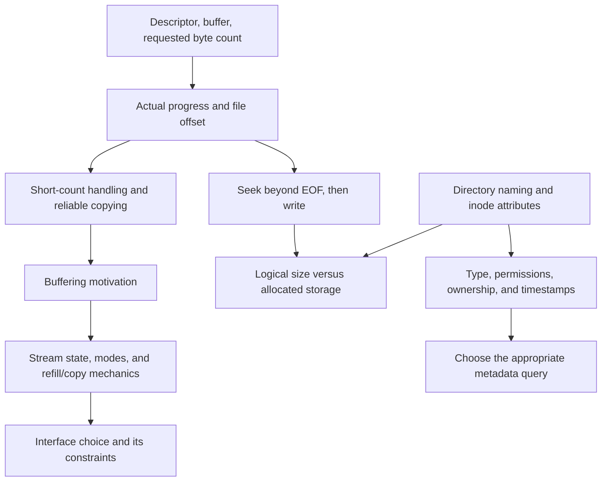

**Estimated materials review — System Programming, September 16, 2026.** No recording exists, and the actual lecture scope and spoken explanations remain unconfirmed.  
This review connects M01 slides 12–47 with M02 slides 3–8; it is a materials-based study aid, not a reconstructed lecture or transcript.

## Lecture Content and Explanation

**Estimated materials review for the unrecorded September 16 session.** The actual lecture scope, spoken explanations, and emphasis are unconfirmed. This section explains the selected materials, M01 slides 12–47 and M02 slides 3–8; citations such as `[M01 p.12]` refer to slide numbers.

### Reading and writing: a request is different from a completed transfer

[[concepts/unix-io|Unix I/O]] exposes files through an integer [[concepts/file-descriptor|File descriptor]]. Once a suitable descriptor is open, `read` transfers bytes from its input into application memory, while `write` transfers bytes from application memory to its output. The descriptor identifies the open resource; the buffer identifies the memory involved; `count` specifies the requested number of bytes. For an ordinary seekable file, the current [[concepts/file-offset|File offset]] advances by the number of bytes actually transferred. [M01 p.12]

The interfaces are:

```c
#include <unistd.h>

ssize_t read(int fd, void *buf, size_t count);
ssize_t write(int fd, const void *buf, size_t count);
```

`size_t` represents a nonnegative size. `ssize_t` is signed, allowing the result to represent either a byte count or the error value `-1`. The `const` in `write` means that the function obtains output bytes from the supplied memory rather than using that memory as its destination. [M01 p.12]

The buffer’s capacity, the requested count, and the returned count are three distinct quantities. A 512-byte array can safely receive a request for at most its available capacity, but its existence does not force every request to be 512 bytes. If only 100 bytes are requested and 100 are returned, that is a complete transfer even though the array is larger. The slide’s comparison with `sizeof(buf)` applies specifically when that expression was also the requested count. In general, compare the result with **the actual request**. [M01 p.12; M01 p.13]

For a positive-size `read` request:

| Result | Meaning | Consequence |
|---|---|---|
| `n > 0` | Exactly `n` bytes were obtained | Process those bytes; do not assume the rest of the buffer contains new input |
| `n == 0` | End of input for the file or byte-stream cases discussed here | Stop the read loop normally |
| `n == -1` | An error was reported | Examine the error and choose an appropriate response |

A zero-length request must be distinguished from these cases: a return of zero after requesting zero bytes does not establish EOF. Also, `read` does not append a C string terminator. If the program intends to treat input as text, it must reserve space and establish termination itself; arbitrary file data may contain embedded zero bytes. [M01 p.12; M01 p.13; M01 p.19; M01 p.20]

The 512-byte examples save the result before checking it:

```c
ssize_t nbytes = read(fd, buf, sizeof buf);
if (nbytes < 0) {
    perror("Cannot read from file");
    exit(EXIT_FAILURE);
}
```

Here `fd` must already be valid and `buf` must have sufficient writable storage. `perror` reports an error description associated with `errno`; it does not repair the operation. The corresponding write example additionally requires the bytes being written to have been initialized. [M01 p.13; M01 p.14]

**Slide correction:** M01 slide 14 has a missing closing parenthesis. Its intended combined assignment and test is:

```c
if ((nbytes = write(fd, buf, sizeof buf)) < 0) {
    perror("Cannot write to file");
    exit(EXIT_FAILURE);
}
```

The inner parentheses matter because the program must store the transfer result, then compare that result with zero. Even after the syntax is corrected, this fragment checks only for an error; it does not finish a partial write. [M01 p.14]

### String output: identifying the bytes that belong in the output

The first “Hello, world!” example demonstrates why byte-oriented output needs an explicit length. Its actual array is:

```c
char str[] = "Hello, world\n";
write(STDOUT_FILENO, str, strlen(str));
```

Despite the slide title, this particular string has **no exclamation mark**. It contains 13 output bytes: five letters, a comma, a space, five more letters, and a newline. The array occupies 14 bytes because its initializer also supplies the terminating `'\0'`. Thus `strlen(str)` is 13, while `sizeof str` is 14. Passing the array size would also write the terminating zero byte. [M01 p.15]

The file-output example uses `"Hello, world!\n"`, which does contain an exclamation mark: its text length is 14 and its array size is 15. These are different source examples, so their lengths should not be silently treated as identical. [M01 p.16]

[[concepts/c-string|C strings]] use a terminating zero to mark their end; [[concepts/binary-io|Binary I/O]] uses an independently known byte count. Consequently, `strlen` is appropriate for these terminated strings but is not a general file-buffer length function. An embedded zero would stop the count early, and a buffer without a terminator would not satisfy `strlen`’s input requirements. Similarly, `sizeof` measures the array only where the expression actually has array type; applying it to a pointer does not recover the allocation’s size. [M01 p.12; M01 p.15]

The next example opens its own destination:

```c
int fd = open("./output.txt",
              O_WRONLY | O_CREAT | O_APPEND,
              S_IRUSR | S_IWUSR | S_IRGRP | S_IROTH);
```

The flags combine three decisions. `O_WRONLY` requests writing, `O_CREAT` allows creation when the file is absent, and `O_APPEND` makes writes append at the end. The permission bits request owner read/write and group/other read permission when creating the file. Requested creation permissions are subject to the environment’s creation rules, including its permission mask; this call is not a claim that an existing file’s permissions are replaced. [M01 p.16]

The example checks whether `open` returned `-1`, reports failure if necessary, then performs `write` and `close`. This contrasts with the assumed already-open `STDOUT_FILENO`. The sample leaves both the transfer result and the close result unchecked, so it illustrates the lifecycle without proving that every byte reached the destination successfully. [M01 p.15; M01 p.16]

**Exam transfer — explicit representation and output length:** the 2024-2 midterm’s Q2 asks students to produce decimal text and send it to standard output without `printf`. The transferable decision is to distinguish the generated character sequence, its length, and its destination. Those output decisions connect directly to these slides; digit extraction and reversal additionally require integer arithmetic and array manipulation. The provided negative-number conversion must not be generalized without checking the minimum signed integer, whose positive magnitude may be unrepresentable in the same signed type. A single `write` also retains the partial-transfer contract explained above. [EX:sp_2024_2_midterm_q02 p.4] [EX:sp_2024_2_midterm_q02 p.5]

### Seeking: changing a position without transferring data

[[concepts/lseek|lseek]] changes the current offset of a seekable open file. It neither reads bytes into a buffer nor writes new contents. Its `whence` argument selects the reference point for the signed `offset`. [M01 p.17]

| `whence` | Reference point | New absolute position |
|---|---|---|
| `SEEK_SET` | Beginning of the file | `offset` |
| `SEEK_CUR` | Current position | `current + offset` |
| `SEEK_END` | End of the file | `file_size + offset` |

The return type is `off_t`. A successful call returns the new absolute position, while failure returns `-1`. Therefore, a successful seek to position zero is not a failure, and a successful seek does not normally return a Boolean success value. [M01 p.17]

The slide’s code:

```c
if (lseek(fd, 100, SEEK_SET) < 0) {
    perror("Cannot seek in file");
    exit(EXIT_FAILURE);
}
```

moves to byte offset 100 from the beginning. It does not mean “advance by 100 bytes,” which would require `SEEK_CUR`. The fragment presupposes a suitable descriptor; supporting `read` and `write` does not imply that a resource also supports seeking. [M01 p.18]

Seeking beyond EOF is especially important for understanding a [[concepts/sparse-file|Sparse file]]. **Seeking alone does not enlarge the file.** A subsequent write beyond the previous EOF can extend the logical size and leave an intervening region that reads as zero bytes. Whether that region occupies physical storage blocks depends on the filesystem. [M01 p.17]

For a new illustrative example, assume a regular file has size 1,024 bytes, supports seeking, and is opened without append mode. A successful seek to offset 8,192 leaves its size at 1,024. If a subsequent one-byte write succeeds there, the new size is 8,193 bytes. The intervening offsets 1,024 through 8,191 comprise 7,168 zero-reading bytes. The assumption about append mode matters: an append-mode write is directed to the file’s end rather than simply using an earlier arbitrary seek position. [M01 p.16; M01 p.17]

**Partial exam connection:** Q3(c) of the 2025-2 midterm combines seeking and overwriting with descriptor duplication. This review provides the offset arithmetic and byte-overwrite reasoning, but solving that entire question additionally requires understanding how `dup` relates two descriptors to shared open-file state. That relationship is an additional prerequisite, not something established by merely recognizing `lseek`. [EX:sp_2025_2_midterm_q03 p.7]

### Short counts: preserving progress instead of assuming completion

A [[concepts/short-count|Short count]] is a non-error transfer result smaller than the requested amount. The slide requests 512 bytes and reports 302. Those 302 bytes are real progress; the remaining 210 bytes have not been supplied by that call. A short count does not, by itself, tell the application whether another call will obtain more data. [M01 p.20]

The material lists several situations in which partial transfers can arise: nearing EOF during a read, limited filesystem space during a write, terminal line input, communication through sockets or pipes, and interruption associated with signals. These situations do not all produce an identical result. For example, a transfer may make some progress before interruption, while an operation that reports `-1` has entered its error-reporting path. Interpret the returned count first, then inspect `errno` when the operation’s failure contract makes it relevant. A stale `errno` value cannot turn a positive result into an error. [M01 p.20]

The slide prints its `ssize_t` result with `%ld`, reflecting a platform assumption that the corresponding signed type is `long`. A POSIX-oriented example should use the appropriate signed size format, such as `%zd`, rather than assuming that every platform gives `ssize_t` the same underlying type. This is a qualification of the sample’s formatting, not a change to the byte-count principle. [M01 p.20]

The one-byte copy example makes the basic data path visible:

```c
char c;
while (read(STDIN_FILENO, &c, 1) > 0) {
    write(STDOUT_FILENO, &c, 1);
}
return EXIT_SUCCESS;
```

`c` temporarily holds one byte read from standard input before that byte is sent to standard output. The loop exits when `read` returns either zero or a negative value, so its termination alone does not distinguish EOF from an error. It also ignores every write result and returns success unconditionally afterward. The source is therefore a small transfer illustration, not a complete reliable copy utility. [M01 p.19]

The larger copy example specifies a useful operation: take an input file, an output file, an input offset, and a byte limit; open the files; seek within the input; append copied bytes to the output; then close both files. Its displayed request starts at input offset 400,000 and asks to copy 100,000 bytes. The final read requests 34,464 bytes but obtains 27,776. [M01 p.21]

The accounting is:

$$
\text{earlier progress}=100000-34464=65536,
$$

$$
\text{total copied}=65536+27776=93312,
$$

$$
\text{shortfall}=100000-93312=6688.
$$

The requested amount and the copied amount answer different questions. The display establishes partial completion and reports it explicitly; it does not establish why that short read occurred, nor does it reveal the complete copying implementation. [M01 p.21]

For a buffer containing `total` bytes, reliable partial-write reasoning maintains this invariant:

> Bytes before `done` have already been transferred; the next attempt starts at `buffer + done` and requests `total - done` bytes.

After a positive result `n`, increase `done` by `n`. Restarting from the beginning duplicates data; advancing by the requested amount instead of the returned amount skips data. A zero result for a positive remaining write request must not cause an endless loop that makes no progress. [M01 p.12; M01 p.20; M01 p.21]

**Exam transfer — maintaining the remaining suffix:** the ordinary binary-output portion of the 2025-1 midterm’s Q3 tests precisely this combination of byte length, pointer offset, partial progress, and interrupted-call handling. Its useful connection is the loop invariant above. An interruption reported as `-1` with `EINTR` can be handled by retrying without advancing the offset; a positive short result advances the offset by the actual progress. The exam’s separate byte-to-text conversion component requires further representation work. These are bounded implementation connections, not evidence that every part of that question belongs to the estimated September 16 scope. [EX:sp_2025_1_midterm_q03 p.7] [EX:sp_2025_1_midterm_q03 p.8] [EX:sp_2025_1_midterm_q03 p.9]

### Why Standard I/O adds buffering and formatting

Character-oriented programs often want one character or one line at a time. Calling Unix `read` and `write` for each individual byte makes that convenient application granularity expensive at the system-call boundary. [[concepts/standard-io|Standard I/O]] addresses this by allowing small application operations to share larger underlying transfers. [M01 p.23; M01 p.24; M01 p.25]

The introductory code changes the interface from an integer descriptor to a [[concepts/file-stream|FILE stream]]:

```c
FILE *f = fopen("standard.io", "r+");
```

`"r+"` requests an update stream for reading and writing an existing file. `FILE *` represents library-managed stream state; it is not simply another spelling of an integer descriptor. This declaration illustrates the interface, without demonstrating a successful opening or any completed I/O. [M01 p.22]

The slides give two separate motivations:

1. **Reduce transfer overhead.** Keep a user-space buffer so many small operations can be serviced with fewer underlying `read` or `write` calls.
2. **Provide formatted I/O.** Use functions such as `fprintf` and `fscanf` to convert between textual representations and program values.

Formatting and buffering are independent features. Selecting unbuffered operation does not remove formatting support, and transferring a block with `fread` does not imply parsing a textual number. [M01 p.24; M01 p.25]

The displayed 10 MiB byte-by-byte copy measurements are:

| Displayed measurement | Unix I/O implementation | Standard I/O implementation |
|---|---:|---:|
| Elapsed time, `real` | 2.679 s | 0.261 s |
| User CPU time, `user` | 0.363 s | 0.261 s |
| Kernel CPU time, `sys` | 2.316 s | 0.000 s |

The striking feature is the kernel-time component associated with repeated tiny system calls. The printed `0.000 s` does not prove that Standard I/O made no system calls; it is a measurement at the displayed precision. Likewise, the slide’s “more than 10,000 cycles” description is an illustrative cost statement, not a guaranteed current-machine constant. [M01 p.23]

**Exam transfer — explain the mechanism behind a timing difference:** Q3(d) of the 2025-2 midterm compares a character-at-a-time Standard I/O loop with a one-byte-at-a-time Unix I/O loop. The relevant reasoning is to count boundary crossings and explain how buffering combines transfers. Under successful one-byte transfers, copying $N$ bytes with the direct loop requires approximately $2N$ transfer calls, plus the read that discovers EOF. The conclusion concerns those implementations and their buffering conditions; it does not establish that Unix I/O is always slower than Standard I/O. [EX:sp_2025_2_midterm_q03 p.8]

### The library and kernel perform different parts of I/O

The layer diagram appears as a miniature on slide 38 and in expanded form on slide 39. It places the application and the C standard library in [[concepts/user-space|User space]], above a boundary separating them from [[concepts/kernel-space|Kernel space]]. Its arrows show two application paths. [M01 p.38; M01 p.39]

Along the library path, the application calls functions such as `fopen`, `fread`, `fwrite`, `fseek`, `fflush`, or `fprintf`. The library maintains stream state and invokes underlying Unix I/O when necessary. Along the direct path, the application uses operations such as `open`, `read`, `write`, `lseek`, and `close` without the Standard I/O stream layer. Both paths reach the system-call interface, after which the kernel manages the resource and its interaction with storage. [M01 p.39]

The diagram explains why a call to `printf` need not correspond to an immediate `write`. Formatting and buffer updates can happen entirely in user space. It also explains why using Standard I/O does not eliminate kernel involvement: eventually, data must cross the interface when the library fills or drains a buffer. The arrows depict architectural relationships, not a claim that every library call takes every step. [M01 p.25; M01 p.39]

Three kinds of state must remain distinct:

| State | Location and role |
|---|---|
| Application data and the `FILE` buffer | User-space storage used by the program and its library |
| Open-file position and descriptor-related state | Kernel-managed state governing underlying file access |
| Disk block cache | Kernel-side cached file data, distinct from the Standard I/O buffer |

Removing or flushing one layer’s buffer does not imply that all other layers have disappeared or completed their work. This distinction becomes essential when interpreting both read-ahead and output flushing. [M01 p.39; M01 p.40]

### Read-ahead separates stream consumption from the kernel offset

[[concepts/read-ahead|Read-ahead]] allows the library to fetch a block before the application has requested every individual byte in it. In slide 26, a Unix `read` has obtained bytes $B_0$ through $B_{k-1}$ into the stream’s user-space buffer. The kernel’s current file position is now at $B_k$, the next byte beyond that transferred block. [M01 p.26]

The application has consumed only part of the buffered block. Its next stream byte is $B_s$, with $s<k$. Thus the two position arrows in the figure refer to different events:

- The **kernel file position** tracks how far underlying reads have advanced.
- The **stream consumption position** tracks how far the application has consumed the bytes already available in its library buffer.

Subsequent small input operations can advance the second position without advancing the first. Another underlying read becomes necessary when the buffered input is exhausted. [M01 p.26]

Slide 40 gives concrete state labels: `bufpos = 378`, `fd = 4`, kernel `pos = 1024`, and `refcnt = 1`. The stream’s descriptor leads through process A’s descriptor table to open-file state, which in turn connects to file attributes and cached storage data. The user-space buffer and the kernel disk block cache are drawn separately. [M01 p.40]

Under the illustrated first-block interpretation, 1,024 bytes have been fetched and 378 consumed, leaving:

$$
1024-378=646
$$

bytes available to the application without another underlying read. The alphabet fragments inside the blocks identify regions schematically; they do not specify a complete actual file. Similarly, the displayed `fopen("input.txt", "r")` line does not establish that `fopen` itself immediately performed the depicted read-ahead. The figure represents a buffered state during use. [M01 p.40]

A practical misconception is to assume that an underlying descriptor always sits exactly where the next Standard I/O input operation will obtain data. Once read-ahead exists, that assumption fails. Mixing direct descriptor operations with stream operations therefore requires deliberate coordination of the two interfaces’ state. [M01 p.26; M01 p.40]

### Stream operations have their own lifecycle, units, and status

The Standard I/O API table groups operations around a `FILE *` stream. Its purpose is broader than replacing each Unix function with a similarly named function. The library also manages buffering and records stream status. [M01 p.27]

| Task | Main interface | Related names shown in the slides |
|---|---|---|
| Open a stream | `fopen(path, mode)` | `fdopen`, `freopen` |
| Transfer blocks | `fread`, `fwrite` | Element size and element count are separate arguments |
| Change or inspect position | `fseek`, `ftell` | `rewind`, `fsetpos`, `fgetpos` |
| Close a stream | `fclose` | `fcloseall` is also listed |
| Pass buffered output onward | `fflush` | Operates on stream buffering |
| Inspect state | `feof`, `ferror` | Distinguish EOF and error indicators |
| Obtain the underlying descriptor | `fileno` | Returns an integer descriptor |

`fdopen` associates a stream with an existing descriptor; `freopen` reopens or redirects a stream. `fgetpos` and `fsetpos` provide a save-and-restore approach to stream position, while `rewind` returns to the beginning. The table includes interfaces with different portability status: appearance in the same table does not make every name, such as `fcloseall`, an ISO C facility available everywhere. [M01 p.27]

For block transfer, the signatures separate the size of each element from the number of elements:

```c
size_t fread(void *ptr, size_t size, size_t nmemb, FILE *stream);
size_t fwrite(const void *ptr, size_t size, size_t nmemb, FILE *stream);
```

The requested byte quantity is `size * nmemb`, but the return value counts **complete elements**, not bytes. For example, requesting three elements of four bytes each requests 12 bytes; a successful full transfer returns `3`. Choosing `size == 1` makes element counts and byte counts numerically equal. That convenient special case must not be generalized to other element sizes. [M01 p.27]

A short `fread` result still requires interpretation. `feof` checks whether the stream’s EOF indicator has been set; `ferror` checks its error indicator. Neither predicts that a future operation will succeed. The useful order is to attempt the operation, inspect its result, and then inspect the relevant stream indicators if completion was short. [M01 p.27]

Position APIs also differ in their return contracts. `fseek` reports success or failure; `ftell` obtains the current stream position. This is different from `lseek`, whose successful return is itself the resulting absolute offset. Remembering only that the names contain “seek” obscures this distinction. [M01 p.17; M01 p.27]

### Character, line, and formatted I/O solve different representation problems

The next API table separates character or line handling from format-directed conversion. [[concepts/formatted-io|Formatted I/O]] interprets a format string; character and line interfaces primarily move characters or strings without that conversion step. [M01 p.28]

| Purpose | Representative operation | Related interfaces and distinctions |
|---|---|---|
| Read a character or line | `fgets(s, size, stream)` | `fgetc`, `getc`, `getchar`; `ungetc` pushes a character back into an input stream |
| Read formatted values | `fscanf(stream, format, ...)` | `scanf` uses standard input; `sscanf` obtains input from a string; `vscanf` belongs to the variable-argument-list family |
| Write a character or string | `fputs(s, stream)` | `fputc`, `putc`, `putchar`; `puts` also supplies a newline |
| Write formatted values | `fprintf(stream, format, ...)` | `printf`, `dprintf`, `sprintf`, `snprintf`, `vprintf` |

`fgets` receives a destination size, whereas the legacy `gets` interface cannot be given a destination bound. The rendered slide visibly strikes out `gets`; that exclusion must be retained. It is an unsafe obsolete interface, not a recommended alternative to `fgets`. Also, reading a line-sized chunk does not guarantee that an arbitrarily long input line fits into one call. [M01 p.28]

**Slide corrections:** the table gives `fputs` the return type `char`; its actual return type is `int`. It also lists `sprint`, which should be read as the intended `sprintf`. These are corrections to the printed API table. The destinations still differ: `fprintf` uses a stream, `dprintf` uses a descriptor, and `sprintf` or `snprintf` writes a representation into memory. `snprintf` additionally accepts a destination-size bound. [M01 p.28]

A related character-input trap is storing `getchar`’s result immediately in `char`. Character input functions must communicate both an input-byte value and the distinct `EOF` result, so test the `int` result before narrowing it. A character’s value, its printable appearance, and the text used to describe that value are separate things. [M01 p.28]

**Exam transfer — representing arbitrary bytes:** the byte-conversion part of the 2025-1 midterm’s Q3 asks for a textual representation of byte values. Its relevant demand is to preserve values that may be zero or nonprinting. Printing a character directly and printing a numeric literal describing that character produce different output. This connects to the API distinctions above, while hexadecimal literal syntax remains an additional representation prerequisite. [EX:sp_2025_1_midterm_q03 p.9] [EX:sp_2025_1_midterm_q03 p.10]

### Standard streams and the two “Hello” output paths

The stream names `stdin`, `stdout`, and `stderr` correspond to the conventional Unix standard descriptors, but they expose different interfaces. [M01 p.29]

| Stream interface | Descriptor interface | Conventional role |
|---|---|---|
| `stdin` | `STDIN_FILENO` | Standard input |
| `stdout` | `STDOUT_FILENO` | Standard output |
| `stderr` | `STDERR_FILENO` | Standard error |

Use the `FILE *` stream with Standard I/O functions and the integer descriptor with Unix I/O functions. The conceptual declarations shown on slide 29 explain the stream types; application code obtains these interfaces through the proper headers rather than assuming a particular library’s internal declarations. [M01 p.29]

The slide’s first stream example writes directly through an explicit output stream:

```c
fprintf(stdout, "Hello, world\n");
```

The next example compares:

```c
fprintf(stdout, "%s", str);
printf("%s", str);
```

`fprintf` names the destination; `printf` implicitly uses `stdout`. The `%s` conversion obtains the text from a terminated string, so the caller does not separately supply the byte count as it does with `write`. If both displayed calls execute, they output the string **twice**. Their juxtaposition illustrates alternative interfaces, but the shown program actually contains both calls. [M01 p.29; M01 p.30]

For file output, the stream example uses:

```c
FILE *out = fopen("./output.txt", "a+");
```

`"a+"` allows reading and appending, creating the file if necessary. The sample checks for a `NULL` result, uses `fprintf`, and then calls `fclose`. Standard I/O therefore still requires an explicit lifecycle for a file the program opens itself. It does not make open failures disappear. [M01 p.31]

**Slide correction:** the `fprintf` call on slide 31 contains typographic quotation marks. The C spelling is:

```c
fprintf(out, "%s", str);
```

The example omits result checking for both output and closure. That matters especially with buffering: an apparent successful handoff to a stream can precede the underlying transfer, and a later flush or close can report failure. Reading and writing through an update stream also involves sequencing requirements beyond merely choosing a mode containing `+`. [M01 p.27; M01 p.31; M01 p.35]

### Buffering modes determine when output leaves the stream

[[concepts/buffering|Buffering]] combines operations, but the chosen mode changes the timing of that combination. The material distinguishes three modes and notes that defaults depend on the underlying destination. [M01 p.33]

| Mode | Constant | Core behavior | Typical situation in the slides |
|---|---|---|---|
| Fully buffered | `_IOFBF` | Accumulate output for block transfer | Ordinary file output |
| Line buffered | `_IOLBF` | A newline can trigger delivery, alongside other triggers | Terminal output |
| Unbuffered | `_IONBF` | Do not retain output waiting for a stdio buffer to fill | Standard error or an explicit request |

`setvbuf` can select a mode. Its setup belongs before ordinary I/O on that stream; the trace example places it first. A destination’s default and a mode deliberately selected by the program must be distinguished. [M01 p.33; M01 p.37]

For fully buffered input, the simple model is **refill when empty**. The application first consumes bytes already available in the library buffer; when more are needed, the library performs underlying input. For fully buffered output, the corresponding model is **drain when full**, with explicit `fflush` available to request delivery earlier. These are useful conceptual rules rather than a specification of every optimization a library may use for large transfers. [M01 p.34]

The diagram on slide 32 shows separate calls for `"h"`, `"e"`, `"l"`, `"l"`, `"o"`, and `"\n"` feeding six consecutive positions in one buffer. The downward arrow then represents those six bytes being sent through a call such as `write(1, buf, 6)`. The central idea is aggregation: six application-level calls need not produce six system calls. The diagram’s newline-trigger explanation belongs to line buffering; it is not a rule that every newline immediately flushes every output stream. [M01 p.32; M01 p.33]

For line-buffered output, the slide lists newline, buffer exhaustion, input-related interaction, explicit `fflush`, stream closure, and process termination as delivery occasions. Several qualifications are essential:

- A full buffer can be flushed even without a newline.
- Input-related flushing depends on the relevant stream and input conditions; the slide does not specify a rule that every input call flushes all output.
- Normal termination that performs Standard I/O cleanup differs from abnormal termination or termination paths that bypass that cleanup.
- A newline in a fully buffered file stream does not, by itself, impose line-buffered behavior. [M01 p.35]

[[concepts/flushing|fflush]] moves pending output from the Standard I/O layer to the underlying output mechanism. The slide describes this informally as writing the buffer to disk, but **successful flushing is not a guarantee of durable physical storage**. The kernel and storage layers remain distinct from the user-space stream buffer. [M01 p.34; M01 p.39; M01 p.40]

Unbuffered operation still uses the `FILE` interface and still permits formatting. The slide presents `stderr` as unbuffered in the illustrated Unix environment. “Immediate” here concerns avoiding stdio’s accumulation delay: it does not guarantee that the endpoint is a terminal, that the operation succeeds, or that lower layers have no buffering. [M01 p.36]

**Exam transfer — explaining delayed diagnostics:** Q3(d–e) of the 2024-2 midterm asks about diagnostic messages, newline behavior after redirection, and Standard I/O’s benefits. The approach is to identify the destination and buffering mode before reasoning about visibility. A message ending in a newline can still remain buffered when `stdout` is fully buffered. Using the diagnostic stream addresses its intended role and usual buffering behavior, but does not establish durable storage or immunity from output errors. [EX:sp_2024_2_midterm_q03 p.7]

### Reading the supplied system-call trace

The `strace` example explicitly selects line buffering and then makes several output calls. With typographic quotation marks normalized to ordinary C syntax, the relevant sequence is:

```c
setvbuf(stdout, NULL, _IOLBF, 0);

printf("hello\n");

printf("hello");
printf(",");
fflush(stdout);

printf("wor");
printf("ld");
printf("\n");
```

This is the slide’s teaching sequence; it still omits result checking. Its displayed trace contains three writes, each of six bytes. [M01 p.37]

| Output operations | Trigger in the displayed example | Bytes in the corresponding write |
|---|---|---|
| `printf("hello\n")` | Newline in a line-buffered stream | `hello\n` |
| `printf("hello")`, then `printf(",")` | Explicit `fflush(stdout)` | `hello,` |
| `printf("wor")`, `printf("ld")`, then newline | Newline in a line-buffered stream | `world\n` |

The second group is particularly revealing: neither of its two `printf` calls contains a newline, but the explicit flush sends their combined contents onward. The final group shows that the buffer preserves order across calls, combining `"wor"` and `"ld"` before the newline causes delivery. [M01 p.37]

The accompanying command, normalized from its printed dash, is `strace -o log ./bufferedio x`; the subsequent `cat log` displays the recorded calls. `execve` and `exit_group` also appear because tracing can show process startup and termination as well as I/O. The argument `x` is present in the command but unused by the displayed program body. These are observations printed in the material, not a newly executed experiment or recovered September 16 demonstration. [M01 p.37]

### Building a stream: what the `fopen` pseudocode is modeling

The stream implementation sketches explain how the earlier interface can be built over Unix I/O. They use a simplified internal structure containing a descriptor, a buffer pointer, a consumption position, and a count of available bytes. Those teaching fields are not a portable public layout of the real `FILE` type. [M01 p.41]

The `fopen` sketch performs these operations in order:

1. Call `open(path, ...)` to obtain an underlying descriptor.
2. Return `NULL` if opening fails.
3. Allocate the stream object.
4. Record its descriptor.
5. Allocate a `BUFSIZE` buffer.
6. Initialize `bufpos` and `bufsize` to zero.
7. Return the stream pointer. [M01 p.41]

The two size concepts deserve attention. `BUFSIZE` is the allocated buffer capacity. The sketch’s `bufsize` is the amount of currently available input data. A newly allocated buffer can therefore have positive capacity and zero available data. Setting `bufsize = 0` does not mean that no memory was allocated; it means that no input bytes have yet been made available there. [M01 p.41; M01 p.42]

The sketch explicitly omits error checking. A complete implementation would need to handle failure of either allocation and release resources already acquired on a later failure. It would also need to translate the textual opening mode into correct lower-level flags and maintain additional stream state. Merely checking the initial `open` result does not cover the subsequent failure paths. [M01 p.41]

### Refilling, consuming, and closing are different state transitions

The `refill_buffer` sketch issues a `read` for up to `BUFSIZE` bytes, resets `bufpos` to zero, and sets `bufsize` to the positive read result or to zero otherwise. It returns the original read result. Thus EOF and error can both leave no buffered data, while remaining distinguishable through that returned result. The original sketch stores this result in `int`; a concrete implementation must respect the actual `ssize_t` transfer-result type and its range. [M01 p.42]

The helper called `slide_buffer` performs:

```c
stream->bufpos  += len;
stream->bufsize -= len;
```

Its name does not imply that it physically shifts the remaining bytes in memory. It advances the index and reduces the available-byte count. Before doing so, it must establish that `len` does not exceed the available amount; otherwise the state becomes invalid, and an unsigned count could wrap. [M01 p.42]

For example, suppose the buffer contains eight valid bytes and its current position is zero. Consuming three sets `bufpos` to 3 and leaves `bufsize` at 5. The next five bytes are already present; another read is unnecessary until those bytes are exhausted or another operation changes the situation. This is a new numerical illustration of the source’s state updates. [M01 p.42]

The `fclose` sketch closes the descriptor, frees the buffer, frees the stream object, and always returns zero. That sequence demonstrates resource ownership, but it omits a crucial behavior already established by the buffering slides: pending output must be dealt with when closing an output stream. It also omits error reporting. Copying this sketch as a real `fclose` replacement would therefore discard essential semantics. [M01 p.35; M01 p.42]

The `fileno` sketch simply returns the descriptor stored in the stream. It illustrates how the interfaces are related; obtaining that descriptor does not automatically synchronize direct descriptor operations with buffered stream state. [M01 p.27; M01 p.40; M01 p.42]

### Crossing buffer boundaries in the `fread` pseudocode

The `fread` sketch begins by computing a requested byte total, `size * nmemb`, and setting `read_bytes` to zero. While bytes remain to be supplied, it refills an empty buffer, copies an available chunk, and updates both the request and stream state. [M01 p.43]

The key selection is:

$$
\text{copy\_bytes}
=
\min(\text{remaining request},\ \text{available buffered bytes}).
$$

This protects two independent boundaries. The copy must not exceed what the caller still requested, and it must not exceed what the stream currently holds. The destination starts at the already-completed offset, while the source starts at the buffer’s current consumption position. After copying, the algorithm increases completed bytes, decreases requested bytes, and advances the buffer state. [M01 p.43]

Consider a new illustrative state with three buffered bytes remaining and an application request for seven bytes. The first iteration copies three, leaving four requested and none buffered. Suppose refill then obtains eight bytes. The next iteration copies four, completing the request and leaving four available for a later call. This example shows why the loop needs both counters: an application request and a refill block need not end at the same boundary. [M01 p.42; M01 p.43]

Several details prevent the printed sketch from being a conforming implementation:

- It returns `read_bytes`, although real `fread` returns the number of complete elements. Those quantities coincide only when `size == 1`.
- Earlier sketches use `stream->buffer`, while this one uses `stream->buf`.
- Arithmetic directly on `void *` is not portable ISO C byte arithmetic; a concrete byte pointer is needed.
- `size * nmemb`, copy-size types, allocation boundaries, and zero-size cases need deliberate handling.
- EOF and error indicators require separate state handling, rather than merely returning after any refill result at or below zero. [M01 p.27; M01 p.41; M01 p.42; M01 p.43]

The algorithm remains useful because it exposes the refill-and-copy mechanism. Its usefulness depends on keeping that mechanism separate from the precise external API contract.

### Choosing an interface requires both cost and correctness reasoning

Unix I/O offers direct control over descriptors, transfers, positioning, and metadata operations. The material describes it as a general, low-overhead foundation for the higher-level packages being discussed. Its costs move into application code: partial transfers must be handled correctly, and efficient line-oriented input usually requires buffering logic. [M01 p.45]

“Low overhead” at the interface level does not mean that millions of tiny calls produce a fast program. The byte-copy comparison already demonstrated that a higher-level interface can reduce total overhead by reducing the number of kernel crossings. Conversely, a carefully designed block-oriented Unix I/O implementation is a different comparison from the one-byte sample. [M01 p.23; M01 p.45]

Standard I/O provides useful buffering, formatted conversion, and handling of underlying partial transfers. Its automatic handling of short counts does not promise that every `fread` or `fwrite` request completes: EOF and errors remain observable at the stream interface, so results and status still matter. Standard I/O also does not itself provide the file-metadata interface introduced next. [M01 p.27; M01 p.46]

The slides introduce [[concepts/async-signal-safety|Async-signal safety]] as an interface-selection constraint. Standard I/O functions are unsuitable for general use inside signal handlers, whereas appropriate async-signal-safe operations from the Unix interface can be used subject to their contracts. The broad slide wording must not be read as permission to treat every operating-system or library function as signal-safe. Detailed signal-handler design is a later prerequisite, not content established by this preview. [M01 p.45; M01 p.46; M01 p.47]

The socket warning is also a qualified design recommendation. The material warns that stream restrictions interact poorly with socket use and refers onward for details. This does not mean that associating a stream with a socket is physically impossible, nor does the selected material supply a complete network-I/O programming model. [M01 p.46]

The stated selection principle is to use the highest-level interface that satisfies the application’s needs. Standard I/O is a useful default for ordinary disk and terminal work; specific safety constraints or carefully justified performance requirements can call for lower-level operations. An interface choice should explain the required behavior, transfer pattern, and constraints rather than relying on “higher level is slow” or “buffered means always correct.” [M01 p.47]

### File metadata describes a file without being its contents

[[concepts/file-metadata|File metadata]] is information about a file: its type, size, ownership, permissions, and timestamps, among other attributes. Reading a file’s data bytes and asking about those attributes are different operations. A program can need the size or file type without wanting to interpret the file’s contents. [M02 p.4; M02 p.5]

The directory–[[concepts/inode|Inode]] distinction explains why file names should not be treated as an ordinary field inside the file’s content or inode. In the slides’ Unix filesystem model, the containing directory stores the filename association, while the inode holds the file’s principal attributes. The kernel manages these related structures. The slide’s “everything else” wording expresses this introductory model; it should not be expanded into a universal statement about every extended attribute and every filesystem implementation. [M02 p.4]

This separation also explains why a metadata result need not contain a “filename” member. A pathname is one way to find the object whose metadata is requested; it is not the same thing as the object’s entire identity or attribute record. [M02 p.4; M02 p.5; M02 p.8]

**Partial exam connection:** the 2025-2 midterm’s Q3(a–b) requires reasoning about hard links, symbolic links, and directory references. The name/inode distinction and the meaning of `st_nlink` provide a foundation, but the complete questions additionally require link semantics and the directory-reference model. This review does not turn those additional rules into confirmed September 16 material. [EX:sp_2025_2_midterm_q03 p.7]

### Reading `struct stat` as several kinds of information

The declaration on M02 slide 3 is substantive: it introduces the fields later explained on slide 5. The [[concepts/stat-family|stat]] family obtains file metadata in a `struct stat`, whose members answer different questions. [M02 p.3; M02 p.5]

| Field | Meaning in the material | Distinction to preserve |
|---|---|---|
| `st_dev` | Device containing the file | Different from a special file’s represented device |
| `st_ino` | Inode number | Not a filename |
| `st_mode` | File type and permission information | Contains multiple categories of bits |
| `st_nlink` | Number of hard links | Not a count of open descriptors |
| `st_uid` | Owner’s user ID | Numeric identifier, not directly a displayed name |
| `st_gid` | Owner’s group ID | Numeric group identifier |
| `st_rdev` | Device identifier for an applicable special file | Different role from `st_dev` |
| `st_size` | Logical file size in bytes | Different from allocated storage |
| `st_blksize` | Preferred block size for filesystem I/O | Different from the unit used by `st_blocks` |
| `st_blocks` | Allocated storage in 512-byte units in the presented Linux model | A block count, not a byte count |
| `st_atim`, `st_mtim`, `st_ctim` | Access, content-modification, and status-change timestamps | Different events, discussed below |

The source declarations differ: slide 3 uses `blksize_t` and `blkcnt_t`, while slide 5 writes `unsigned long` for the corresponding members. Treat the slides as a field guide rather than combining their declarations into a universal ABI. Real code should use the structure supplied by the target environment’s headers. [M02 p.3; M02 p.5]

The three size-related fields are especially easy to confuse. `st_size` tells how far the logical byte sequence extends. `st_blocks` describes allocated storage in its specified units. `st_blksize` is an I/O-size hint; it neither redefines the unit of `st_blocks` nor declares that the application must issue transfers of exactly that size. [M02 p.5; M02 p.6]

### File type, permission bits, and ownership need different tests

The material shows `stat("filename", &sb)` as the means of obtaining a `struct stat` result. A concrete program must first establish that the call succeeded before interpreting `sb`; a failed call does not provide a valid fresh metadata result to inspect. [M02 p.6; M02 p.8]

[[concepts/file-mode|File mode]] combines type information and permission bits in `st_mode`. The following expressions therefore answer different questions:

```c
S_ISREG(sb.st_mode)
sb.st_mode & S_IRUSR
```

`S_ISREG` tests whether the encoded file type is a regular file. The bitwise-AND expression tests whether the owner-read permission bit is set. Comparing the whole mode value with `S_IRUSR` would be wrong because other permission bits and the type bits can be present simultaneously. [M02 p.6]

The `S_IR*`, `S_IW*`, and `S_IX*` mask families concern read, write, and execute permissions for the relevant user categories. A positive owner-read-bit test describes one stored permission bit; it is not, by itself, a complete authorization decision for an arbitrary current process. File type, ownership, and permission categories should remain separate in the explanation. [M02 p.5; M02 p.6]

The owner and group fields are numerical IDs. The slide connects `st_uid` to `getpwuid` and `st_gid` to `getgrgid` for resolving associated user or group information. These lookup functions do not turn the numeric ID into a permission test, and the lookup’s availability must be considered separately from the successful metadata query. [M02 p.6]

### Sparse files separate logical extent from allocated storage

A [[concepts/sparse-file|Sparse file]] can present a large logical byte sequence while allocating less storage for regions that read as zeros. The seek-beyond-EOF example provides the creation intuition; the `struct stat` fields provide a way to examine the difference. [M01 p.17; M02 p.6]

The slide compares:

$$
\frac{\texttt{st\_size}}{512}>\texttt{st\_blocks}.
$$

The division aligns the logical byte size with the stated 512-byte allocation units. Without that conversion, comparing a byte count directly with a block count would mix units. [M02 p.6]

For a new illustrative result, suppose `st_size` is 8,192 and `st_blocks` is 8. The logical extent is 16 units of 512 bytes, while reported allocated storage is:

$$
8\times512=4096\text{ bytes}.
$$

That difference is consistent with the hole-based explanation. The preferred I/O size in `st_blksize` is not needed for this calculation. [M02 p.5; M02 p.6]

Two limitations prevent this from becoming an overly broad definition. First, a file full of explicitly stored zero bytes need not be sparse: byte values and physical allocation are separate properties. Second, the comparison is a useful heuristic in the slide’s filesystem model, not a complete characterization of every compressed, shared, or otherwise specially allocated file. Integer division and allocation granularity also matter near boundaries. [M01 p.17; M02 p.6]

The inspected exam candidates do not provide a direct matched question for this sparse-file calculation. Its explanation remains part of the primary materials regardless of that absence.

### Access time, modification time, and status-change time identify different events

[[concepts/file-timestamps|File timestamps]] must be read by meaning rather than by guessing from their abbreviations. The materials distinguish:

| Timestamp | Event represented |
|---|---|
| `atime` / `st_atim` | File access |
| `mtime` / `st_mtim` | Modification of file data |
| `ctime` / `st_ctim` | Change to file status or inode metadata |

In particular, **`ctime` is not creation time**. Changing permissions is a useful conceptual example of a metadata change that need not modify the file’s data bytes. A content write can also entail metadata changes, so the categories do not imply that only one timestamp can change during an operation. [M02 p.5; M02 p.7]

**Slide correction:** slide 5 incorrectly comments `st_mtim` as the time of last access. The same slide correctly describes `st_mtime` as modification time, and slide 7 explicitly distinguishes modification from access. Read `st_mtim` as the content-modification timestamp. Similarly, slide 4’s broad access-time “read/write” wording should not be used to claim identical timestamp-update rules for reads and writes. [M02 p.4; M02 p.5; M02 p.7]

The `st_*tim` fields use `struct timespec`, which represents seconds and a nanosecond component. The slides associate these finer representations with Linux 2.6-era support and also show the seconds-based `st_*time` interfaces. The older-looking names do not simply cease to exist when a finer representation is available, and their spelling does not imply that every implementation stores independent duplicate fields. [M02 p.5; M02 p.7]

Representation precision is different from the filesystem’s actual timestamp resolution and update policy. A nanosecond field does not guarantee that every file operation produces a distinct nanosecond-accurate timestamp. Access-time updates may be suppressed or reduced for performance; the material gives `noatime` as an example. Therefore, an unchanged access timestamp does not conclusively prove that no access occurred. [M02 p.7]

Creation or birth time is a separate attribute. The material notes that traditional Unix timestamp sets did not generally provide it, while some newer filesystems support it through extended status interfaces such as `statx`. Support and availability must be checked; relabeling `ctime` as creation time does not fill that gap. [M02 p.7; M02 p.8]

No directly matched timestamp question was identified in the supplied candidate index. These distinctions remain necessary for understanding the selected metadata slides.

### Choosing a metadata query: pathname, descriptor, directory context, and extended fields

The metadata API table varies two things: how the target is identified and what result is requested. Although these interfaces are callable through C library declarations, they belong to the Unix/Linux metadata interface rather than the `FILE`-based Standard I/O operations. The heading should not be read as making all of them ISO C functions. [M02 p.5; M02 p.8]

| Interface | Target and result | Reason to distinguish it |
|---|---|---|
| `stat(pathname, &sb)` | A pathname; result in `struct stat` | Ordinary pathname-based metadata query |
| `lstat(pathname, &sb)` | A pathname; result in `struct stat` | Inspects a final symbolic link itself rather than following it to its target |
| `fstat(fd, &sb)` | An already-open descriptor | Queries the object referred to by that descriptor |
| `fstatat(dirfd, pathname, &sb, flags)` | A pathname interpreted with directory context and flags | Useful for directory-relative lookup and selected lookup behavior |
| `statx(dirfd, pathname, flags, mask, &sx)` | Directory/path targeting plus requested extended fields | Returns extended status through `struct statx` |

For [[concepts/symbolic-link|Symbolic link]] handling, `stat` and `lstat` can answer different questions about the same pathname spelling. One asks about the resolved target; the other can ask about the link object at the final pathname component. The slide’s short “does not follow symbolic links” description should not be expanded into a claim that no symbolic link in any intermediate pathname component is ever traversed. [M02 p.8]

`fstat` avoids replacing an existing descriptor with a fresh pathname lookup merely to obtain metadata. The descriptor and pathname forms therefore express different ways of selecting the object, even when they happen to refer to the same file in a simple example. [M02 p.8]

For `fstatat`, directory context and `flags` are distinct arguments. For `statx`, the request `mask` is distinct again: flags govern aspects of the lookup or operation, while the mask requests categories of extended information. A mask does not guarantee that an unsupported attribute, such as birth time on a particular filesystem, will become available; the returned availability information must also be respected. The selected table introduces these distinctions without supplying a complete catalogue of flags, masks, or failure cases. [M02 p.7; M02 p.8]

## Lecture Flow and Connections

### From transferring bytes to understanding the state behind them

The selected materials develop three connected questions: **How much data actually moved? Where is the remaining data? What information describes the file itself?** These questions organize the content and the practice below; they do not establish the September 16 teaching sequence.

| Objectives | Conceptual connection | Primary material |
|---|---|---|
| LO01–LO02 | [[concepts/unix-io\|Unix I/O]] connects a [[concepts/file-descriptor\|File descriptor]], a memory buffer, and an explicit byte request. The two string-output examples separate text length from array size and already-open output from an explicitly opened file. | [M01 p.12] [M01 p.13] [M01 p.14] [M01 p.15] [M01 p.16] |
| LO03–LO05 | [[concepts/file-offset\|File offset]] reasoning explains seeking; [[concepts/short-count\|Short count]] reasoning explains incomplete transfers. The one-byte loop and larger copy report make the difference between requested and completed work visible. | [M01 p.17] [M01 p.18] [M01 p.19] [M01 p.20] [M01 p.21] |
| LO06, LO15 | [[concepts/standard-io\|Standard I/O]] adds buffering and formatting above the system-call interface. The timing example motivates the layer diagram: more application calls need not mean more kernel crossings. | [M01 p.22] [M01 p.23] [M01 p.24] [M01 p.25] [M01 p.38] [M01 p.39] |
| LO07 | [[concepts/read-ahead\|Read-ahead]] explains why the next application byte can precede the kernel’s current offset. Both position diagrams distinguish user-space stream state from kernel state and the disk block cache. | [M01 p.26] [M01 p.40] |
| LO08–LO10 | A [[concepts/file-stream\|FILE stream]] has its own lifecycle, transfer units, status indicators, and formatting interfaces. The Standard I/O “Hello” examples retain explicit opening, closing, and failure concerns. | [M01 p.27] [M01 p.28] [M01 p.29] [M01 p.30] [M01 p.31] |
| LO11–LO14 | [[concepts/buffering\|Buffering]] modes determine when accumulated output is delivered. The character-buffer diagram and supplied `strace` example connect several library calls to fewer underlying writes. | [M01 p.32] [M01 p.33] [M01 p.34] [M01 p.35] [M01 p.36] [M01 p.37] |
| LO16–LO18 | Stream pseudocode exposes allocation, refill, consumption, cleanup, and copying across buffer boundaries. Its educational state model must remain separate from a conforming library implementation. | [M01 p.41] [M01 p.42] [M01 p.43] |
| LO19–LO21 | Interface selection combines convenience, transfer costs, metadata needs, and safety constraints. The signal and socket remarks introduce boundaries that need further study. | [M01 p.45] [M01 p.46] [M01 p.47] |
| LO22–LO24 | [[concepts/file-metadata\|File metadata]] separates directory naming from [[concepts/inode\|Inode]] attributes, then distinguishes identity, ownership, file type, permissions, logical size, and allocation. | [M02 p.3] [M02 p.4] [M02 p.5] [M02 p.6] |
| LO25–LO27 | [[concepts/sparse-file\|Sparse file]] reasoning reconnects allocation to seeking. [[concepts/file-timestamps\|File timestamps]] and the [[concepts/stat-family\|stat]] family then distinguish events, target selection, and availability of extended information. | [M01 p.17] [M02 p.6] [M02 p.7] [M02 p.8] |

The dependency map is:



The diagram combines the transfer, buffering, and metadata relationships already explained in the content. [M01 p.12] [M01 p.17] [M01 p.20] [M01 p.25] [M01 p.39] [M01 p.43] [M01 p.47] [M02 p.4] [M02 p.6] [M02 p.8]

### Previous-lecture navigation and scope boundaries

For navigation, use [[courses/system_programming/lectures/en/2026-09-14-lecture-04|September 14 — English notes]] or [[courses/system_programming/lectures/2026-09-14-lecture-04|September 14 — Korean notes]]. These links provide continuity; earlier notes are not teaching authority for this review.

The selected range is an estimated bridge between the earlier open/close topic and the later metadata recap. It does not establish which examples were demonstrated on September 16. Descriptor duplication, complete link-count reasoning, process creation, detailed signal handling, and network programming require additional material before related exam questions can be treated as fully accessible.

## Key Takeaways

- **Track the actual transfer.** Capacity, requested bytes, and returned bytes are separate quantities. A positive short result is progress; an error check alone does not complete the operation. [M01 p.12] [M01 p.20]
- **Keep positions and sizes distinct.** Seeking changes an offset. A later write can extend logical size; physical allocation is a separate question. [M01 p.17] [M02 p.6]
- **Buffering changes where work happens.** Small library operations can reuse a user-space buffer, reducing system calls while leaving the kernel offset ahead of application consumption. [M01 p.25] [M01 p.26] [M01 p.40]
- **Know the interface’s unit.** `read` and `write` return byte counts; `fread` and `fwrite` return complete-element counts. Formatting adds another distinction between data and its textual representation. [M01 p.12] [M01 p.27] [M01 p.28]
- **Visibility depends on buffering conditions.** Newline-triggered delivery belongs to line buffering. `fflush` concerns the stream buffer and does not establish durable storage. [M01 p.32] [M01 p.34] [M01 p.35]
- **Treat implementation sketches as models.** The stream pseudocode helps explain state transitions, but omitted checks, inconsistent fields, missing close-time flushing, and the wrong `fread` return unit prevent literal adoption. [M01 p.41] [M01 p.42] [M01 p.43]
- **Interpret metadata by meaning.** A filename, inode number, permission bit, logical size, allocation count, and timestamp answer different questions. In particular, `ctime` means status change, not creation. [M02 p.4] [M02 p.5] [M02 p.6] [M02 p.7]

## Recall and Practice

### Ordinary recall: retrieve the material before applying it

**R01 · LO01 — What do the arguments and result of `read` or `write` describe? Why is checking only for a negative result insufficient?** [M01 p.12] [M01 p.13] [M01 p.14]

<details><summary>Answer</summary>

The descriptor selects the open resource, the buffer selects application memory, and `count` requests a number of bytes. The signed result reports actual bytes transferred or `-1` for an error. For a seekable file, successful transfer advances the offset by actual progress.

A nonnegative result can still be smaller than the request. Compare against the requested count, not automatically against buffer capacity. Slide 14 also needs its missing parenthesis corrected before its assignment-and-test expression is valid C.

</details>

**R02 · LO02 — Why do the two Unix “Hello” examples have different lengths, and what changes when output goes to a named file?** [M01 p.15] [M01 p.16]

<details><summary>Answer</summary>

`"Hello, world\n"` has 13 text bytes and a 14-byte array; `"Hello, world!\n"` has 14 text bytes and a 15-byte array. `strlen` excludes the terminating zero, whereas the array’s `sizeof` includes it.

The named-file example obtains a descriptor with write/create/append flags, checks opening, writes, and closes. Its write and close results remain unchecked. `strlen` is suitable for these terminated strings, not arbitrary binary buffers.

</details>

**R03 · LO03 — How do the three `lseek` reference points differ? Does seeking beyond EOF enlarge the file?** [M01 p.17] [M01 p.18]

<details><summary>Answer</summary>

`SEEK_SET` uses the beginning, `SEEK_CUR` the current offset, and `SEEK_END` the file’s end. Success returns the resulting absolute position; failure returns `-1`.

Seeking alone does not enlarge the file. A subsequent write beyond the old end can extend its logical size and leave an intervening zero-reading region. Physical allocation depends on the filesystem.

</details>

**R04 · LO04 — What does `c` do in the one-byte copy loop, and why does loop termination not prove success?** [M01 p.19]

<details><summary>Answer</summary>

`c` holds the byte obtained from standard input before it is written to standard output. The loop condition accepts only positive reads, so both EOF and a read error terminate it. It ignores write results and subsequently returns success; therefore it demonstrates data flow without fully establishing successful copying.

</details>

**R05 · LO05 — Explain the 100,000-byte request and 93,312-byte completion report. What can be inferred about its cause?** [M01 p.20] [M01 p.21]

<details><summary>Answer</summary>

Before the final request, progress was $100000-34464=65536$ bytes. The last reported read supplied 27,776 bytes, giving $65536+27776=93312$ and leaving a 6,688-byte shortfall.

The report establishes partial completion, not its cause. The materials list EOF proximity, limited output space, terminal input, pipes/sockets, and interruptions as situations requiring careful interpretation. A stale `errno` does not override a positive transfer result.

</details>

**R06 · LO06 — What two problems motivate Standard I/O? What does the timing example fail to prove?** [M01 p.22] [M01 p.23] [M01 p.24] [M01 p.25]

<details><summary>Answer</summary>

Buffering reduces repeated underlying transfers; formatting converts between program values and textual representations. These are independent services.

The displayed measurements compare particular byte-at-a-time implementations. They do not establish universal cycle costs or prove that every Standard I/O implementation beats every Unix I/O implementation. Printed kernel time of `0.000` does not mean no system calls occurred.

</details>

**R07 · LO07 — How can the stream have consumed 378 bytes while the kernel position is 1,024?** [M01 p.26] [M01 p.40]

<details><summary>Answer</summary>

A block was fetched into the user-space buffer before the application consumed all of it. Under the figure’s first-block interpretation, $1024-378=646$ bytes remain available without another underlying read.

The descriptor links the stream to kernel-managed open-file state. Neither that state nor the kernel disk block cache is the same object as the user-space stream buffer. The picture does not prove that `fopen` itself performed the read-ahead.

</details>

**R08 · LO08 — Which functions manage stream transfer, position, status, and descriptor access? What does `fread` return?** [M01 p.27]

<details><summary>Answer</summary>

`fopen`/`fclose` manage the lifecycle; `fread`/`fwrite` transfer blocks; `fseek` changes position and `ftell` reports it. `fgetpos`/`fsetpos` support saving and restoring position, and `rewind` returns to the beginning. `feof` and `ferror` inspect existing indicators; `fileno` obtains the underlying descriptor.

`fread` returns complete elements. Its requested byte count is `size * nmemb`. Status indicators should help interpret an attempted operation; they do not predict future success. Listed variants have differing portability.

</details>

**R09 · LO09 — How do character/line functions differ from formatted functions, and which printed API entries need qualification?** [M01 p.28]

<details><summary>Answer</summary>

Character/line functions handle characters or strings; `fscanf`/`fprintf` families apply format-directed conversion. Their variants can use streams, standard input/output, descriptors, or memory strings.

The slide visibly strikes out unsafe legacy `gets`. Its `fputs` return type should be `int`, and `sprint` is a typo for `sprintf`. Keep character-input results in `int` until distinguishing a byte value from `EOF`. A bounded `fgets` call need not contain an entire long line.

</details>

**R10 · LO10 — How do standard streams correspond to descriptors, and how many strings does the paired `fprintf`/`printf` example output?** [M01 p.29] [M01 p.30] [M01 p.31]

<details><summary>Answer</summary>

`stdin`, `stdout`, and `stderr` are stream interfaces corresponding to the conventional standard input, output, and error descriptors. `fprintf` names its stream; `printf` uses `stdout`. Executing both displayed calls outputs the string twice.

The file example opens with `"a+"`, checks for `NULL`, outputs, and closes. Its typographic quotes need normal C quotes, and its omitted output/close checks remain limitations.

</details>

**R11 · LO11 — Name the three buffering modes. Does unbuffered Standard I/O bypass every buffer in the system?** [M01 p.33] [M01 p.36]

<details><summary>Answer</summary>

`_IOFBF` is fully buffered, `_IOLBF` line buffered, and `_IONBF` unbuffered. The slides associate these with ordinary files, terminals, and standard error or explicit user choice.

Unbuffered operation still uses the `FILE` interface. It avoids stdio accumulation delay; it neither removes kernel/device buffering nor guarantees a terminal destination or successful output. Explicit `setvbuf` configuration must be distinguished from defaults.

</details>

**R12 · LO12 — When does the fully buffered model refill or drain, and what does `fflush` establish?** [M01 p.34]

<details><summary>Answer</summary>

Input refills when more data is needed and the buffer is empty. Output drains when the buffer fills; `fflush` can request earlier delivery of pending output.

These are simplified buffer mechanics, not every implementation path. Successful `fflush` transfers pending output through the underlying mechanism; it does not establish that the storage device has durably retained it.

</details>

**R13 · LO13 — Is a newline necessary or sufficient for every flush? How should the six-character buffer figure be read?** [M01 p.32] [M01 p.35]

<details><summary>Answer</summary>

The figure combines `h`, `e`, `l`, `l`, `o`, and newline into six bytes for underlying output. Newline-triggered delivery depends on line buffering.

A full buffer, explicit flush, stream closure, or normal stdio cleanup can also cause delivery. A newline alone does not impose line buffering on a fully buffered stream. Input-related flushing has conditions omitted by the slide; abnormal termination cannot be assumed to flush output.

</details>

**R14 · LO14 — Reconstruct the three writes in the supplied `strace` example. Is this a trace newly produced for this review?** [M01 p.37]

<details><summary>Answer</summary>

The displayed writes contain `hello\n`, `hello,`, and `world\n`, each six bytes. Their triggers are newline, explicit `fflush`, and newline respectively. Separate `printf` calls can contribute to one write.

The material shows `strace -o log ./bufferedio x` followed by reading the log. The displayed program does not use `x`. This is a supplied trace, not a newly executed experiment; printed quotes and the command dash need normalization for actual code.

</details>

**R15 · LO15 — Where do the direct and Standard I/O paths meet in the layer diagrams?** [M01 p.38] [M01 p.39]

<details><summary>Answer</summary>

The Standard I/O path passes through the user-space C library before reaching the Unix system-call interface. The direct path reaches that interface without the stream layer. The kernel then manages the resource and storage interaction.

The miniature diagram on slide 38 contains the same architectural relationship expanded on slide 39. The arrows do not mean every library operation immediately performs a system call.

</details>

**R16 · LO16 — After `open` succeeds in the `fopen` sketch, what resources and state are still needed?** [M01 p.41]

<details><summary>Answer</summary>

The sketch allocates a stream object and a buffer, records the descriptor, and initializes consumption position and available-byte count to zero. Positive buffer capacity can coexist with zero available input.

Allocation failures require handling and cleanup of resources already acquired. Mode translation is incomplete, and the illustrated fields are not a portable public layout of `FILE`.

</details>

**R17 · LO17 — What changes during refill and consumption? What is missing from the close sketch?** [M01 p.42]

<details><summary>Answer</summary>

Refill performs an underlying read, resets `bufpos`, and records positive returned bytes as available data. Consumption advances `bufpos` and reduces available bytes; it need not move data physically.

Bounds must be checked. EOF and error can both leave zero available data but require different interpretation. The close sketch frees resources without implementing required output flushing or reliable error reporting. `fileno` merely returns the stored descriptor; it does not synchronize interfaces.

</details>

**R18 · LO18 — Why does the `fread` sketch copy the minimum of two quantities? Why is its final return misleading?** [M01 p.43]

<details><summary>Answer</summary>

The copy must fit both the remaining application request and the available buffered input. Each iteration advances destination progress, reduces the outstanding request, and updates consumption state; an empty buffer triggers refill.

The sketch returns accumulated bytes, whereas real `fread` returns complete elements. Its `buf`/`buffer` mismatch, nonportable arithmetic on `void *`, missing range checks, and incomplete EOF/error state also prevent literal use as a conforming implementation.

</details>

**R19 · LO19 — How can Unix I/O have low interface overhead yet perform poorly in a byte-at-a-time loop?** [M01 p.23] [M01 p.45]

<details><summary>Answer</summary>

Interface-layer overhead and the number of system calls are different costs. Direct control can still involve millions of expensive boundary crossings. Applications also inherit responsibility for partial transfers and efficient buffering. The low-overhead description therefore does not establish that tiny direct calls are the fastest implementation.

</details>

**R20 · LO20 — What remains the caller’s responsibility when Standard I/O handles underlying short counts?** [M01 p.27] [M01 p.46]

<details><summary>Answer</summary>

The caller must still check high-level results and distinguish EOF from errors. Automatic handling does not guarantee full completion.

The selected material also identifies metadata access as outside the stdio interface and gives signal-handler and socket cautions. Those remarks do not supply a complete signal or networking model, nor prove that every possible stream/socket association is impossible.

</details>

**R21 · LO21 — What is the interface-selection rule, and how should its exceptions be justified?** [M01 p.47]

<details><summary>Answer</summary>

Use the highest-level interface that satisfies the requirements. Standard I/O is presented as suitable for ordinary disk and terminal work.

Lower-level operations may be needed for particular safety requirements or carefully justified performance needs. Specific operations must meet their contracts; the slide’s broad signal wording is not a guarantee about every Unix API. Performance claims need a workload and transfer pattern.

</details>

**R22 · LO22 — Where does the basic filesystem model place filenames and file attributes?** [M02 p.4]

<details><summary>Answer</summary>

The containing directory stores the filename association; the inode holds the principal file attributes described here. Thus a pathname used to locate a file is distinct from its attribute record.

The slide’s broad wording is an introductory model, not a universal inventory of every filesystem’s extended metadata placement.

</details>

**R23 · LO23 — Group the `struct stat` fields by the questions they answer.** [M02 p.3] [M02 p.5]

<details><summary>Answer</summary>

`st_dev` and `st_ino` concern device and inode identity; `st_rdev` concerns an applicable special file’s represented device. `st_mode` combines type and permission information. `st_nlink` counts hard links, while `st_uid` and `st_gid` identify ownership.

`st_size` is logical bytes, `st_blocks` counts allocated 512-byte units in the presented model, and `st_blksize` is an I/O-size hint. Timestamp fields describe different events. The differing slide declarations are not a universal ABI; use the target headers.

</details>

**R24 · LO24 — Why are `S_ISREG(sb.st_mode)` and `sb.st_mode & S_IRUSR` different tests?** [M02 p.6]

<details><summary>Answer</summary>

The first checks file type; the second checks the owner-read permission bit. Equality between the whole mode and one permission mask would ignore other simultaneously present bits.

Interpret the structure only after a successful metadata query. `getpwuid` and `getgrgid` resolve information associated with numeric ownership IDs; they are not permission tests. One owner-read bit is not a complete access decision for an arbitrary process.

</details>

**R25 · LO25 — Why compare logical size and allocation using matching units? Does a zero-filled file have to be sparse?** [M01 p.17] [M02 p.6]

<details><summary>Answer</summary>

Logical bytes and allocated blocks cannot be compared directly. In the slide’s model, allocated bytes are `st_blocks * 512`; holes can make allocation smaller than logical extent.

Explicitly stored zero bytes can occupy ordinary storage. The slide’s comparison is a useful heuristic, not a universal classifier covering all allocation, compression, sharing, and integer-division cases.

</details>

**R26 · LO26 — Distinguish access, modification, status-change, and birth time. What qualifications apply to precision?** [M02 p.5] [M02 p.7]

<details><summary>Answer</summary>

`atime` concerns access, `mtime` file-data modification, and `ctime` status/inode changes. Birth time is separate and depends on support; `ctime` is not creation time.

Slide 5’s access comment for `st_mtim` is contradicted by slide 7 and its own `st_mtime` description: read it as modification. Nanosecond representation does not guarantee nanosecond update resolution. Access-time policies such as `noatime` can prevent an access from producing an updated timestamp.

</details>

**R27 · LO27 — How do the metadata interfaces select their targets and results?** [M02 p.8]

<details><summary>Answer</summary>

`stat` selects by pathname and normally follows the final symbolic link; `lstat` can inspect that final link itself. `fstat` selects an already-open descriptor. `fstatat` adds directory-relative targeting and flags.

`statx` adds requested extended fields and a `struct statx` result. Lookup flags and the request mask have different purposes. Requesting a field does not guarantee its availability. These interfaces are not `FILE`-based ISO C metadata functions.

</details>

### Exam-style Practice and Variations

The progression is **ordinary recall → a bounded application demand → a newly authored variation**. An exam connection below identifies an observed reasoning task, not a prediction of future questions. Exercises without an appropriate connection explicitly use general practice.

#### Practice P01 — Preserve the unwritten suffix

**Newly authored synthetic exercise.**

**Scope:** LO01, LO05; requested bytes, actual progress, binary length, and write-failure handling. [M01 p.12] [M01 p.19] [M01 p.20] [M01 p.21]  
**Required skill:** maintain and explain a loop invariant.  
**Prerequisites:** C arrays, byte-pointer arithmetic, loops; the interrupted-call rule stated below.  
**Readiness:** currently accessible with those prerequisites; no signal-handler implementation is required.  
**Style basis:** the binary-output portion of [EX:sp_2025_1_midterm_q03 p.7], [EX:sp_2025_1_midterm_q03 p.8], and [EX:sp_2025_1_midterm_q03 p.9] requires tracking the remaining suffix. This variation changes the payload and supplies a deterministic result sequence.

An eight-byte array contains:

```text
41 00 42 43 FF 0A 44 45
```

Assume an appropriate blocking descriptor and a valid eight-byte source buffer. Successive `write` attempts report `3`, `-1` with `errno == EINTR`, `2`, and `3`. For this exercise, an `EINTR` error reports no progress, so retry the same suffix.

1. Give each attempt’s starting offset and requested count.
2. State the invariant that prevents duplication or omission.
3. Explain why `strlen` is unsuitable.
4. Specify what the loop should do if a positive-size request returns zero.

<details><summary>Worked answer and grading points</summary>

| Attempt | Starting offset | Requested bytes | Result | Completed total |
|---|---:|---:|---|---:|
| 1 | 0 | 8 | 3 | 3 |
| 2 | 3 | 5 | `-1`, `EINTR` | 3 |
| 3 | 3 | 5 | 2 | 5 |
| 4 | 5 | 3 | 3 | 8 |

The invariant is: bytes in `[0, done)` have been transferred; the next request begins at `data + done` and has length `total - done`. Only a positive result advances `done`.

The embedded zero is data. Treating this array as a string would stop length calculation early; the correct payload length is the known array length.

A zero result must not cause an endless no-progress loop. A bounded educational implementation can report failure:

```c
size_t done = 0;

while (done < total) {
    ssize_t n = write(fd, data + done, total - done);

    if (n > 0) {
        done += (size_t)n;
    } else if (n < 0 && errno == EINTR) {
        continue;
    } else {
        return -1;
    }
}
return 0;
```

Here `data` is a byte pointer, `total` is eight, the necessary headers are supplied, and success means transfer completion under the stated conditions—not durable storage.

**Grading points, 10:** correct request sequence, 4; invariant, 2; unchanged offset on `EINTR`, 1; binary-length explanation, 1; handling zero and other failures, 2.

</details>

#### Practice P02 — Separate decimal representation from output

**Newly authored synthetic exercise.**

**Scope:** LO02 and LO10; output representation, destination, and explicit length. [M01 p.15] [M01 p.16] [M01 p.29] [M01 p.30]  
**Required skill:** distinguish generated characters from storage capacity and transferred bytes.  
**Prerequisites:** arrays, integer division/remainder, and reversal of a sequence.  
**Readiness:** the output portion is currently accessible; decimal conversion adds the stated arithmetic prerequisites.  
**Style basis:** [EX:sp_2024_2_midterm_q02 p.4] and [EX:sp_2024_2_midterm_q02 p.5] connect decimal conversion to Unix output. This variation supplies a restricted input range and asks for representation and partial-output reasoning rather than reproducing its blanks.

Accept only integers from `-999` through `999`. For a negative input, preserve a leading minus sign, convert its positive magnitude, generate digits by repeated remainder/division by ten, and reverse only the digit portion. Ensure zero produces one digit.

For `-407`, `0`, and `208`:

1. Give the generated least-significant-first digits, final text, and output length.
2. Does a terminator belong in the byte count sent to standard output?
3. If output of `-407` reports two bytes written, what suffix remains?
4. Why does the restricted range matter if the algorithm negates a negative `int`?

<details><summary>Worked answer and grading points</summary>

| Input | Generated digits before reversal | Final text | Output bytes |
|---|---|---|---:|
| `-407` | `7, 0, 4` | `-407` | 4 |
| `0` | `0` | `0` | 1 |
| `208` | `8, 0, 2` | `208` | 3 |

The middle zero in `407` must survive. A loop that performs no digit step for zero would incorrectly produce an empty representation; a first mandatory digit step solves that case.

An optional terminating zero supports later string use but is excluded from these output lengths. The Unix destination is `STDOUT_FILENO`.

After two bytes of `-407`, the prefix `-4` is complete and `07` remains: request two bytes starting at offset two.

All magnitudes in the stated range fit in `int`. Extending the same signed-negation method to every `int` is unjustified because the minimum signed value’s positive magnitude may not be representable in that type.

**Grading points, 10:** three representations and lengths, 4; zero case and digit order, 2; terminator exclusion and destination, 1; remaining suffix, 1; signed-range qualification, 2.

</details>

#### Practice P03 — Predict delivery under two buffering modes

**Newly authored synthetic exercise.**

**Scope:** LO10–LO14; stream output, buffering modes, explicit flushing, and normal termination. [M01 p.30] [M01 p.32] [M01 p.33] [M01 p.34] [M01 p.35] [M01 p.37]  
**Required skill:** trace pending bytes and identify delivery triggers.  
**Prerequisites:** string concatenation and the three buffering modes.  
**Readiness:** currently accessible.  
**Style basis:** [EX:sp_2024_2_midterm_q03 p.7] requires explaining delayed diagnostics and the limits of newline behavior. This variation changes the output sequence and makes buffering assumptions explicit.

Consider:

```c
printf("red");
printf(":");
fflush(stdout);
printf("bl");
printf("ue\n");
printf("tail");
/* normal return from main follows */
```

Assume successful operations, an initially empty output buffer large enough for all pending text, no input-related flushing, and normal termination that performs stdio cleanup.

Give the **delivery groups and their byte lengths** for:

1. Line-buffered output.
2. Fully buffered output.
3. Explain whether these groups guarantee an exact number of system calls or durable storage.

<details><summary>Worked answer and grading points</summary>

For line buffering:

| Trigger | Delivered group | Bytes |
|---|---|---:|
| Explicit flush | `red:` | 4 |
| Newline | `blue\n` | 5 |
| Normal cleanup | `tail` | 4 |

For full buffering:

| Trigger | Delivered group | Bytes |
|---|---|---:|
| Explicit flush | `red:` | 4 |
| Normal cleanup | `blue\ntail` | 9 |

The newline remains ordinary pending output in the fully buffered case under the assumptions. Both runs produce the same ordered 13-byte output.

These are conceptual delivery groups. Exact underlying call partitioning also depends on library behavior and transfer results. Neither the grouping nor a successful flush proves durable storage.

**Grading points, 10:** line-buffered groups, 3; fully buffered groups, 3; byte counts/order, 2; system-call and durability qualifications, 2.

</details>

#### Practice P04 — Explain cost through call counts

**Newly authored synthetic exercise.**

**Scope:** LO06, LO15, LO19; successful-copy costs, buffering motivation, and the library/kernel boundary. [M01 p.19] [M01 p.23] [M01 p.25] [M01 p.39] [M01 p.45]  
**Required skill:** calculate transfer-call counts and limit a performance conclusion.  
**Prerequisites:** integer arithmetic and ceiling division.  
**Readiness:** currently accessible.  
**Style basis:** [EX:sp_2025_2_midterm_q03 p.8] compares character-level Standard I/O with one-byte Unix I/O. This variation isolates the mechanism through a specified block model.

A file contains exactly 10,000 bytes.

- Implementation A performs one successful one-byte read and one successful one-byte write per byte, then one read returning EOF.
- Implementation B requests 1,024 bytes per read. In this teaching model, every nonfinal nonempty read returns the full 1,024 bytes, the final data read returns the remaining 784 bytes, and each returned block is written in full by exactly one write. One later read returns zero for EOF.

Assume no errors or interruptions in addition to the explicit returned-count assumptions above. Count only `read` and `write` calls. Calculate both totals, confirm the final nonempty block size, and explain why the totals do not determine an exact runtime ratio. Also explain why requesting 1,024 bytes and observing no errors would not, by themselves, establish B's total.

<details><summary>Worked answer and grading points</summary>

Implementation A makes:

$$
10000+10000+1=20001
$$

calls.

Under B's stated full-read teaching model, nine full blocks account for $9\times1024=9216$ bytes, leaving:

$$
10000-9216=784.
$$

Under those assumptions, there are ten nonempty reads, ten writes, and one later EOF read:

$$
10+10+1=21.
$$

The saving comes from combining bytes into larger transfers. A library can provide that combination while the application still requests characters individually.

The 21-call total and 784-byte final block are conditional on the stated returned counts. A request of 1,024 bytes can instead produce a positive short read without reporting an error. For example, nineteen 512-byte reads and one 272-byte read also supply 10,000 bytes; with one full write per block and one later EOF read, that would require 41 calls. Absence of errors alone therefore does not fix the call count. [M01 p.12] [M01 p.20]

The ratio $20001/21$ is a call-count ratio, not a measured speedup. Runtime also includes data copying, library work, kernel work, storage behavior, and output conditions. This comparison does not prove that direct block-oriented Unix I/O is intrinsically slow.

**Grading points, 10:** A total, 2; B's conditional total including EOF, 2; final block, 1; mechanism, 1; limited performance conclusion, 2; explaining why positive short reads defeat an unconditional 21-call claim, 2.

</details>

#### Practice P05 — Trace read-ahead across a buffer boundary

**Newly authored synthetic exercise.**

**General practice — no relevant exam evidence.**

**Scope:** LO07, LO08, LO16–LO18; stream construction, read-ahead, refill/copy state, and element counts. [M01 p.26] [M01 p.27] [M01 p.40] [M01 p.41] [M01 p.42] [M01 p.43]  
**Required skill:** track two positions and a bounded copy loop.  
**Prerequisites:** array indexing, `min`, byte counts, and element counts.  
**Readiness:** currently accessible under the specified teaching model.

A stream uses an eight-byte input buffer. The first refill fetched file offsets 0–7, leaving the kernel offset at 8. The application consumed three bytes, so `bufpos = 3` and five bytes remain available.

It now requests `fread(dst, 2, 4, stream)`. The destination has eight writable bytes. The next refill returns eight more bytes, and no error occurs.

1. Give the two copy sizes and final stream/kernel state.
2. What should real `fread` return?
3. Name two reasons the printed slide pseudocode is not a conforming replacement.
4. Explain why buffer capacity can be eight immediately after allocation while available data is zero.

<details><summary>Worked answer and grading points</summary>

The request is $2\times4=8$ bytes.

First copy $\min(8,5)=5$ bytes from offsets 3–7. Three requested bytes remain and the buffer is empty. Refill obtains offsets 8–15, moving the kernel offset to 16. Then copy $\min(3,8)=3$ bytes.

The request receives file offsets 3–10. Final state is:

- Eight bytes delivered, equivalent to **four complete elements**.
- Kernel offset: 16.
- Buffer position within the newly filled block: 3.
- Available bytes: 5, corresponding to file offsets 11–15.

Real `fread` returns `4`; the sketch’s `read_bytes` would be `8`. Other defects include inconsistent field names, nonportable `void *` arithmetic, omitted range/overflow checks, and incomplete EOF/error indicators.

Allocation establishes capacity, not valid input. Until a read fills the buffer, the available-byte count can correctly remain zero.

**Grading points, 10:** copy sequence, 3; final positions and availability, 3; element return, 1; two defects, 2; capacity distinction, 1.

</details>

#### Practice P06 — Separate seeking, logical extension, and allocation

**Newly authored synthetic exercise.**

**General practice — no relevant exam evidence.**

**Scope:** LO03, LO23, LO25; seeking beyond EOF and interpreting size/allocation fields. [M01 p.17] [M01 p.18] [M02 p.5] [M02 p.6]  
**Required skill:** calculate offsets and compare quantities in compatible units.  
**Prerequisites:** byte offsets, addition, and block-to-byte conversion.  
**Readiness:** currently accessible; no descriptor duplication or directory link-count rules are required.

A seekable regular file has logical size 1,000 bytes. It is opened for writing without append mode. Assume these operations succeed:

```c
lseek(fd, 3096, SEEK_END);
write(fd, "XYZ", 3);   /* returns 3 */
```

A subsequent successful metadata query reports `st_blocks = 4` and `st_blksize = 4096`, using the slide’s 512-byte allocation unit.

Determine:

1. The offset and logical size immediately after the seek.
2. The final logical size and intervening zero-reading region.
3. Reported allocated bytes.
4. Whether `st_blksize` changes the allocation calculation, and what the size/allocation comparison can establish.

<details><summary>Worked answer and grading points</summary>

The seek returns:

$$
1000+3096=4096.
$$

At that point the logical size is still 1,000. The write occupies offsets 4096–4098, leaving the next offset and final size at 4,099.

The intervening region is offsets 1000–4095, containing:

$$
4096-1000=3096
$$

zero-reading bytes.

Reported allocation is:

$$
4\times512=2048\text{ bytes}.
$$

`st_blksize = 4096` is an I/O-size hint; it does not replace the 512-byte unit of `st_blocks`. The logical extent exceeds reported allocation, consistent with the sparse-file model. This does not derive the filesystem’s exact physical layout or make the heuristic universal.

**Grading points, 10:** seek result and unchanged intermediate size, 3; final size and gap, 3; allocation conversion, 2; block-size distinction and qualification, 2.

</details>

#### Practice P07 — Interpret a metadata report without overclaiming

**Newly authored synthetic exercise.**

**General practice — no relevant exam evidence.**

**Scope:** LO22–LO24, LO26–LO27; names, attributes, permission tests, timestamps, and query selection. [M02 p.3] [M02 p.4] [M02 p.5] [M02 p.6] [M02 p.7] [M02 p.8]  
**Required skill:** select the right field or interface and reject unsupported conclusions.  
**Prerequisites:** C structures, bit masks, pathname/descriptor distinction, and the described final-symbolic-link behavior.  
**Readiness:** currently accessible; complete hard-link accounting is outside this exercise.

A successful metadata query describes a regular file whose owner-read bit is set. Its numeric owner ID has not been resolved to a name. A later operation changes permissions without changing data bytes. Access-time updates are disabled.

Explain:

1. The separate tests for regular-file type and owner-read permission.
2. How to obtain information associated with the owner ID.
3. Which timestamp meaning corresponds to the permission change, and why creation time remains unknown.
4. Whether unchanged access time proves no reads occurred.
5. Which interfaces suit an existing descriptor, a final symbolic link itself, a directory-relative pathname, and requested extended birth-time information.
6. In the slide's basic filesystem model, where is the filename association stored, and where are the file's principal attributes stored? Explain why using a pathname for the query does not imply a filename field in `struct stat`.

<details><summary>Worked answer and grading points</summary>

Use `S_ISREG(sb.st_mode)` for type and `(sb.st_mode & S_IRUSR) != 0` for the owner-read bit. Neither requires equality between the whole mode and one mask. The permission-bit result alone is not a full access decision for every process.

`getpwuid(sb.st_uid)` can retrieve associated user information, subject to lookup success. The numeric ID and a displayed username are distinct.

A metadata-only permission change concerns status-change time, `ctime`; it does not become a content modification merely because the inode changed. `ctime` does not reveal creation time. An unchanged `atime` cannot exclude reads when access-time updates are disabled.

Choose:

| Target or information need | Interface |
|---|---|
| Already-open descriptor | `fstat` |
| Final symbolic link itself | `lstat` |
| Directory-relative pathname and lookup behavior | `fstatat` |
| Requested extended fields, potentially including birth time | `statx` |

For `statx`, check returned field availability; a request mask cannot create unsupported information.

The containing directory stores the filename association, while the inode stores the file's principal attributes in the slide's model. The pathname selects the object whose metadata is requested; it is not itself an ordinary attribute field in `struct stat`. Filenames therefore remain directory associations rather than ordinary fields of the result. [M02 p.4] [M02 p.5]

**Grading points, 12:** separate tests, 2; ownership lookup, 1; timestamp distinctions, 2; access-time limitation, 1; four interface choices and availability qualification, 4; directory-held filename versus inode-held attributes and the pathname/result distinction, 2.

</details>

#### Practice P08 — Choose an interface and audit its limitations

**Newly authored synthetic exercise.**

**General practice — no relevant exam evidence.**

**Scope:** LO17, LO19–LO21; cleanup, I/O trade-offs, and the boundaries of signal/socket guidance. [M01 p.35] [M01 p.42] [M01 p.45] [M01 p.46] [M01 p.47]  
**Required skill:** justify a design choice from requirements rather than slogans.  
**Prerequisites:** buffering, descriptors, stream cleanup, and the selected material’s safety preview.  
**Readiness:** currently accessible as conceptual review; signal-handler or socket implementation requires later prerequisites.

Assess these proposals:

1. Use Standard I/O for an ordinary disk report with formatted columns.
2. Replace it with one-byte Unix writes because “lower level is always faster.”
3. Copy the slide’s `fclose` sketch as a complete output-stream implementation.
4. Use any function labeled “Unix” inside a signal handler.
5. Interpret the socket caution as proof that streams can never be associated with sockets.

For each, give a decision and the reason.

<details><summary>Worked answer and grading points</summary>

1. **Reasonable starting choice:** formatting and buffering match the stated report task. Opening, output, and closing can still fail and require checks.
2. **Unsupported performance claim:** many tiny writes can increase system-call overhead. A lower-level redesign needs a justified transfer pattern and measurements.
3. **Incomplete implementation:** the sketch omits pending-output flushing and dependable error reporting. Resource release alone does not implement stream semantics.
4. **Overgeneralization:** safety is a property of specific operations and contracts. The selected material previews a constraint; it does not authorize every Unix/library function.
5. **Overstatement:** the material warns of interacting stream/socket restrictions. It does not establish impossibility, and it does not provide enough detail for a complete network design.

**Grading points, 10:** two points per decision, requiring both the verdict and the applicable limitation. No credit for repeating a slogan without explaining the transfer or state requirement.

</details>

#### Practice P09 — Match the API to the representation

**Newly authored synthetic exercise.**

**General practice — no relevant exam evidence.**

**Scope:** LO08–LO10; stream APIs, character/line handling, formatting, and standard streams. [M01 p.27] [M01 p.28] [M01 p.29] [M01 p.30] [M01 p.31]  
**Required skill:** distinguish byte movement, string output, and formatted conversion.  
**Prerequisites:** arrays, terminated strings, stream pointers, and numeric descriptors.  
**Readiness:** currently accessible.

Select a suitable interface and explain its return or destination for each task:

1. Read up to 24 arbitrary bytes into a 24-byte array.
2. Read a bounded text-line fragment into a 32-byte array.
3. Write the literal text `value=%d` without interpreting `%d`.
4. Print the value of integer `n` as decimal text to standard output.
5. Interpret a short result from the first operation.
6. Correct the claims “`fputs` returns `char`” and “`gets` is another bounded line reader.”

<details><summary>Worked answer and grading points</summary>

1. `fread(buf, 1, 24, stream)` requests 24 one-byte elements. Its return is therefore numerically a byte count. It does not append a string terminator.
2. `fgets(line, sizeof line, stream)` supplies the destination bound. A successful fragment need not be the entire line if the input is longer than available space.
3. `fputs("value=%d", stream)` outputs those characters without format conversion and without automatically adding a newline.
4. `printf("%d", n)` uses `stdout`; `fprintf(stdout, "%d", n)` names the same destination explicitly. Executing both prints twice.
5. Use the returned count, then inspect `feof` and `ferror` as appropriate. Checking `feof` beforehand does not guarantee a full read.
6. `fputs` returns `int`. Legacy `gets` has no destination-size argument and is visibly struck out in the source; it is not an acceptable bounded alternative.

`stdout` is a stream pointer used by stdio functions; `STDOUT_FILENO` is the descriptor used by Unix I/O.

**Grading points, 10:** first four selections with correct semantics, 4; element/byte and termination distinctions, 2; status interpretation, 2; two source corrections, 2.

</details>

#### Practice P10 — Distinguish loop termination from successful copying

**Newly authored synthetic exercise.**

**General practice — no relevant exam evidence.**

**Scope:** LO04; the one-byte read/write loop, EOF versus read error, unchecked output, and unconditional success. [M01 p.19]  
**Required skill:** trace control flow using actual return values and identify failures hidden by the program's exit status.  
**Prerequisites:** C `while` conditions, a one-byte buffer, and the `read`/`write` return meanings. [M01 p.12] [M01 p.19]  
**Readiness:** currently accessible. This is bounded error analysis, not a request to implement a complete robust production copy utility.

Consider the slide's loop inside `main`:

```c
char c;
while (read(STDIN_FILENO, &c, 1) > 0) {
    write(STDOUT_FILENO, &c, 1);
}
return EXIT_SUCCESS;
```

Analyze these three independent runs. Every listed call returns normally; there is no signal termination, hidden retry, or other exit path. Each positive read returns one byte into `c`, and the listed writes occur in order after those positive reads.

| Run | Successive read results | Successive write results |
|---|---|---|
| A | `1` containing `A`, `1` containing `B`, then `0` | `1`, `1` |
| B | `1` containing `A`, then `-1` | `1` |
| C | `1` containing `A`, `1` containing `B`, then `0` | `-1`, `1` |

1. For each run, identify the stopping read as EOF or error, count write attempts, and identify successfully transferred bytes.
2. What exit status does the shown code return in each run? Explain how a write failure can be ignored even when the loop eventually reaches EOF.
3. Describe the minimal checks that would distinguish these outcomes under a stop-and-report-failure policy. No retry strategy, optimization, or general-purpose copying implementation is required.

<details><summary>Worked answer and grading points</summary>

| Run | Why the loop stops | Write attempts | Bytes successfully transferred by the listed writes | Returned status |
|---|---|---:|---|---|
| A | `read == 0`: EOF for this positive one-byte request | 2 | `AB`, two bytes | `EXIT_SUCCESS` |
| B | `read == -1`: read error | 1 | `A`, one byte | `EXIT_SUCCESS` |
| C | `read == 0`: EOF | 2 | `B`, one byte; the attempt to write `A` failed | `EXIT_SUCCESS` |

Both zero and `-1` fail the condition `read(...) > 0`, but they mean different things. The shown code discards that distinction instead of saving the result for inspection after the loop.

In C, the failed write does not affect the loop condition or any stored success flag. Execution proceeds to the next read; its byte replaces `c`, and the subsequent write succeeds. Reaching EOF afterward does not repair the earlier failed output. Every run reaches the unconditional `return EXIT_SUCCESS`, so this exit status cannot certify successful copying. [M01 p.19]

For the bounded policy, save each read result in `ssize_t`. Treat `-1` as failure and `0` as normal end of input; after a positive one-byte read, require the corresponding write to return exactly `1`. Otherwise stop and report failure, including for a zero-progress result. Report success only after EOF with no failed transfer. This distinguishes the supplied outcomes without claiming to handle every production I/O condition.

**Grading points, 10:** EOF versus read-error distinction, 2; correct write attempts and successful bytes for all three runs, 3; ignored write failure, continued execution, and unconditional success explained, 3; bounded read/write checks and conditional success, 2.

</details>

### Next-review plan

| Review stage | Work to attempt | Boundary to preserve |
|---|---|---|
| **Accessible from this review and stated C prerequisites** | R01–R27; P01–P10; diagnostic-buffering reasoning in [EX:sp_2024_2_midterm_q03 p.7]; call-cost reasoning in [EX:sp_2025_2_midterm_q03 p.8]. | Explain the mechanism before checking an answer. Transfer counts and buffering assumptions must remain explicit. |
| **Partially connected** | Decimal conversion/output in [EX:sp_2024_2_midterm_q02 p.4] and [EX:sp_2024_2_midterm_q02 p.5]; binary representation and output-loop work in [EX:sp_2025_1_midterm_q03 p.7]–[EX:sp_2025_1_midterm_q03 p.10]. | Review integer range, digit generation, pointer arithmetic, interruption handling, and numeric byte representations as needed. An output connection does not establish every prerequisite. |
| **Revisit after additional material** | Link-count and descriptor-duplication portions of [EX:sp_2025_2_midterm_q03 p.7]. Process, signal, and networking candidates remain later work. | Learn link semantics, directory references, and shared open-file state before solving complete questions. Shared vocabulary alone is insufficient. |
| **Retain despite no direct exam match** | Redraw both read-ahead figures; trace the refill/copy sketch; redo sparse-file, filename/inode, timestamp, metadata-query, and API-selection exercises; use P10 for LO04's EOF/read-error, unchecked-write, and success-status analysis. | No-match is a statement about the available evidence, not a reason to omit an objective. |

On the next pass, first answer each ordinary recall question with its answer folded. Then reproduce one transfer trace, one buffering trace, and one metadata interpretation without copying the worked solution. Compare each result with the relevant slide and record the specific distinction that caused any error.

## Sources and Verification

Publication update, 2026-09-23: Source and exercise review is complete. This is an inferred materials review for an unrecorded class; exact September16 teaching and wording remain unverified. No September16 transcript exists.

### Primary materials

- **M01 — Direct and Buffered I/O:** [Official deck](https://jhlee1020lee.github.io/2026-fall-study-hub/materials/system_programming/04.IO.Direct.and.Buffered.IO_8e725857.pptx), selected **slides 12–47**. Covers transfers, seeking, short counts, Standard I/O, buffering figures, example programs, implementation sketches, and interface-selection guidance.
- **M02 — Files and Directories:** [Official deck](https://jhlee1020lee.github.io/2026-fall-study-hub/materials/system_programming/05.IO.Files.and.Directories_3d312c60.pptx), selected **slides 3–8**. Covers metadata, `struct stat`, permissions, allocation, timestamps, and query variants.

`[M01 p.n]` and `[M02 p.n]` denote **slide numbers**. All 42 selected slides remain within the estimated materials-review scope. M01 slide 44 is a summary divider; M01 slide 38 contains a miniature layer diagram, and M02 slide 3 contains a substantive structure declaration.

### Exam references and their limits

| Reference | Material used | Transfer or limitation |
|---|---|---|
| **2024-2 midterm, Q2**, PDF pp.4–5 | [EX:sp_2024_2_midterm_q02 p.4] [EX:sp_2024_2_midterm_q02 p.5] | Decimal representation, destination, and output length. Signed-range limits and partial transfers require independent reasoning. |
| **2024-2 midterm, Q3(d–e)**, PDF p.7 | [EX:sp_2024_2_midterm_q03 p.7] | Delayed diagnostics, buffering after redirection, and Standard I/O benefits. |
| **2025-1 midterm, Q3**, PDF pp.7–10 | [EX:sp_2025_1_midterm_q03 p.7] [EX:sp_2025_1_midterm_q03 p.8] [EX:sp_2025_1_midterm_q03 p.9] [EX:sp_2025_1_midterm_q03 p.10] | Only general binary-output, remaining-suffix, and byte-representation demands are transferred. |
| **2025-2 midterm, Q3(a–d)**, PDF pp.7–8 | [EX:sp_2025_2_midterm_q03 p.7] [EX:sp_2025_2_midterm_q03 p.8] | Buffering-cost explanation is directly useful. Link accounting and descriptor duplication require additional prerequisites. |

Exam page numbers are **PDF pages counted from the cover**. These are historical 2024-2, 2025-1, and 2025-2 documents, not current-term scope statements. Instructor attribution comes from filenames and was not independently verified. Supplied answers are not automatically correct or officially authenticated. Masked variants are not separate exam evidence; the catalog’s semester-conflicting masked final was not used for these connections.

**Exam relevance review:** connections are limited to explicit output representation, partial-transfer invariants, diagnostic buffering, and system-call cost reasoning. Sparse-file allocation calculations, timestamp interpretation, metadata-query selection, the particular stream-internal state exercises, and LO04's combined EOF/read-error, unchecked-write, and unconditional-success analysis have **no direct matched exam evidence** here. P10 supplies general practice for LO04; P01's write-only invariant and P04's successful-copy cost model do not establish that coverage. P07 separately practices the directory-filename versus inode-attribute distinction. The filename/inode and seek connections are partial: complete related questions additionally require link and descriptor-sharing semantics. Process, signal, networking, memory-management, linking, and synchronization questions do not become part of this estimated scope merely because the index contains them.

### Corrections and verification boundaries

The review preserves the source qualifications: M01 slide 14’s missing parenthesis; slide 28’s incorrect `fputs` type, `sprint` spelling, and struck-out `gets`; typographic quotes in example code; the incomplete stream pseudocode and its byte-versus-element return error; and M02 slide 5’s incorrect `st_mtim` comment. Buffering defaults, performance measurements, timestamp precision, allocation heuristics, signal safety, and socket guidance remain bounded by their stated conditions.

No September 16 speech, STT, exact teaching progress, or instructor emphasis is established by these materials or exam connections. The review covers the selected 42-slide estimate; the actual unrecorded lecture's scope remains unconfirmed.
